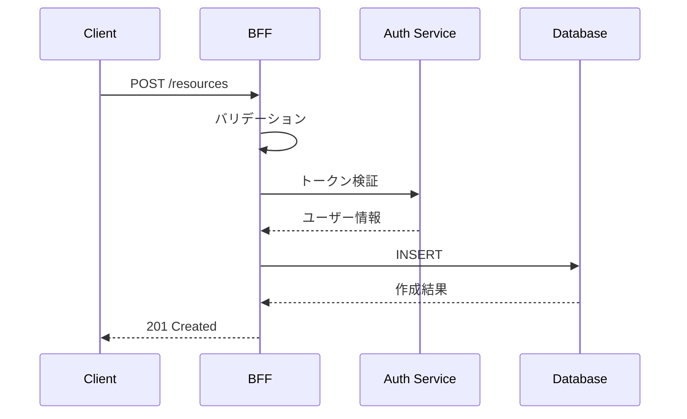
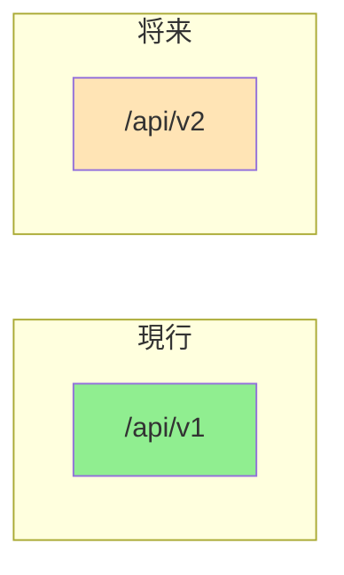

# API設計書

## 基本情報

| 項目 | 内容 |
|------|------|
| **API名** | `[API Name]` |
| **バージョン** | v1 |
| **ベースパス** | `/api/v1` |
| **作成日** | YYYY-MM-DD |
| **更新日** | YYYY-MM-DD |
| **担当者** | [担当者名] |

## 概要

APIの目的と提供する機能を説明します。

## エンドポイント一覧

| メソッド | パス | 説明 | 認証 |
|---------|------|------|------|
| GET | `/resources` | リソース一覧取得 | Required |
| GET | `/resources/:id` | リソース詳細取得 | Required |
| POST | `/resources` | リソース作成 | Required |
| PUT | `/resources/:id` | リソース更新 | Required |
| DELETE | `/resources/:id` | リソース削除 | Required |

## リクエスト/レスポンスフロー



## API詳細

### GET /resources

リソースの一覧を取得します。

#### リクエスト

**Query Parameters**

| パラメータ | 型 | 必須 | デフォルト | 説明 |
|-----------|-----|------|-----------|------|
| `page` | `number` | No | `1` | ページ番号 |
| `limit` | `number` | No | `20` | 1ページあたりの件数（max: 100） |
| `sort` | `string` | No | `createdAt` | ソートフィールド |
| `order` | `'asc' \| 'desc'` | No | `desc` | ソート順 |
| `filter` | `string` | No | - | フィルター条件（JSON） |

**ヘッダー**

| ヘッダー | 必須 | 説明 |
|---------|------|------|
| `Authorization` | Yes | `Bearer <token>` |
| `Accept-Language` | No | レスポンス言語（`ja`, `en`） |
| `X-Request-ID` | No | リクエスト追跡ID |

#### レスポンス

**成功（200 OK）**

```json
{
  "data": [
    {
      "id": "res_123",
      "name": "リソース名",
      "status": "active",
      "createdAt": "2024-01-01T00:00:00Z",
      "updatedAt": "2024-01-01T00:00:00Z"
    }
  ],
  "meta": {
    "total": 100,
    "page": 1,
    "limit": 20,
    "totalPages": 5
  }
}
```

### POST /resources

新しいリソースを作成します。

#### リクエスト

**Body (application/json)**

```json
{
  "name": "リソース名",
  "description": "説明文",
  "type": "A"
}
```

**Zodスキーマ**

```typescript
const createResourceSchema = z.object({
  name: z.string().min(1).max(100),
  description: z.string().max(1000).optional(),
  type: z.enum(['A', 'B', 'C']),
  metadata: z.record(z.unknown()).optional(),
});
```

#### レスポンス

**成功（201 Created）**

```json
{
  "data": {
    "id": "res_456",
    "name": "新規リソース",
    "status": "active",
    "createdAt": "2024-01-01T00:00:00Z"
  }
}
```

### GET /resources/:id

リソースの詳細を取得します。

#### パスパラメータ

| パラメータ | 型 | 説明 |
|-----------|-----|------|
| `id` | `string` | リソースID |

#### レスポンス

**成功（200 OK）**

```json
{
  "data": {
    "id": "res_123",
    "name": "リソース名",
    "description": "説明文",
    "type": "A",
    "status": "active",
    "metadata": {},
    "createdAt": "2024-01-01T00:00:00Z",
    "updatedAt": "2024-01-01T00:00:00Z"
  }
}
```

**エラー（404 Not Found）**

```json
{
  "error": {
    "code": "RESOURCE_NOT_FOUND",
    "message": "指定されたリソースが見つかりません",
    "requestId": "req_abc123"
  }
}
```

### PUT /resources/:id

リソースを更新します。

#### リクエスト

```json
{
  "name": "更新後の名前",
  "description": "更新後の説明"
}
```

#### レスポンス

**成功（200 OK）**

```json
{
  "data": {
    "id": "res_123",
    "name": "更新後の名前",
    "updatedAt": "2024-01-02T00:00:00Z"
  }
}
```

### DELETE /resources/:id

リソースを削除します。

#### レスポンス

**成功（204 No Content）**

（ボディなし）

## 型定義

```typescript
// リクエスト型
interface CreateResourceRequest {
  name: string;
  description?: string;
  type: 'A' | 'B' | 'C';
  metadata?: Record<string, unknown>;
}

interface UpdateResourceRequest {
  name?: string;
  description?: string;
  type?: 'A' | 'B' | 'C';
}

// レスポンス型
interface Resource {
  id: string;
  name: string;
  description: string | null;
  type: 'A' | 'B' | 'C';
  status: 'active' | 'inactive';
  metadata: Record<string, unknown>;
  createdAt: string;
  updatedAt: string;
}

interface PaginatedResponse<T> {
  data: T[];
  meta: {
    total: number;
    page: number;
    limit: number;
    totalPages: number;
  };
}

interface SingleResponse<T> {
  data: T;
}
```

## エラーレスポンス

### 標準エラー形式

```typescript
interface ErrorResponse {
  error: {
    code: string;
    message: string;
    details?: Record<string, string[]>;
    requestId: string;
  };
}
```

### エラーコード一覧

| HTTPステータス | エラーコード | 説明 |
|--------------|-------------|------|
| 400 | `VALIDATION_ERROR` | バリデーションエラー |
| 400 | `INVALID_REQUEST` | 不正なリクエスト |
| 401 | `UNAUTHORIZED` | 認証エラー |
| 401 | `TOKEN_EXPIRED` | トークン期限切れ |
| 403 | `FORBIDDEN` | 権限エラー |
| 404 | `RESOURCE_NOT_FOUND` | リソースが見つからない |
| 409 | `CONFLICT` | 競合エラー |
| 422 | `UNPROCESSABLE_ENTITY` | 処理不可 |
| 429 | `RATE_LIMITED` | レート制限 |
| 500 | `INTERNAL_ERROR` | サーバーエラー |

## バージョニング

### 戦略



| バージョン | ステータス | サポート終了 |
|-----------|----------|------------|
| v1 | Stable | - |
| v2 | Planning | - |

### 破壊的変更のルール

- マイナーバージョンでは破壊的変更を行わない
- 破壊的変更が必要な場合は新バージョンを作成
- 旧バージョンは最低6ヶ月間サポート

## レート制限

### 制限値

| プラン | リクエスト/分 | リクエスト/日 |
|--------|-------------|-------------|
| Free | 60 | 1,000 |
| Pro | 300 | 10,000 |
| Enterprise | 1,000 | 100,000 |

### レスポンスヘッダー

```
X-RateLimit-Limit: 60
X-RateLimit-Remaining: 45
X-RateLimit-Reset: 1640000000
Retry-After: 60
```

## 認証・認可

### 認証方式

- Bearer Token (JWT)

### 権限マトリックス

| エンドポイント | guest | user | admin |
|--------------|-------|------|-------|
| GET /resources | - | Read | Read |
| GET /resources/:id | - | Read | Read |
| POST /resources | - | Create | Create |
| PUT /resources/:id | - | Own | All |
| DELETE /resources/:id | - | Own | All |

## 関連ドキュメント

- [認証・認可設計](./authentication-design)
- [バリデーション設計](./validation-design)
- [エラーハンドリング](./error-handling)

## 変更履歴

| バージョン | 日付 | 変更内容 |
|-----------|------|---------|
| 1.0.0 | YYYY-MM-DD | 初版作成 |
