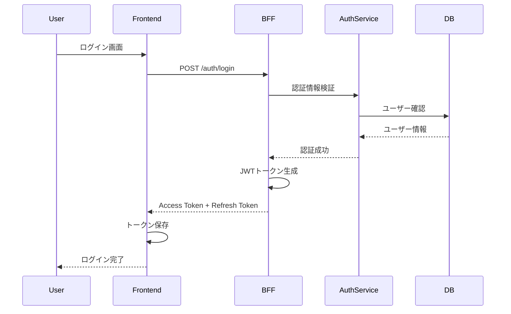
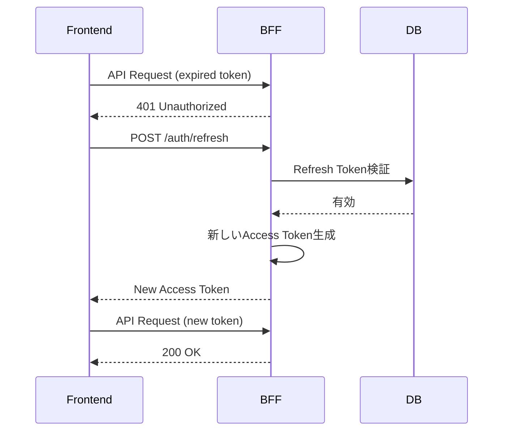
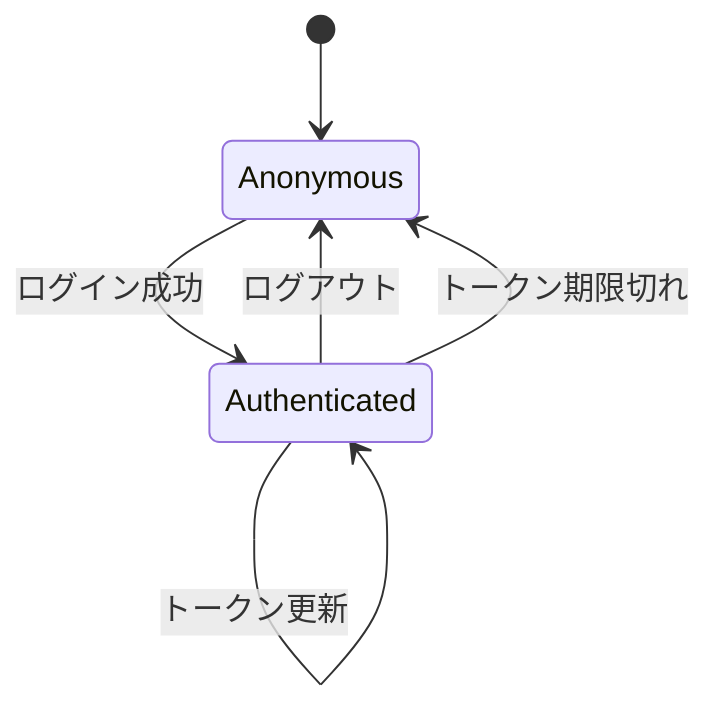
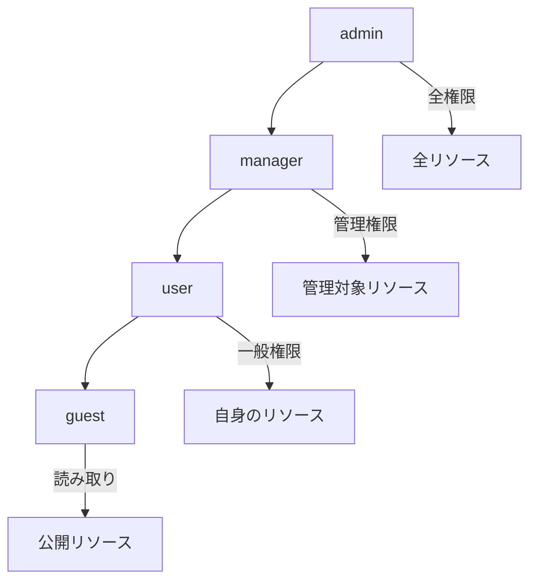
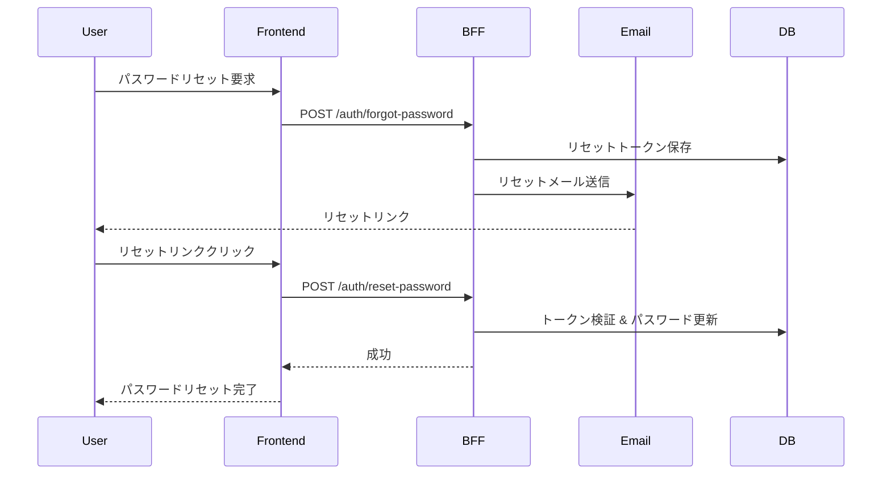
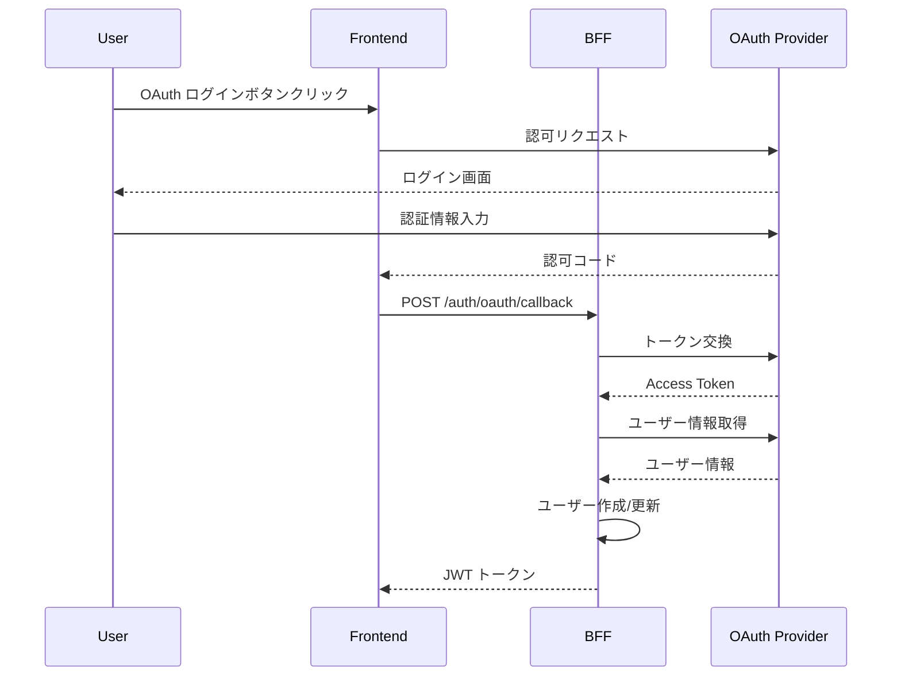

# 認証・認可設計書

## 基本情報

| 項目 | 内容 |
|------|------|
| **機能名** | `[FeatureName]` |
| **作成日** | YYYY-MM-DD |
| **更新日** | YYYY-MM-DD |
| **担当者** | [担当者名] |

## 概要

認証・認可の設計方針と実装ガイドラインを説明します。

## 認証フロー

### 全体フロー



### トークン更新フロー



## JWT設計

### トークン構造

```typescript
// Access Token Payload
interface AccessTokenPayload {
  sub: string;        // ユーザーID
  email: string;      // メールアドレス
  roles: string[];    // ロール
  iat: number;        // 発行時刻
  exp: number;        // 有効期限
  jti: string;        // トークンID
}

// Refresh Token Payload
interface RefreshTokenPayload {
  sub: string;        // ユーザーID
  tokenFamily: string; // トークンファミリー（ローテーション用）
  iat: number;
  exp: number;
  jti: string;
}
```

### トークン設定

| トークン種別 | 有効期限 | 保存場所 |
|-------------|---------|---------|
| Access Token | 15分 | メモリ / Cookie (httpOnly) |
| Refresh Token | 7日 | Cookie (httpOnly, secure) |

### JWT生成・検証

```typescript
import jwt from 'jsonwebtoken';

const JWT_SECRET = process.env.JWT_SECRET!;
const JWT_REFRESH_SECRET = process.env.JWT_REFRESH_SECRET!;

// Access Token生成
function generateAccessToken(user: User): string {
  return jwt.sign(
    {
      sub: user.id,
      email: user.email,
      roles: user.roles,
    },
    JWT_SECRET,
    {
      expiresIn: '15m',
      jwtid: generateUUID(),
    }
  );
}

// Refresh Token生成
function generateRefreshToken(userId: string, tokenFamily: string): string {
  return jwt.sign(
    {
      sub: userId,
      tokenFamily,
    },
    JWT_REFRESH_SECRET,
    {
      expiresIn: '7d',
      jwtid: generateUUID(),
    }
  );
}

// トークン検証
function verifyAccessToken(token: string): AccessTokenPayload {
  try {
    return jwt.verify(token, JWT_SECRET) as AccessTokenPayload;
  } catch (error) {
    if (error instanceof jwt.TokenExpiredError) {
      throw new AuthError('TOKEN_EXPIRED', 'トークンの有効期限が切れています');
    }
    throw new AuthError('INVALID_TOKEN', '無効なトークンです');
  }
}
```

## セッション管理

### セッション状態



### セッション情報

```typescript
interface Session {
  id: string;
  userId: string;
  tokenFamily: string;
  userAgent: string;
  ipAddress: string;
  createdAt: Date;
  lastAccessAt: Date;
  expiresAt: Date;
}

// Redis でのセッション管理
class SessionService {
  async createSession(userId: string, metadata: SessionMetadata): Promise<Session> {
    const session: Session = {
      id: generateUUID(),
      userId,
      tokenFamily: generateUUID(),
      ...metadata,
      createdAt: new Date(),
      lastAccessAt: new Date(),
      expiresAt: addDays(new Date(), 7),
    };

    await redis.set(
      `session:${session.id}`,
      JSON.stringify(session),
      'EX',
      7 * 24 * 60 * 60 // 7日
    );

    return session;
  }

  async invalidateSession(sessionId: string): Promise<void> {
    await redis.del(`session:${sessionId}`);
  }

  async invalidateAllUserSessions(userId: string): Promise<void> {
    const keys = await redis.keys(`session:*`);
    for (const key of keys) {
      const session = await redis.get(key);
      if (session && JSON.parse(session).userId === userId) {
        await redis.del(key);
      }
    }
  }
}
```

## RBAC（ロールベースアクセス制御）

### ロール階層



### 権限定義

```typescript
const permissions = {
  // リソース権限
  'resources:read': ['guest', 'user', 'manager', 'admin'],
  'resources:create': ['user', 'manager', 'admin'],
  'resources:update': ['user', 'manager', 'admin'],
  'resources:delete': ['manager', 'admin'],

  // ユーザー管理権限
  'users:read': ['manager', 'admin'],
  'users:create': ['admin'],
  'users:update': ['admin'],
  'users:delete': ['admin'],

  // システム権限
  'system:settings': ['admin'],
  'system:logs': ['admin'],
} as const;

type Permission = keyof typeof permissions;

function hasPermission(userRoles: string[], permission: Permission): boolean {
  const allowedRoles = permissions[permission];
  return userRoles.some(role => allowedRoles.includes(role));
}
```

### 権限チェックミドルウェア

```typescript
function requirePermission(permission: Permission) {
  return (req: Request, res: Response, next: NextFunction) => {
    const user = req.user;

    if (!user) {
      return res.status(401).json({
        error: { code: 'UNAUTHORIZED', message: '認証が必要です' }
      });
    }

    if (!hasPermission(user.roles, permission)) {
      return res.status(403).json({
        error: { code: 'FORBIDDEN', message: 'この操作を行う権限がありません' }
      });
    }

    next();
  };
}

// 使用例
router.delete(
  '/resources/:id',
  authenticate,
  requirePermission('resources:delete'),
  deleteResource
);
```

## パスワード管理

### パスワードポリシー

| 項目 | 要件 |
|------|------|
| 最小長 | 8文字 |
| 最大長 | 128文字 |
| 必須文字 | 英字 + 数字 |
| 推奨 | 記号を含む |
| 禁止 | よく使われるパスワード |

### パスワードハッシュ

```typescript
import bcrypt from 'bcrypt';

const SALT_ROUNDS = 12;

async function hashPassword(password: string): Promise<string> {
  return bcrypt.hash(password, SALT_ROUNDS);
}

async function verifyPassword(password: string, hash: string): Promise<boolean> {
  return bcrypt.compare(password, hash);
}
```

### パスワードリセットフロー



## OAuth2.0 / OIDC連携

### 対応プロバイダー

| プロバイダー | 用途 | スコープ |
|-------------|------|---------|
| Google | ソーシャルログイン | openid, email, profile |
| GitHub | 開発者ログイン | read:user, user:email |

### OAuthフロー



## セキュリティ対策

### 実装チェックリスト

- [ ] パスワードは bcrypt でハッシュ化
- [ ] JWT シークレットは十分な長さ（256bit以上）
- [ ] Refresh Token はローテーション
- [ ] ログイン試行回数制限
- [ ] セッション固定攻撃対策
- [ ] CSRF トークン検証
- [ ] セキュアな Cookie 設定

### ブルートフォース対策

```typescript
import rateLimit from 'express-rate-limit';

const loginLimiter = rateLimit({
  windowMs: 15 * 60 * 1000, // 15分
  max: 5, // 5回まで
  message: {
    error: {
      code: 'TOO_MANY_REQUESTS',
      message: 'ログイン試行回数が上限を超えました。15分後に再試行してください。',
    },
  },
  keyGenerator: (req) => req.body.email || req.ip,
});

router.post('/auth/login', loginLimiter, login);
```

## 関連ドキュメント

- [API設計](./api-design)
- [セキュリティ設計](./security-design)
- [ミドルウェア設計](./middleware-design)

## 変更履歴

| バージョン | 日付 | 変更内容 |
|-----------|------|---------|
| 1.0.0 | YYYY-MM-DD | 初版作成 |
