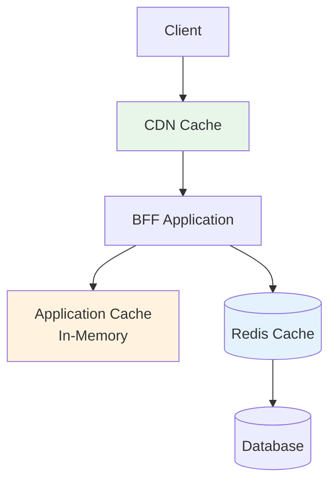
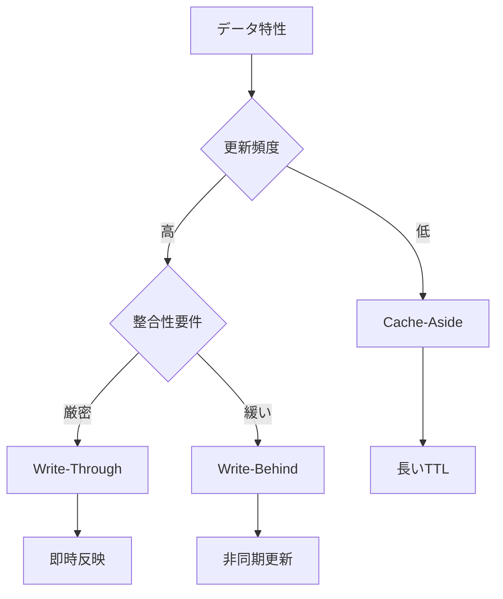
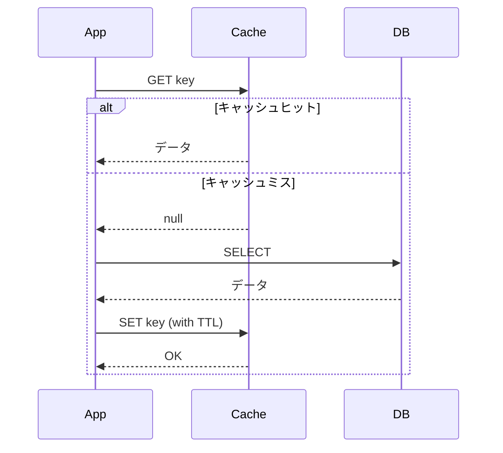
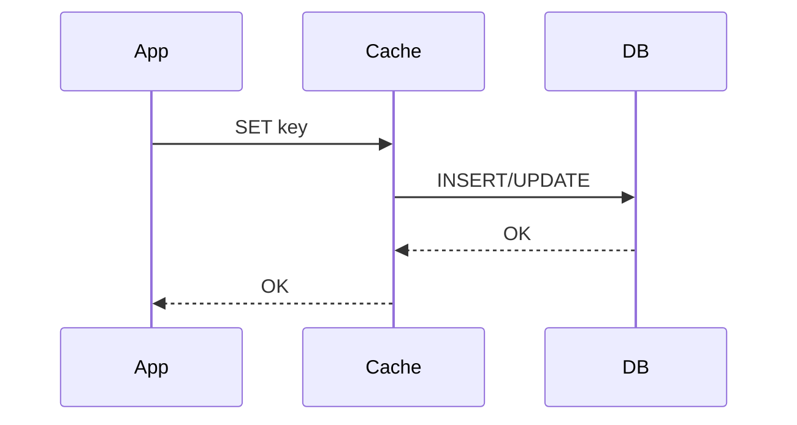
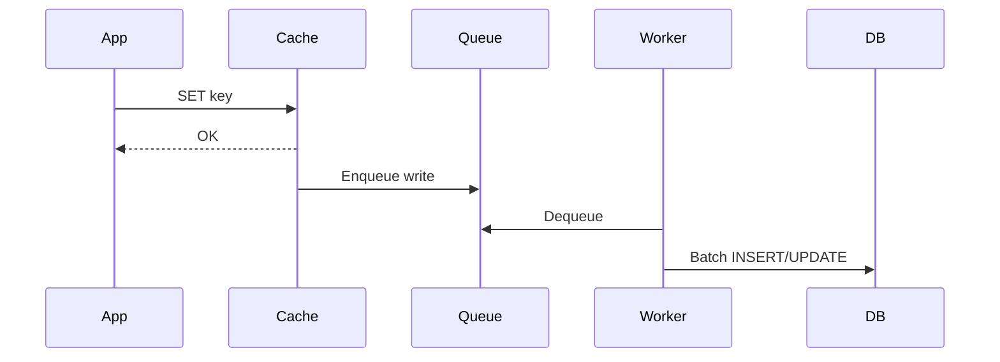
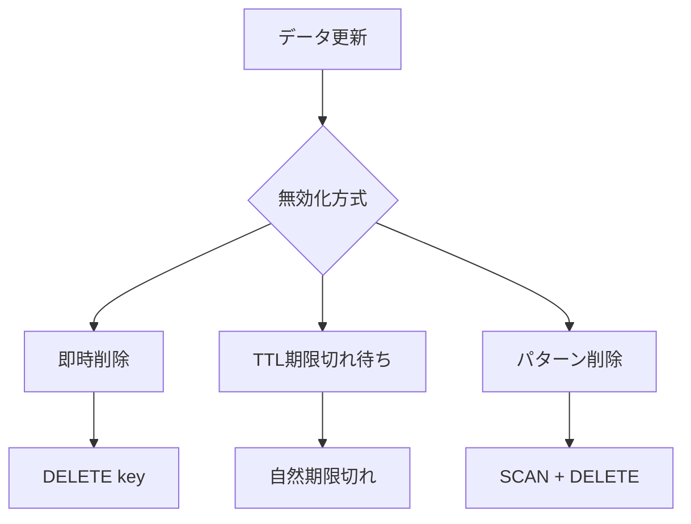

# キャッシュ設計書

## 基本情報

| 項目 | 内容 |
|------|------|
| **機能名** | `[FeatureName]` |
| **作成日** | YYYY-MM-DD |
| **更新日** | YYYY-MM-DD |
| **担当者** | [担当者名] |

## 概要

キャッシュ戦略と設計方針を説明します。

## キャッシュアーキテクチャ

### キャッシュ階層



### キャッシュ戦略選択



## Redis設定

### 接続設定

```typescript
import Redis from 'ioredis';

const redis = new Redis({
  host: process.env.REDIS_HOST || 'localhost',
  port: parseInt(process.env.REDIS_PORT || '6379'),
  password: process.env.REDIS_PASSWORD,
  db: parseInt(process.env.REDIS_DB || '0'),
  retryStrategy: (times) => {
    const delay = Math.min(times * 50, 2000);
    return delay;
  },
  maxRetriesPerRequest: 3,
});

redis.on('error', (err) => {
  logger.error('Redis connection error:', err);
});

redis.on('connect', () => {
  logger.info('Redis connected');
});
```

### クラスタ設定（本番環境）

```typescript
const redis = new Redis.Cluster([
  { host: 'redis-1', port: 6379 },
  { host: 'redis-2', port: 6379 },
  { host: 'redis-3', port: 6379 },
], {
  redisOptions: {
    password: process.env.REDIS_PASSWORD,
  },
  scaleReads: 'slave', // 読み取りは slave から
});
```

## キャッシュキー設計

### 命名規則

```
{prefix}:{entity}:{identifier}:{version?}
```

| コンポーネント | 説明 | 例 |
|--------------|------|-----|
| prefix | アプリケーション識別子 | `app` |
| entity | エンティティ種別 | `user`, `product` |
| identifier | 一意識別子 | `123`, `list` |
| version | キャッシュバージョン | `v1` |

### キー例

```typescript
const cacheKeys = {
  // 単一リソース
  user: (id: string) => `app:user:${id}`,
  product: (id: string) => `app:product:${id}`,

  // リスト
  userList: (page: number, limit: number) =>
    `app:users:list:p${page}:l${limit}`,
  productsByCategory: (categoryId: string) =>
    `app:products:category:${categoryId}`,

  // 集計
  productCount: () => `app:products:count`,
  userStats: (userId: string) => `app:user:${userId}:stats`,

  // セッション
  session: (sessionId: string) => `session:${sessionId}`,
  userSessions: (userId: string) => `sessions:user:${userId}`,
};
```

## キャッシュパターン

### Cache-Aside (Lazy Loading)



```typescript
class CacheAsideRepository<T> {
  constructor(
    private cache: Redis,
    private db: DatabaseClient,
    private options: { ttl: number }
  ) {}

  async get(key: string, fetcher: () => Promise<T>): Promise<T> {
    // 1. キャッシュから取得を試みる
    const cached = await this.cache.get(key);
    if (cached) {
      return JSON.parse(cached);
    }

    // 2. キャッシュミス時はDBから取得
    const data = await fetcher();

    // 3. キャッシュに保存
    await this.cache.set(
      key,
      JSON.stringify(data),
      'EX',
      this.options.ttl
    );

    return data;
  }
}
```

### Write-Through



```typescript
async function writeThrough<T>(
  key: string,
  data: T,
  dbOperation: () => Promise<void>
): Promise<void> {
  // 1. DBに書き込み
  await dbOperation();

  // 2. キャッシュを更新
  await cache.set(key, JSON.stringify(data), 'EX', TTL);
}
```

### Write-Behind (Write-Back)



```typescript
// キューベースの非同期書き込み
async function writeBehind<T>(key: string, data: T): Promise<void> {
  // 1. キャッシュに即座に書き込み
  await cache.set(key, JSON.stringify(data), 'EX', TTL);

  // 2. キューに追加（非同期でDBに反映）
  await queue.add('db-write', { key, data });
}
```

## TTL（有効期限）設計

### TTL設定ガイドライン

| データ種別 | TTL | 理由 |
|-----------|-----|------|
| 静的マスター | 24時間 | 変更頻度が低い |
| ユーザー情報 | 1時間 | 適度な鮮度が必要 |
| 商品情報 | 5分 | 価格・在庫の変動 |
| セッション | 7日 | セキュリティ要件 |
| 一時データ | 5分 | 短期間のみ必要 |

### TTL実装

```typescript
const TTL = {
  STATIC_MASTER: 60 * 60 * 24,    // 24時間
  USER_INFO: 60 * 60,              // 1時間
  PRODUCT_INFO: 60 * 5,            // 5分
  SESSION: 60 * 60 * 24 * 7,       // 7日
  TEMPORARY: 60 * 5,               // 5分
} as const;
```

## キャッシュ無効化

### 無効化戦略



### 実装例

```typescript
class CacheInvalidator {
  constructor(private cache: Redis) {}

  // 単一キー削除
  async invalidate(key: string): Promise<void> {
    await this.cache.del(key);
  }

  // パターンマッチ削除
  async invalidatePattern(pattern: string): Promise<void> {
    let cursor = '0';
    do {
      const [nextCursor, keys] = await this.cache.scan(
        cursor,
        'MATCH',
        pattern,
        'COUNT',
        100
      );
      cursor = nextCursor;

      if (keys.length > 0) {
        await this.cache.del(...keys);
      }
    } while (cursor !== '0');
  }

  // 関連キーの一括削除
  async invalidateRelated(entityType: string, entityId: string): Promise<void> {
    const patterns = [
      `app:${entityType}:${entityId}`,
      `app:${entityType}:${entityId}:*`,
      `app:${entityType}:list:*`,
    ];

    for (const pattern of patterns) {
      await this.invalidatePattern(pattern);
    }
  }
}
```

## キャッシュ監視

### メトリクス

| メトリクス | 説明 | 目標値 |
|-----------|------|-------|
| Hit Rate | キャッシュヒット率 | > 90% |
| Miss Rate | キャッシュミス率 | < 10% |
| Eviction Rate | 追い出し率 | < 5% |
| Memory Usage | メモリ使用率 | < 80% |

### 監視実装

```typescript
class CacheMetrics {
  private hits = 0;
  private misses = 0;

  recordHit(): void {
    this.hits++;
  }

  recordMiss(): void {
    this.misses++;
  }

  getHitRate(): number {
    const total = this.hits + this.misses;
    return total > 0 ? this.hits / total : 0;
  }

  async reportMetrics(): Promise<void> {
    const info = await redis.info('memory');
    const memory = parseRedisMemoryInfo(info);

    metrics.gauge('cache.hit_rate', this.getHitRate());
    metrics.gauge('cache.memory_usage', memory.usedMemory);
    metrics.gauge('cache.memory_peak', memory.peakMemory);
  }
}
```

## エラーハンドリング

### フォールバック

```typescript
async function getWithFallback<T>(
  key: string,
  fetcher: () => Promise<T>
): Promise<T> {
  try {
    const cached = await cache.get(key);
    if (cached) {
      return JSON.parse(cached);
    }
  } catch (error) {
    // キャッシュエラー時はログを出力して続行
    logger.warn('Cache read error:', error);
  }

  // DBから取得
  const data = await fetcher();

  // キャッシュへの保存は失敗しても無視
  cache.set(key, JSON.stringify(data), 'EX', TTL).catch((error) => {
    logger.warn('Cache write error:', error);
  });

  return data;
}
```

## 関連ドキュメント

- [パフォーマンス設計](../frontend/performance-design)
- [API設計](./api-design)

## 変更履歴

| バージョン | 日付 | 変更内容 |
|-----------|------|---------|
| 1.0.0 | YYYY-MM-DD | 初版作成 |
