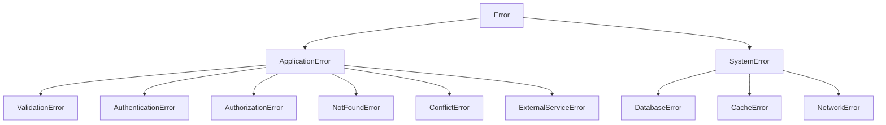
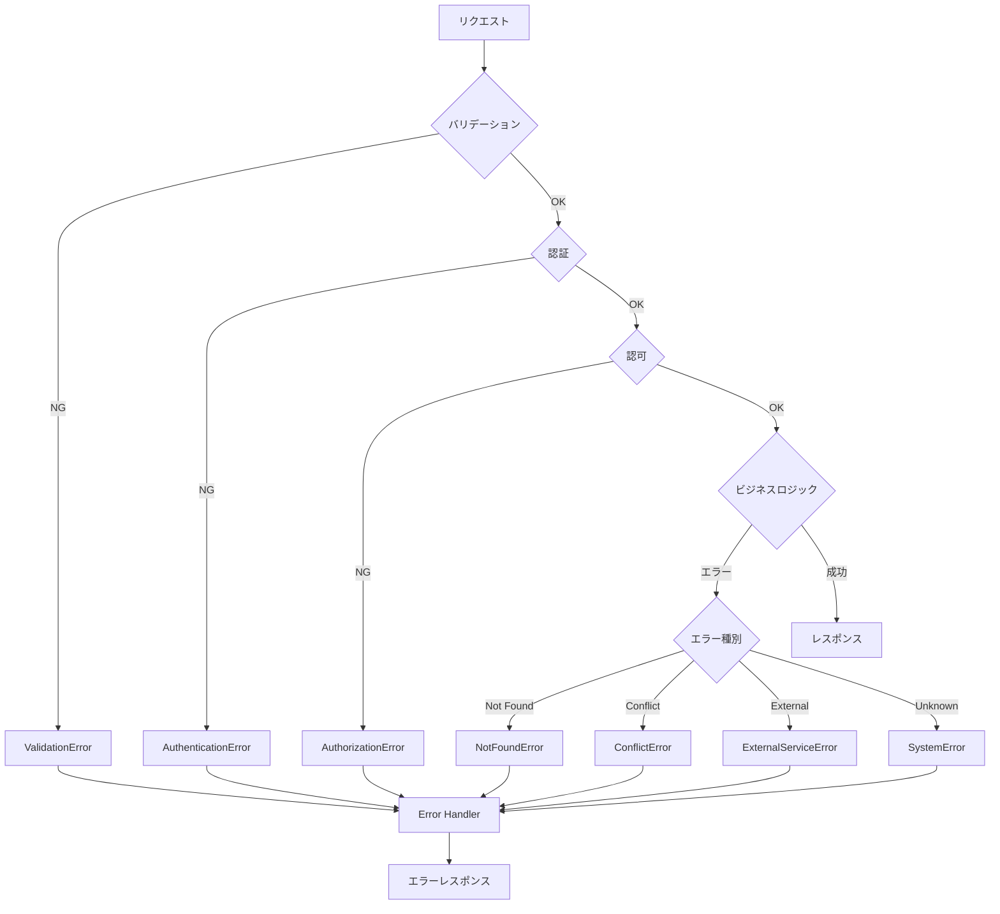

# エラーハンドリング設計書

## 基本情報

| 項目 | 内容 |
|------|------|
| **機能名** | `[FeatureName]` |
| **作成日** | YYYY-MM-DD |
| **更新日** | YYYY-MM-DD |
| **担当者** | [担当者名] |

## 概要

エラーハンドリングの設計方針と実装ガイドラインを説明します。

## エラー分類

### エラー階層



### エラー種別マッピング

| エラークラス | HTTPステータス | エラーコード | 説明 |
|-------------|--------------|-------------|------|
| ValidationError | 400 | `VALIDATION_ERROR` | 入力値バリデーションエラー |
| AuthenticationError | 401 | `UNAUTHORIZED` | 認証エラー |
| AuthorizationError | 403 | `FORBIDDEN` | 権限エラー |
| NotFoundError | 404 | `NOT_FOUND` | リソースが見つからない |
| ConflictError | 409 | `CONFLICT` | 競合エラー |
| ExternalServiceError | 502 | `EXTERNAL_SERVICE_ERROR` | 外部サービスエラー |
| SystemError | 500 | `INTERNAL_ERROR` | システムエラー |

## エラーレスポンス形式

### 標準フォーマット

```typescript
interface ErrorResponse {
  error: {
    code: string;           // エラーコード
    message: string;        // ユーザー向けメッセージ
    details?: ErrorDetail[]; // 詳細情報
    requestId: string;      // リクエスト追跡ID
    timestamp: string;      // エラー発生時刻
  };
}

interface ErrorDetail {
  field?: string;    // エラーが発生したフィールド
  code: string;      // 詳細エラーコード
  message: string;   // 詳細メッセージ
}
```

### レスポンス例

**バリデーションエラー（400）**

```json
{
  "error": {
    "code": "VALIDATION_ERROR",
    "message": "入力値が不正です",
    "details": [
      {
        "field": "email",
        "code": "INVALID_FORMAT",
        "message": "有効なメールアドレスを入力してください"
      },
      {
        "field": "password",
        "code": "TOO_SHORT",
        "message": "パスワードは8文字以上で入力してください"
      }
    ],
    "requestId": "req_abc123",
    "timestamp": "2024-01-01T00:00:00Z"
  }
}
```

**認証エラー（401）**

```json
{
  "error": {
    "code": "UNAUTHORIZED",
    "message": "認証が必要です",
    "requestId": "req_def456",
    "timestamp": "2024-01-01T00:00:00Z"
  }
}
```

**サーバーエラー（500）**

```json
{
  "error": {
    "code": "INTERNAL_ERROR",
    "message": "サーバーエラーが発生しました",
    "requestId": "req_ghi789",
    "timestamp": "2024-01-01T00:00:00Z"
  }
}
```

## カスタムエラークラス

### 基底クラス

```typescript
export class ApplicationError extends Error {
  constructor(
    public code: string,
    message: string,
    public statusCode: number = 500,
    public details?: ErrorDetail[]
  ) {
    super(message);
    this.name = this.constructor.name;
    Error.captureStackTrace(this, this.constructor);
  }

  toJSON(): ErrorResponse['error'] {
    return {
      code: this.code,
      message: this.message,
      details: this.details,
      requestId: '', // ミドルウェアで設定
      timestamp: new Date().toISOString(),
    };
  }
}
```

### 派生クラス

```typescript
export class ValidationError extends ApplicationError {
  constructor(message: string, details?: ErrorDetail[]) {
    super('VALIDATION_ERROR', message, 400, details);
  }
}

export class AuthenticationError extends ApplicationError {
  constructor(message: string = '認証が必要です') {
    super('UNAUTHORIZED', message, 401);
  }
}

export class AuthorizationError extends ApplicationError {
  constructor(message: string = 'この操作を行う権限がありません') {
    super('FORBIDDEN', message, 403);
  }
}

export class NotFoundError extends ApplicationError {
  constructor(resource: string = 'リソース') {
    super('NOT_FOUND', `${resource}が見つかりません`, 404);
  }
}

export class ConflictError extends ApplicationError {
  constructor(message: string) {
    super('CONFLICT', message, 409);
  }
}

export class ExternalServiceError extends ApplicationError {
  constructor(service: string, originalError?: Error) {
    super('EXTERNAL_SERVICE_ERROR', `外部サービス(${service})でエラーが発生しました`, 502);
    if (originalError) {
      this.cause = originalError;
    }
  }
}
```

## エラーハンドリングミドルウェア

### Express実装

```typescript
import { Request, Response, NextFunction } from 'express';

export function errorHandler(
  error: Error,
  req: Request,
  res: Response,
  next: NextFunction
): void {
  // リクエストIDを取得または生成
  const requestId = req.id || generateRequestId();

  // ApplicationError の場合
  if (error instanceof ApplicationError) {
    const errorResponse = error.toJSON();
    errorResponse.requestId = requestId;

    // ログ出力（4xx は warn、5xx は error）
    if (error.statusCode >= 500) {
      logger.error('Server error', {
        error: errorResponse,
        stack: error.stack,
        requestId,
      });
    } else {
      logger.warn('Client error', {
        error: errorResponse,
        requestId,
      });
    }

    res.status(error.statusCode).json({ error: errorResponse });
    return;
  }

  // 予期しないエラー
  logger.error('Unexpected error', {
    error: error.message,
    stack: error.stack,
    requestId,
  });

  res.status(500).json({
    error: {
      code: 'INTERNAL_ERROR',
      message: '予期しないエラーが発生しました',
      requestId,
      timestamp: new Date().toISOString(),
    },
  });
}
```

## エラーフロー

### 処理フロー



## エラーロギング

### ログ構造

```typescript
interface ErrorLog {
  level: 'warn' | 'error';
  message: string;
  error: {
    code: string;
    message: string;
    stack?: string;
  };
  request: {
    id: string;
    method: string;
    path: string;
    query: Record<string, string>;
    body?: unknown; // 機密情報はマスク
    headers: {
      'user-agent': string;
      'x-forwarded-for': string;
    };
  };
  user?: {
    id: string;
    roles: string[];
  };
  timestamp: string;
}
```

### ログ出力例

```typescript
function logError(error: ApplicationError, req: Request): void {
  const logData: ErrorLog = {
    level: error.statusCode >= 500 ? 'error' : 'warn',
    message: error.message,
    error: {
      code: error.code,
      message: error.message,
      stack: error.statusCode >= 500 ? error.stack : undefined,
    },
    request: {
      id: req.id,
      method: req.method,
      path: req.path,
      query: req.query as Record<string, string>,
      body: maskSensitiveData(req.body),
      headers: {
        'user-agent': req.headers['user-agent'] || '',
        'x-forwarded-for': req.headers['x-forwarded-for'] as string || '',
      },
    },
    user: req.user ? {
      id: req.user.id,
      roles: req.user.roles,
    } : undefined,
    timestamp: new Date().toISOString(),
  };

  logger[logData.level](logData);
}
```

## リトライ戦略

### リトライ可能なエラー

| エラー種別 | リトライ | 理由 |
|-----------|---------|------|
| NetworkError | Yes | 一時的な接続エラー |
| DatabaseError (接続) | Yes | 一時的な接続エラー |
| ExternalServiceError | Yes | 外部サービスの一時的障害 |
| ValidationError | No | 入力値の問題 |
| AuthenticationError | No | 認証情報の問題 |
| NotFoundError | No | リソースが存在しない |

### 指数バックオフ

```typescript
async function withRetry<T>(
  operation: () => Promise<T>,
  options: {
    maxRetries?: number;
    baseDelay?: number;
    maxDelay?: number;
    retryable?: (error: Error) => boolean;
  } = {}
): Promise<T> {
  const {
    maxRetries = 3,
    baseDelay = 1000,
    maxDelay = 30000,
    retryable = isRetryableError,
  } = options;

  let lastError: Error;

  for (let attempt = 0; attempt <= maxRetries; attempt++) {
    try {
      return await operation();
    } catch (error) {
      lastError = error as Error;

      if (!retryable(lastError) || attempt === maxRetries) {
        throw lastError;
      }

      const delay = Math.min(baseDelay * 2 ** attempt, maxDelay);
      const jitter = Math.random() * delay * 0.1;

      logger.warn(`Retry attempt ${attempt + 1}/${maxRetries}`, {
        error: lastError.message,
        delay: delay + jitter,
      });

      await sleep(delay + jitter);
    }
  }

  throw lastError!;
}

function isRetryableError(error: Error): boolean {
  if (error instanceof ApplicationError) {
    return error.statusCode >= 500;
  }
  return error.name === 'NetworkError' || error.name === 'TimeoutError';
}
```

## 監視・アラート

### エラーメトリクス

| メトリクス | 説明 | アラート閾値 |
|-----------|------|------------|
| error_rate | エラー率 | > 1% |
| 5xx_rate | 5xxエラー率 | > 0.1% |
| 4xx_rate | 4xxエラー率 | > 5% |
| error_count | エラー数/分 | > 100 |

## 関連ドキュメント

- [ロギング設計](./logging-design)
- [API設計](./api-design)
- [ミドルウェア設計](./middleware-design)

## 変更履歴

| バージョン | 日付 | 変更内容 |
|-----------|------|---------|
| 1.0.0 | YYYY-MM-DD | 初版作成 |
