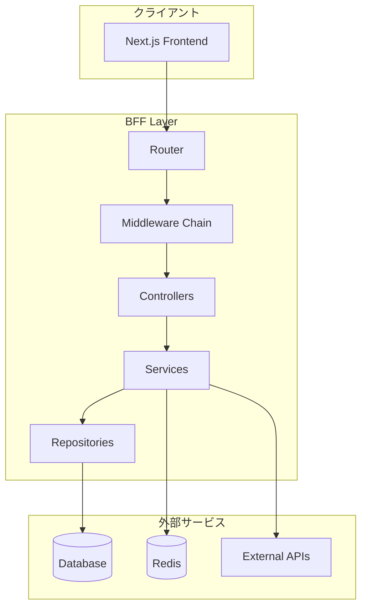
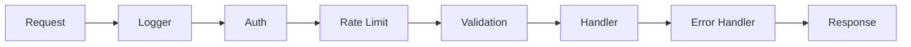

# BFF設計概要

Backend for Frontend（BFF）の設計に関するドキュメント群です。

## 技術スタック

| カテゴリ | 技術 |
|---------|------|
| **ランタイム** | Node.js |
| **フレームワーク** | Express / Fastify / NestJS |
| **言語** | TypeScript |
| **バリデーション** | Zod |
| **ORM** | Prisma / Drizzle |
| **キャッシュ** | Redis |
| **ログ** | Pino / Winston |

## アーキテクチャ概要



## ミドルウェアチェーン



## ドキュメント一覧

| ドキュメント | 概要 |
|-------------|------|
| [API設計](./api-design) | RESTful API、エンドポイント定義 |
| [認証・認可設計](./authentication-design) | JWT、セッション、RBAC |
| [キャッシュ設計](./cache-design) | Redis、キャッシュ戦略 |
| [エラーハンドリング](./error-handling) | エラーコード、レスポンス形式 |
| [バリデーション設計](./validation-design) | 入力検証、サニタイズ |
| [ロギング設計](./logging-design) | 構造化ログ、相関ID |
| [セキュリティ設計](./security-design) | CORS、レートリミット |
| [データベース統合](./database-integration) | ORM、トランザクション |
| [外部API統合](./external-api-integration) | サーキットブレーカー |
| [ミドルウェア設計](./middleware-design) | 認証、ロギング、エラー処理 |

## ディレクトリ構成例

```
src/
├── app.ts                 # アプリケーションエントリ
├── config/                # 設定
│   ├── index.ts
│   └── env.ts
├── routes/                # ルーティング
│   ├── index.ts
│   └── v1/
├── controllers/           # コントローラー
├── services/              # ビジネスロジック
├── repositories/          # データアクセス
├── middlewares/           # ミドルウェア
│   ├── auth.ts
│   ├── validation.ts
│   └── errorHandler.ts
├── schemas/               # Zodスキーマ
├── types/                 # 型定義
├── utils/                 # ユーティリティ
└── lib/                   # 外部ライブラリラッパー
    ├── prisma.ts
    └── redis.ts
```
