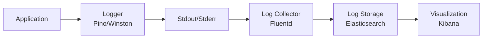
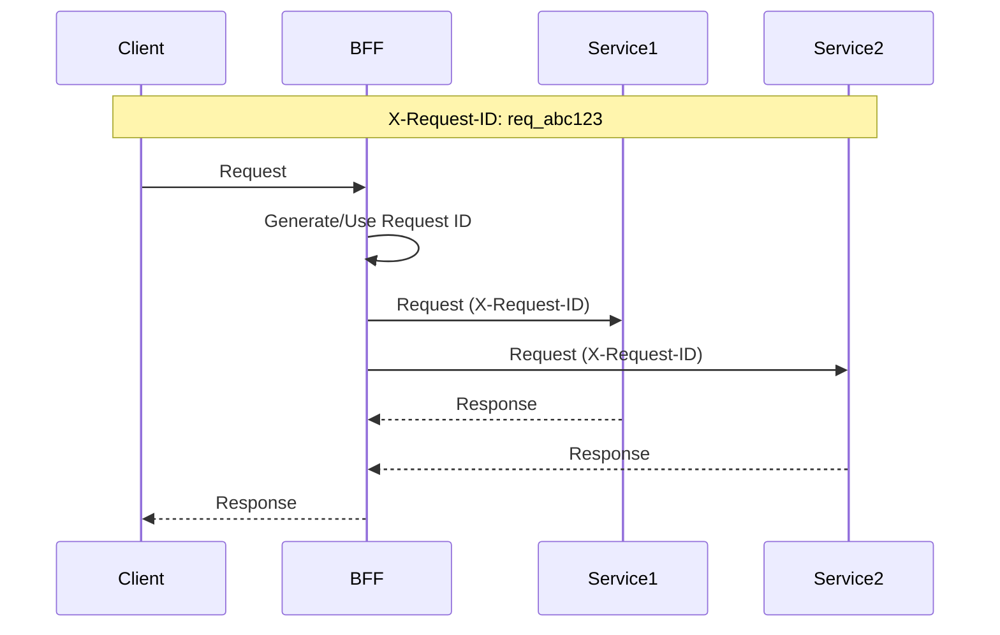

# ロギング設計書

## 基本情報

| 項目 | 内容 |
|------|------|
| **機能名** | `[FeatureName]` |
| **作成日** | YYYY-MM-DD |
| **更新日** | YYYY-MM-DD |
| **担当者** | [担当者名] |

## 概要

ログ出力の設計方針と実装ガイドラインを説明します。

## ログアーキテクチャ

### ログフロー



## ログレベル

### レベル定義

| レベル | 値 | 用途 | 例 |
|-------|-----|------|-----|
| fatal | 60 | 致命的エラー | システムダウン |
| error | 50 | エラー | 例外、処理失敗 |
| warn | 40 | 警告 | 非推奨、リトライ |
| info | 30 | 情報 | リクエスト開始/終了 |
| debug | 20 | デバッグ | 詳細な処理情報 |
| trace | 10 | トレース | 関数呼び出し |

### 環境別設定

| 環境 | デフォルトレベル | 出力先 |
|------|----------------|--------|
| development | debug | stdout (pretty) |
| staging | info | stdout (JSON) |
| production | info | stdout (JSON) |

## 構造化ログ

### ログフォーマット

```typescript
interface LogEntry {
  // 基本情報
  level: string;
  time: string;
  msg: string;

  // リクエスト情報
  requestId?: string;
  method?: string;
  path?: string;
  statusCode?: number;
  responseTime?: number;

  // ユーザー情報
  userId?: string;

  // エラー情報
  err?: {
    type: string;
    message: string;
    stack?: string;
  };

  // カスタムフィールド
  [key: string]: unknown;
}
```

### ログ出力例

```json
{
  "level": "info",
  "time": "2024-01-01T00:00:00.000Z",
  "msg": "Request completed",
  "requestId": "req_abc123",
  "method": "POST",
  "path": "/api/v1/users",
  "statusCode": 201,
  "responseTime": 150,
  "userId": "user_xyz789"
}
```

## Logger設定

### Pino設定

```typescript
import pino from 'pino';

const logger = pino({
  level: process.env.LOG_LEVEL || 'info',
  formatters: {
    level: (label) => ({ level: label }),
  },
  timestamp: pino.stdTimeFunctions.isoTime,
  redact: {
    paths: ['req.headers.authorization', 'req.body.password', 'res.headers["set-cookie"]'],
    censor: '[REDACTED]',
  },
  transport:
    process.env.NODE_ENV === 'development'
      ? {
          target: 'pino-pretty',
          options: {
            colorize: true,
            translateTime: 'SYS:standard',
          },
        }
      : undefined,
});

export { logger };
```

### 子ロガー

```typescript
// コンテキスト付きロガー
function createContextLogger(context: Record<string, unknown>) {
  return logger.child(context);
}

// 使用例
const userLogger = createContextLogger({ service: 'user-service' });
userLogger.info({ userId: '123' }, 'User created');
```

## 相関ID（Correlation ID）

### リクエストID生成



### ミドルウェア実装

```typescript
import { v4 as uuidv4 } from 'uuid';
import { AsyncLocalStorage } from 'async_hooks';

// AsyncLocalStorage でリクエストコンテキストを管理
const requestContext = new AsyncLocalStorage<{ requestId: string }>();

export function requestIdMiddleware(req: Request, res: Response, next: NextFunction) {
  // 既存のリクエストIDを使用するか、新規生成
  const requestId = req.headers['x-request-id'] as string || `req_${uuidv4()}`;

  // レスポンスヘッダーに設定
  res.setHeader('X-Request-ID', requestId);

  // リクエストオブジェクトに設定
  req.id = requestId;

  // AsyncLocalStorage に保存
  requestContext.run({ requestId }, () => {
    next();
  });
}

// どこからでもリクエストIDを取得
export function getRequestId(): string | undefined {
  return requestContext.getStore()?.requestId;
}

// ロガーにリクエストIDを自動付与
export function getContextLogger() {
  const requestId = getRequestId();
  return requestId ? logger.child({ requestId }) : logger;
}
```

## アクセスログ

### HTTPリクエストログ

```typescript
import pinoHttp from 'pino-http';

const httpLogger = pinoHttp({
  logger,
  genReqId: (req) => req.id || `req_${uuidv4()}`,
  customSuccessMessage: (req, res) => {
    return `${req.method} ${req.url} ${res.statusCode}`;
  },
  customErrorMessage: (req, res, err) => {
    return `${req.method} ${req.url} ${res.statusCode} - ${err.message}`;
  },
  customAttributeKeys: {
    req: 'request',
    res: 'response',
    err: 'error',
    responseTime: 'responseTime',
  },
  serializers: {
    req: (req) => ({
      method: req.method,
      url: req.url,
      query: req.query,
      headers: {
        'user-agent': req.headers['user-agent'],
        'content-type': req.headers['content-type'],
      },
    }),
    res: (res) => ({
      statusCode: res.statusCode,
    }),
  },
});

app.use(httpLogger);
```

## 監査ログ

### 監査対象アクション

| アクション | ログレベル | 必須フィールド |
|-----------|----------|--------------|
| ユーザー作成 | info | userId, email |
| ログイン成功 | info | userId, ipAddress |
| ログイン失敗 | warn | email, ipAddress, reason |
| 権限変更 | info | userId, oldRole, newRole |
| データ削除 | info | userId, resourceType, resourceId |

### 監査ログ実装

```typescript
interface AuditLog {
  timestamp: string;
  action: string;
  actorId: string;
  actorType: 'user' | 'system';
  resourceType: string;
  resourceId?: string;
  details: Record<string, unknown>;
  ipAddress: string;
  userAgent: string;
  result: 'success' | 'failure';
}

class AuditLogger {
  private logger = createContextLogger({ type: 'audit' });

  log(audit: Omit<AuditLog, 'timestamp'>) {
    this.logger.info({
      ...audit,
      timestamp: new Date().toISOString(),
    });
  }

  userCreated(actorId: string, userId: string, email: string, req: Request) {
    this.log({
      action: 'USER_CREATED',
      actorId,
      actorType: 'user',
      resourceType: 'user',
      resourceId: userId,
      details: { email },
      ipAddress: req.ip,
      userAgent: req.headers['user-agent'] || '',
      result: 'success',
    });
  }

  loginAttempt(email: string, success: boolean, req: Request, userId?: string) {
    this.log({
      action: success ? 'LOGIN_SUCCESS' : 'LOGIN_FAILURE',
      actorId: userId || 'anonymous',
      actorType: 'user',
      resourceType: 'session',
      details: { email },
      ipAddress: req.ip,
      userAgent: req.headers['user-agent'] || '',
      result: success ? 'success' : 'failure',
    });
  }
}

export const auditLogger = new AuditLogger();
```

## パフォーマンスログ

### 処理時間計測

```typescript
class PerformanceLogger {
  private logger = createContextLogger({ type: 'performance' });

  measure<T>(name: string, operation: () => Promise<T>): Promise<T>;
  measure<T>(name: string, operation: () => T): T;
  measure<T>(name: string, operation: () => T | Promise<T>): T | Promise<T> {
    const start = performance.now();

    const result = operation();

    if (result instanceof Promise) {
      return result.finally(() => {
        this.logDuration(name, start);
      });
    }

    this.logDuration(name, start);
    return result;
  }

  private logDuration(name: string, start: number) {
    const duration = performance.now() - start;
    this.logger.info({ operation: name, duration }, `${name} completed in ${duration.toFixed(2)}ms`);
  }
}

export const perfLogger = new PerformanceLogger();

// 使用例
const result = await perfLogger.measure('fetchUsers', async () => {
  return await userRepository.findAll();
});
```

## 機密情報のマスキング

### マスキング対象

| フィールド | マスキング方法 |
|-----------|--------------|
| password | 完全マスク |
| token | 完全マスク |
| creditCard | 末尾4桁以外マスク |
| email | 部分マスク（`te***@example.com`） |
| phone | 部分マスク（`090-****-1234`） |

### マスキング実装

```typescript
const sensitiveFields = ['password', 'token', 'secret', 'authorization'];

function maskSensitiveData(obj: unknown, depth = 0): unknown {
  if (depth > 10) return obj; // 深さ制限

  if (obj === null || obj === undefined) return obj;

  if (typeof obj === 'object') {
    if (Array.isArray(obj)) {
      return obj.map((item) => maskSensitiveData(item, depth + 1));
    }

    const masked: Record<string, unknown> = {};
    for (const [key, value] of Object.entries(obj)) {
      if (sensitiveFields.some((field) => key.toLowerCase().includes(field))) {
        masked[key] = '[REDACTED]';
      } else {
        masked[key] = maskSensitiveData(value, depth + 1);
      }
    }
    return masked;
  }

  return obj;
}
```

## ログローテーション

### 設定例（PM2）

```javascript
// ecosystem.config.js
module.exports = {
  apps: [{
    name: 'bff',
    script: 'dist/main.js',
    error_file: '/var/log/bff/error.log',
    out_file: '/var/log/bff/out.log',
    log_date_format: 'YYYY-MM-DD HH:mm:ss Z',
    merge_logs: true,
    max_size: '100M',
    retain: '7',
  }],
};
```

## 関連ドキュメント

- [エラーハンドリング](./error-handling)
- [ミドルウェア設計](./middleware-design)
- [セキュリティ設計](./security-design)

## 変更履歴

| バージョン | 日付 | 変更内容 |
|-----------|------|---------|
| 1.0.0 | YYYY-MM-DD | 初版作成 |
