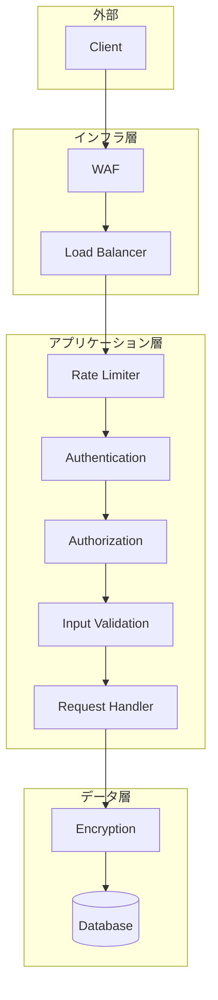
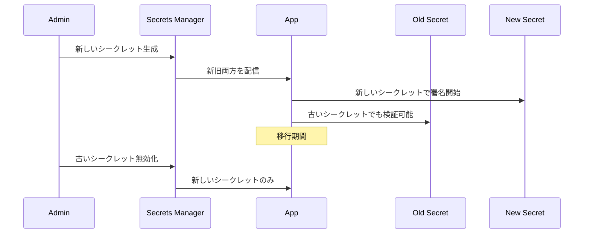

# セキュリティ設計書

## 基本情報

| 項目 | 内容 |
|------|------|
| **機能名** | `[FeatureName]` |
| **作成日** | YYYY-MM-DD |
| **更新日** | YYYY-MM-DD |
| **担当者** | [担当者名] |

## 概要

セキュリティ対策の設計方針と実装ガイドラインを説明します。

## セキュリティアーキテクチャ

### 多層防御



## CORS設定

### 設定項目

| 設定 | 開発環境 | 本番環境 |
|------|---------|---------|
| origin | `*` または `localhost:3000` | 許可リスト |
| methods | 全て | 必要なものだけ |
| credentials | true | true |
| maxAge | 600 | 86400 |

### 実装

```typescript
import cors from 'cors';

const allowedOrigins = process.env.NODE_ENV === 'production'
  ? ['https://example.com', 'https://admin.example.com']
  : ['http://localhost:3000', 'http://localhost:3001'];

const corsOptions: cors.CorsOptions = {
  origin: (origin, callback) => {
    // origin が undefined の場合は同一オリジンからのリクエスト
    if (!origin || allowedOrigins.includes(origin)) {
      callback(null, true);
    } else {
      callback(new Error('CORS not allowed'));
    }
  },
  methods: ['GET', 'POST', 'PUT', 'DELETE', 'PATCH', 'OPTIONS'],
  allowedHeaders: ['Content-Type', 'Authorization', 'X-Request-ID'],
  credentials: true,
  maxAge: 86400, // 24時間
};

app.use(cors(corsOptions));
```

## レートリミット

### 制限設計

| エンドポイント | 制限 | ウィンドウ | 対象 |
|--------------|------|----------|------|
| 全般 | 1000 req | 15分 | IP |
| 認証 | 5 req | 15分 | IP + Email |
| API | 100 req | 1分 | User |
| ファイルアップロード | 10 req | 1時間 | User |

### 実装

```typescript
import rateLimit from 'express-rate-limit';
import RedisStore from 'rate-limit-redis';

// グローバルレートリミット
const globalLimiter = rateLimit({
  windowMs: 15 * 60 * 1000, // 15分
  max: 1000,
  standardHeaders: true,
  legacyHeaders: false,
  store: new RedisStore({
    sendCommand: (...args: string[]) => redisClient.call(...args),
  }),
  message: {
    error: {
      code: 'RATE_LIMITED',
      message: 'リクエストが多すぎます。しばらくしてから再試行してください。',
    },
  },
});

// 認証エンドポイント用
const authLimiter = rateLimit({
  windowMs: 15 * 60 * 1000,
  max: 5,
  keyGenerator: (req) => `auth:${req.body.email || req.ip}`,
  skipSuccessfulRequests: true, // 成功した場合はカウントしない
});

// API エンドポイント用（認証済みユーザー）
const apiLimiter = rateLimit({
  windowMs: 60 * 1000, // 1分
  max: 100,
  keyGenerator: (req) => `api:${req.user?.id || req.ip}`,
});

app.use(globalLimiter);
app.use('/api/auth', authLimiter);
app.use('/api/v1', apiLimiter);
```

## セキュリティヘッダー

### Helmet設定

```typescript
import helmet from 'helmet';

app.use(
  helmet({
    contentSecurityPolicy: {
      directives: {
        defaultSrc: ["'self'"],
        scriptSrc: ["'self'", "'unsafe-inline'"], // 必要に応じて調整
        styleSrc: ["'self'", "'unsafe-inline'"],
        imgSrc: ["'self'", 'data:', 'https:'],
        connectSrc: ["'self'", 'https://api.example.com'],
        fontSrc: ["'self'", 'https://fonts.gstatic.com'],
        objectSrc: ["'none'"],
        mediaSrc: ["'self'"],
        frameSrc: ["'none'"],
      },
    },
    crossOriginEmbedderPolicy: true,
    crossOriginOpenerPolicy: true,
    crossOriginResourcePolicy: { policy: 'same-site' },
    dnsPrefetchControl: { allow: false },
    frameguard: { action: 'deny' },
    hsts: {
      maxAge: 31536000,
      includeSubDomains: true,
      preload: true,
    },
    ieNoOpen: true,
    noSniff: true,
    originAgentCluster: true,
    permittedCrossDomainPolicies: { permittedPolicies: 'none' },
    referrerPolicy: { policy: 'strict-origin-when-cross-origin' },
    xssFilter: true,
  })
);
```

### ヘッダー一覧

| ヘッダー | 値 | 説明 |
|---------|-----|------|
| Strict-Transport-Security | max-age=31536000; includeSubDomains | HTTPS強制 |
| X-Content-Type-Options | nosniff | MIMEスニッフィング防止 |
| X-Frame-Options | DENY | クリックジャッキング防止 |
| X-XSS-Protection | 1; mode=block | XSS防止 |
| Content-Security-Policy | ... | リソース読み込み制限 |
| Referrer-Policy | strict-origin-when-cross-origin | リファラー制限 |

## XSS対策

### 入力サニタイズ

```typescript
import DOMPurify from 'isomorphic-dompurify';

// HTMLサニタイズ
function sanitizeHtml(input: string): string {
  return DOMPurify.sanitize(input, {
    ALLOWED_TAGS: [], // すべてのHTMLタグを除去
  });
}

// リッチテキスト用（一部タグ許可）
function sanitizeRichText(input: string): string {
  return DOMPurify.sanitize(input, {
    ALLOWED_TAGS: ['b', 'i', 'u', 'a', 'p', 'br', 'ul', 'ol', 'li'],
    ALLOWED_ATTR: ['href'],
  });
}
```

### 出力エスケープ

```typescript
// JSON レスポンスは自動的にエスケープ
res.json({ message: userInput });

// HTML内に出力する場合
import { encode } from 'html-entities';
const safeOutput = encode(userInput);
```

## CSRF対策

### トークンベース

```typescript
import csrf from 'csurf';
import cookieParser from 'cookie-parser';

app.use(cookieParser());

const csrfProtection = csrf({
  cookie: {
    httpOnly: true,
    secure: process.env.NODE_ENV === 'production',
    sameSite: 'strict',
  },
});

// CSRF トークン取得エンドポイント
app.get('/api/csrf-token', csrfProtection, (req, res) => {
  res.json({ csrfToken: req.csrfToken() });
});

// CSRF 保護が必要なエンドポイント
app.post('/api/v1/users', csrfProtection, createUser);
```

### SameSite Cookie

```typescript
// Cookie設定
res.cookie('session', sessionId, {
  httpOnly: true,
  secure: process.env.NODE_ENV === 'production',
  sameSite: 'strict', // または 'lax'
  maxAge: 7 * 24 * 60 * 60 * 1000, // 7日
});
```

## SQLインジェクション対策

### パラメータ化クエリ

```typescript
// ❌ 危険: 文字列結合
const query = `SELECT * FROM users WHERE email = '${email}'`;

// ✅ 安全: Prisma
const user = await prisma.user.findUnique({
  where: { email },
});

// ✅ 安全: パラメータ化クエリ
const [rows] = await pool.execute(
  'SELECT * FROM users WHERE email = ?',
  [email]
);
```

## 機密情報管理

### 環境変数管理

```typescript
// 必須環境変数のチェック
const requiredEnvVars = [
  'DATABASE_URL',
  'JWT_SECRET',
  'REDIS_URL',
];

for (const envVar of requiredEnvVars) {
  if (!process.env[envVar]) {
    throw new Error(`Missing required environment variable: ${envVar}`);
  }
}

// 機密情報のアクセス
const config = {
  database: {
    url: process.env.DATABASE_URL!,
  },
  jwt: {
    secret: process.env.JWT_SECRET!,
    expiresIn: '15m',
  },
  redis: {
    url: process.env.REDIS_URL!,
  },
};
```

### シークレットローテーション



## セキュリティチェックリスト

### 実装チェック

- [ ] HTTPS強制
- [ ] セキュリティヘッダー設定
- [ ] CORS適切に設定
- [ ] レートリミット実装
- [ ] 入力値バリデーション
- [ ] 出力エスケープ
- [ ] CSRF対策
- [ ] SQLインジェクション対策
- [ ] パスワードハッシュ化
- [ ] セッション管理

### 監視・監査

- [ ] 不正アクセス検知
- [ ] 監査ログ出力
- [ ] 脆弱性スキャン定期実行
- [ ] ペネトレーションテスト

## 関連ドキュメント

- [認証・認可設計](./authentication-design)
- [バリデーション設計](./validation-design)
- [ロギング設計](./logging-design)

## 変更履歴

| バージョン | 日付 | 変更内容 |
|-----------|------|---------|
| 1.0.0 | YYYY-MM-DD | 初版作成 |
