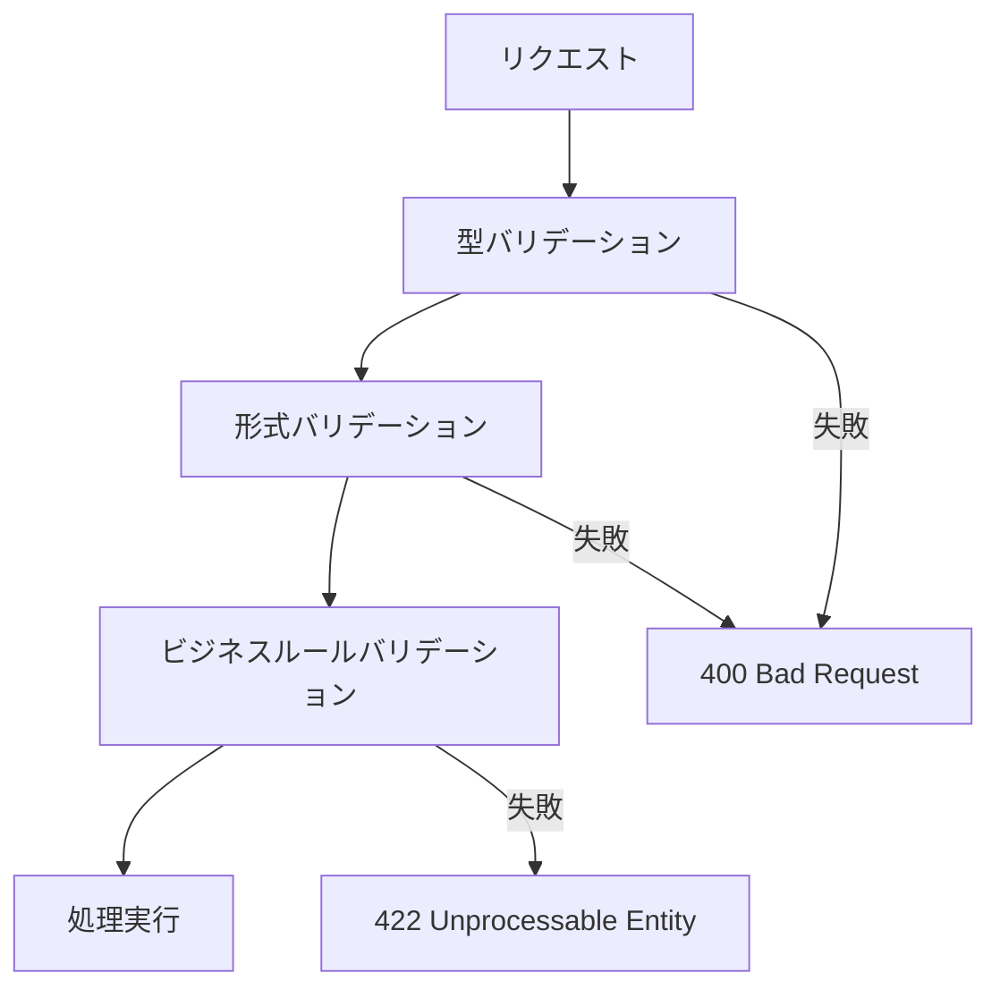
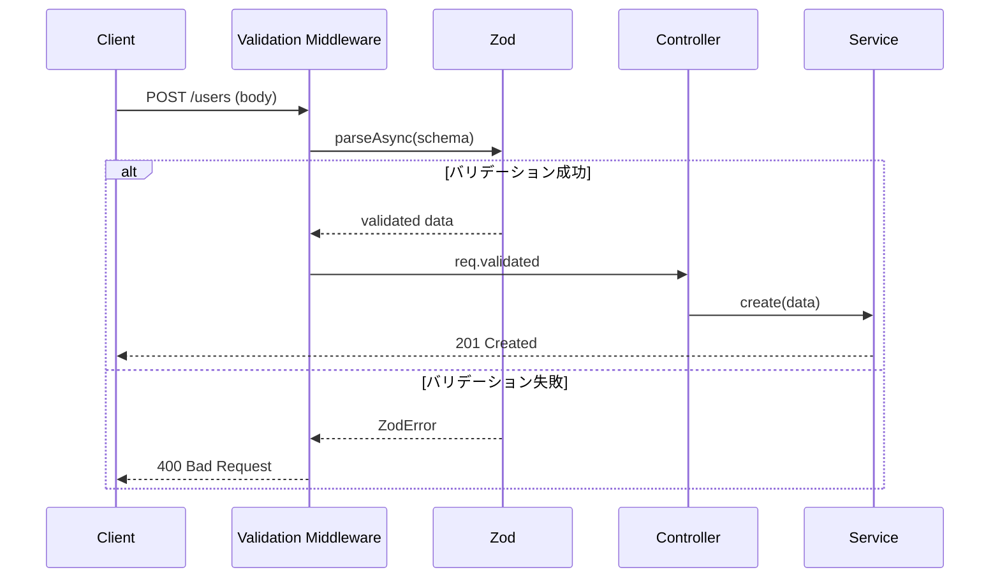

# バリデーション設計書

## 基本情報

| 項目 | 内容 |
|------|------|
| **機能名** | `[FeatureName]` |
| **作成日** | YYYY-MM-DD |
| **更新日** | YYYY-MM-DD |
| **担当者** | [担当者名] |

## 概要

入力値バリデーションの設計方針と実装ガイドラインを説明します。

## バリデーション戦略

### バリデーション階層



### バリデーション種別

| 種別 | 説明 | 例 |
|------|------|-----|
| 型バリデーション | データ型の検証 | string, number, boolean |
| 形式バリデーション | 形式の検証 | email, URL, 日付 |
| 範囲バリデーション | 値の範囲検証 | 最小/最大値、文字数 |
| パターンバリデーション | 正規表現による検証 | 電話番号、郵便番号 |
| ビジネスルール | ドメイン固有の検証 | 存在チェック、重複チェック |

## Zod スキーマ設計

### 基本スキーマ

```typescript
import { z } from 'zod';

// 共通のバリデーションルール
const schemas = {
  // ID
  id: z.string().uuid('無効なIDフォーマットです'),

  // メールアドレス
  email: z
    .string()
    .min(1, 'メールアドレスは必須です')
    .email('有効なメールアドレスを入力してください')
    .max(255, 'メールアドレスは255文字以内で入力してください'),

  // パスワード
  password: z
    .string()
    .min(8, 'パスワードは8文字以上で入力してください')
    .max(128, 'パスワードは128文字以内で入力してください')
    .regex(
      /^(?=.*[a-zA-Z])(?=.*[0-9])/,
      'パスワードは英字と数字を含む必要があります'
    ),

  // 電話番号
  phone: z
    .string()
    .regex(/^[0-9]{10,11}$/, '電話番号は10-11桁の数字で入力してください')
    .optional(),

  // 郵便番号
  postalCode: z
    .string()
    .regex(/^[0-9]{7}$/, '郵便番号は7桁の数字で入力してください'),

  // 日付
  date: z.coerce.date(),

  // ページネーション
  page: z.coerce.number().int().positive().default(1),
  limit: z.coerce.number().int().min(1).max(100).default(20),
};
```

### リクエストスキーマ

```typescript
// ユーザー作成リクエスト
export const createUserSchema = z.object({
  body: z.object({
    email: schemas.email,
    password: schemas.password,
    name: z.string().min(1, '名前は必須です').max(100),
    phone: schemas.phone,
    birthDate: schemas.date.optional(),
    role: z.enum(['user', 'admin']).default('user'),
  }),
});

// ユーザー更新リクエスト
export const updateUserSchema = z.object({
  params: z.object({
    id: schemas.id,
  }),
  body: z.object({
    name: z.string().min(1).max(100).optional(),
    phone: schemas.phone,
    birthDate: schemas.date.optional(),
  }),
});

// 一覧取得リクエスト
export const listUsersSchema = z.object({
  query: z.object({
    page: schemas.page,
    limit: schemas.limit,
    sort: z.enum(['createdAt', 'name', 'email']).default('createdAt'),
    order: z.enum(['asc', 'desc']).default('desc'),
    search: z.string().max(100).optional(),
  }),
});

// 型の抽出
export type CreateUserInput = z.infer<typeof createUserSchema>['body'];
export type UpdateUserInput = z.infer<typeof updateUserSchema>['body'];
export type ListUsersQuery = z.infer<typeof listUsersSchema>['query'];
```

### カスタムバリデーション

```typescript
// 将来の日付を禁止
const pastDate = z.date().refine(
  (date) => date <= new Date(),
  '過去の日付を選択してください'
);

// ユニーク制約のバリデーション
const uniqueEmail = z.string().email().refine(
  async (email) => {
    const exists = await userRepository.existsByEmail(email);
    return !exists;
  },
  'このメールアドレスは既に使用されています'
);

// 条件付きバリデーション
const conditionalSchema = z.object({
  type: z.enum(['individual', 'corporate']),
  companyName: z.string().optional(),
}).refine(
  (data) => {
    if (data.type === 'corporate') {
      return !!data.companyName;
    }
    return true;
  },
  {
    message: '法人の場合、会社名は必須です',
    path: ['companyName'],
  }
);
```

## バリデーションミドルウェア

### Express実装

```typescript
import { Request, Response, NextFunction } from 'express';
import { z, ZodError, ZodSchema } from 'zod';

interface ValidatedRequest<T> extends Request {
  validated: T;
}

export function validate<T extends ZodSchema>(schema: T) {
  return async (
    req: Request,
    res: Response,
    next: NextFunction
  ): Promise<void> => {
    try {
      const validated = await schema.parseAsync({
        body: req.body,
        query: req.query,
        params: req.params,
      });

      (req as ValidatedRequest<z.infer<T>>).validated = validated;
      next();
    } catch (error) {
      if (error instanceof ZodError) {
        const details = error.errors.map((err) => ({
          field: err.path.join('.'),
          code: err.code.toUpperCase(),
          message: err.message,
        }));

        res.status(400).json({
          error: {
            code: 'VALIDATION_ERROR',
            message: '入力値が不正です',
            details,
            requestId: req.id,
            timestamp: new Date().toISOString(),
          },
        });
        return;
      }
      next(error);
    }
  };
}

// 使用例
router.post(
  '/users',
  validate(createUserSchema),
  async (req: ValidatedRequest<typeof createUserSchema>, res) => {
    const { body } = req.validated;
    const user = await userService.create(body);
    res.status(201).json({ data: user });
  }
);
```

## サニタイズ

### 入力値のサニタイズ

```typescript
import DOMPurify from 'isomorphic-dompurify';

// HTMLサニタイズ
const sanitizeHtml = (input: string): string => {
  return DOMPurify.sanitize(input, { ALLOWED_TAGS: [] });
};

// トリム + HTML除去
const sanitizeString = z.string().transform((val) => {
  return sanitizeHtml(val.trim());
});

// サニタイズ付きスキーマ
export const sanitizedUserSchema = z.object({
  name: z.string().transform((val) => sanitizeHtml(val.trim())),
  bio: z.string().transform((val) => DOMPurify.sanitize(val, {
    ALLOWED_TAGS: ['b', 'i', 'a'],
    ALLOWED_ATTR: ['href'],
  })).optional(),
});
```

### SQLインジェクション対策

```typescript
// Prisma / Drizzle などのORMを使用
// パラメータ化クエリが自動的に適用される

// ❌ 危険: 文字列結合
const query = `SELECT * FROM users WHERE email = '${email}'`;

// ✅ 安全: パラメータ化
const user = await prisma.user.findUnique({
  where: { email },
});
```

## エラーメッセージ

### メッセージ設計

| エラー種別 | メッセージ例 |
|-----------|------------|
| 必須 | `[フィールド名]は必須です` |
| 形式 | `有効な[形式名]を入力してください` |
| 範囲（最小） | `[フィールド名]は[値]以上で入力してください` |
| 範囲（最大） | `[フィールド名]は[値]以下で入力してください` |
| 文字数（最小） | `[フィールド名]は[値]文字以上で入力してください` |
| 文字数（最大） | `[フィールド名]は[値]文字以内で入力してください` |
| 重複 | `この[フィールド名]は既に使用されています` |

### i18n対応

```typescript
const messages = {
  ja: {
    required: '{field}は必須です',
    email: '有効なメールアドレスを入力してください',
    min: '{field}は{min}以上で入力してください',
    max: '{field}は{max}以下で入力してください',
  },
  en: {
    required: '{field} is required',
    email: 'Please enter a valid email address',
    min: '{field} must be at least {min}',
    max: '{field} must be at most {max}',
  },
};

function getMessage(
  key: keyof typeof messages['ja'],
  locale: 'ja' | 'en',
  params: Record<string, string | number> = {}
): string {
  let message = messages[locale][key];
  for (const [param, value] of Object.entries(params)) {
    message = message.replace(`{${param}}`, String(value));
  }
  return message;
}
```

## バリデーションフロー



## テスト

### スキーマテスト

```typescript
describe('createUserSchema', () => {
  describe('email', () => {
    it('有効なメールアドレスを受け付ける', () => {
      const result = createUserSchema.safeParse({
        body: {
          email: 'test@example.com',
          password: 'password123',
          name: 'Test User',
        },
      });
      expect(result.success).toBe(true);
    });

    it('無効なメールアドレスを拒否する', () => {
      const result = createUserSchema.safeParse({
        body: {
          email: 'invalid-email',
          password: 'password123',
          name: 'Test User',
        },
      });
      expect(result.success).toBe(false);
      expect(result.error?.issues[0].path).toContain('email');
    });
  });

  describe('password', () => {
    it('8文字未満のパスワードを拒否する', () => {
      const result = createUserSchema.safeParse({
        body: {
          email: 'test@example.com',
          password: 'short',
          name: 'Test User',
        },
      });
      expect(result.success).toBe(false);
    });
  });
});
```

## 関連ドキュメント

- [API設計](./api-design)
- [エラーハンドリング](./error-handling)
- [フォーム設計](../frontend/form-design)

## 変更履歴

| バージョン | 日付 | 変更内容 |
|-----------|------|---------|
| 1.0.0 | YYYY-MM-DD | 初版作成 |
