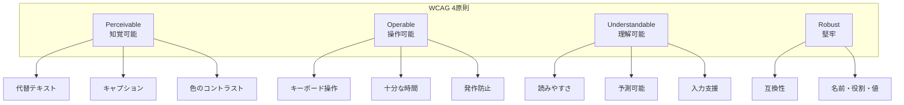
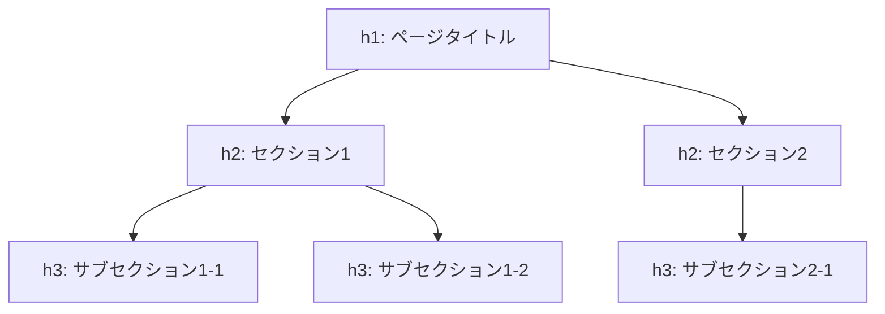
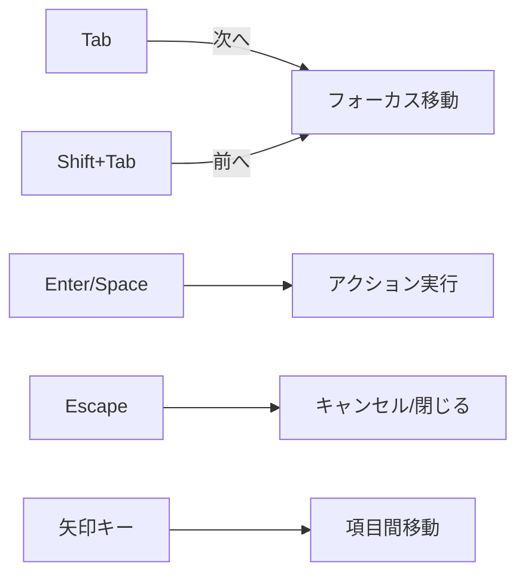
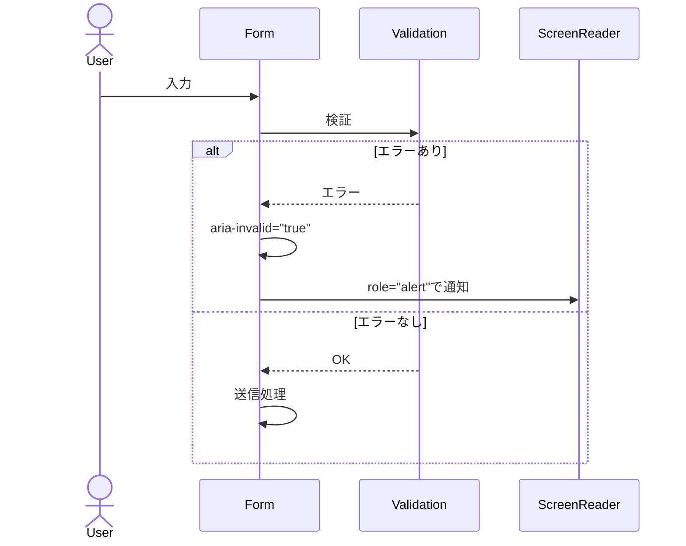

# アクセシビリティ設計書

## 基本情報

| 項目 | 内容 |
|------|------|
| **機能名** | `[FeatureName]` |
| **作成日** | YYYY-MM-DD |
| **更新日** | YYYY-MM-DD |
| **担当者** | [担当者名] |

## 概要

アクセシビリティ（a11y）設計の方針と実装ガイドラインを説明します。

## 準拠基準

### WCAG 2.1 準拠レベル

| レベル | 説明 | 対応状況 |
|-------|------|---------|
| A | 最低限のアクセシビリティ | 必須 |
| AA | 標準的なアクセシビリティ | 目標 |
| AAA | 最高レベル | 可能な範囲で対応 |

### 4原則（POUR）



## セマンティックHTML

### ランドマーク領域

```html
<header role="banner">
  <nav role="navigation" aria-label="メインナビゲーション">
    <!-- ナビゲーション -->
  </nav>
</header>

<main role="main" id="main-content">
  <article>
    <h1>ページタイトル</h1>
    <!-- メインコンテンツ -->
  </article>
</main>

<aside role="complementary" aria-label="関連情報">
  <!-- サイドバー -->
</aside>

<footer role="contentinfo">
  <!-- フッター -->
</footer>
```

### 見出し構造



```html
<h1>商品一覧</h1>
  <h2>カテゴリ: 電子機器</h2>
    <h3>スマートフォン</h3>
    <h3>タブレット</h3>
  <h2>カテゴリ: 家電</h2>
    <h3>テレビ</h3>
```

## ARIA属性

### 一般的なパターン

```tsx
// ボタン
<button
  aria-label="メニューを開く"
  aria-expanded={isOpen}
  aria-controls="menu-dropdown"
  aria-haspopup="true"
>
  <MenuIcon aria-hidden="true" />
</button>

// ダイアログ
<div
  role="dialog"
  aria-modal="true"
  aria-labelledby="dialog-title"
  aria-describedby="dialog-description"
>
  <h2 id="dialog-title">確認</h2>
  <p id="dialog-description">この操作を実行しますか？</p>
</div>

// ライブリージョン
<div
  role="status"
  aria-live="polite"
  aria-atomic="true"
>
  {statusMessage}
</div>

// アラート
<div
  role="alert"
  aria-live="assertive"
>
  {errorMessage}
</div>
```

### ARIA属性リファレンス

| 属性 | 用途 | 例 |
|------|------|-----|
| `aria-label` | ラベルテキスト | `aria-label="閉じる"` |
| `aria-labelledby` | 別要素をラベルとして参照 | `aria-labelledby="title-id"` |
| `aria-describedby` | 説明テキストを参照 | `aria-describedby="desc-id"` |
| `aria-expanded` | 展開状態 | `aria-expanded="true"` |
| `aria-hidden` | 支援技術から隠す | `aria-hidden="true"` |
| `aria-live` | 動的更新の通知 | `aria-live="polite"` |
| `aria-disabled` | 無効状態 | `aria-disabled="true"` |
| `aria-current` | 現在の項目 | `aria-current="page"` |

## キーボード操作

### フォーカス管理



### フォーカストラップ（モーダル内）

```tsx
import { useEffect, useRef } from 'react';

function Modal({ isOpen, onClose, children }) {
  const modalRef = useRef<HTMLDivElement>(null);
  const previousFocus = useRef<HTMLElement | null>(null);

  useEffect(() => {
    if (isOpen) {
      // フォーカスを保存
      previousFocus.current = document.activeElement as HTMLElement;

      // モーダル内の最初のフォーカス可能要素にフォーカス
      const firstFocusable = modalRef.current?.querySelector<HTMLElement>(
        'button, [href], input, select, textarea, [tabindex]:not([tabindex="-1"])'
      );
      firstFocusable?.focus();
    }

    return () => {
      // モーダルを閉じたら元のフォーカスに戻す
      previousFocus.current?.focus();
    };
  }, [isOpen]);

  // Escapeキーで閉じる
  useEffect(() => {
    const handleKeyDown = (e: KeyboardEvent) => {
      if (e.key === 'Escape') onClose();
    };
    document.addEventListener('keydown', handleKeyDown);
    return () => document.removeEventListener('keydown', handleKeyDown);
  }, [onClose]);

  if (!isOpen) return null;

  return (
    <div
      ref={modalRef}
      role="dialog"
      aria-modal="true"
      onKeyDown={handleTabKey}
    >
      {children}
    </div>
  );
}
```

### キーボードショートカット一覧

| コンテキスト | キー | 動作 |
|------------|------|------|
| 全般 | `Tab` | 次の要素へ |
| 全般 | `Shift+Tab` | 前の要素へ |
| ボタン | `Enter/Space` | 実行 |
| リンク | `Enter` | 遷移 |
| モーダル | `Escape` | 閉じる |
| ドロップダウン | `↑/↓` | 項目選択 |
| ドロップダウン | `Enter` | 選択確定 |
| タブ | `←/→` | タブ切り替え |

## カラーコントラスト

### コントラスト比要件

| 要素 | AA基準 | AAA基準 |
|------|--------|---------|
| 通常テキスト | 4.5:1 | 7:1 |
| 大きいテキスト (18pt+) | 3:1 | 4.5:1 |
| UI要素・グラフィック | 3:1 | - |

### カラーパレット（a11y対応）

| 用途 | 色 | 白背景でのコントラスト比 |
|------|-----|------------------------|
| 本文テキスト | `#1a1a1a` | 16.1:1 |
| サブテキスト | `#666666` | 5.7:1 |
| プライマリ | `#0066cc` | 4.5:1 |
| エラー | `#c41e3a` | 5.9:1 |
| 成功 | `#2e7d32` | 4.5:1 |

## フォーム

### アクセシブルなフォーム

```tsx
<form aria-labelledby="form-title">
  <h2 id="form-title">お問い合わせフォーム</h2>

  {/* 必須フィールド */}
  <div>
    <label htmlFor="email">
      メールアドレス
      <span aria-hidden="true" className="required">*</span>
    </label>
    <input
      id="email"
      type="email"
      aria-required="true"
      aria-describedby="email-hint email-error"
      aria-invalid={hasError}
    />
    <span id="email-hint" className="hint">
      例: example@email.com
    </span>
    {hasError && (
      <span id="email-error" role="alert" className="error">
        有効なメールアドレスを入力してください
      </span>
    )}
  </div>

  {/* 送信ボタン */}
  <button type="submit" aria-busy={isSubmitting}>
    {isSubmitting ? '送信中...' : '送信'}
  </button>
</form>
```

### エラーメッセージ



## 画像・メディア

### 代替テキスト

```tsx
// 情報を持つ画像


// 装飾的な画像


// 複雑な画像（長い説明）
<figure>
  
  <figcaption id="diagram-desc">
    フロントエンドからBFFを経由してバックエンドサービスに接続するアーキテクチャ。
    ユーザーリクエストはロードバランサーを通じて分散される。
  </figcaption>
</figure>
```

## テスト

### 自動テスト

```typescript
// jest-axe を使用
import { axe, toHaveNoViolations } from 'jest-axe';

expect.extend(toHaveNoViolations);

describe('Button accessibility', () => {
  it('アクセシビリティ違反がない', async () => {
    const { container } = render(<Button>Click me</Button>);
    const results = await axe(container);
    expect(results).toHaveNoViolations();
  });
});
```

### チェックリスト

- [ ] キーボードのみで全機能が操作可能
- [ ] フォーカスが視覚的に確認可能
- [ ] スクリーンリーダーで内容が理解可能
- [ ] カラーコントラストが基準を満たす
- [ ] 画像に適切な代替テキスト
- [ ] フォームにラベルとエラーメッセージ
- [ ] 動的コンテンツの変更が通知される

## 関連ドキュメント

- [コンポーネント設計](./component-design)
- [デザインシステム](./design-system)

## 変更履歴

| バージョン | 日付 | 変更内容 |
|-----------|------|---------|
| 1.0.0 | YYYY-MM-DD | 初版作成 |
