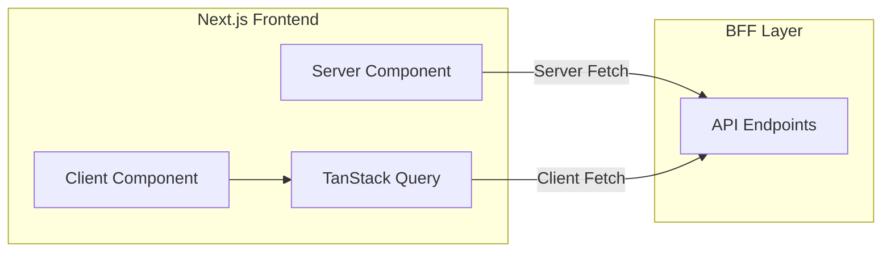
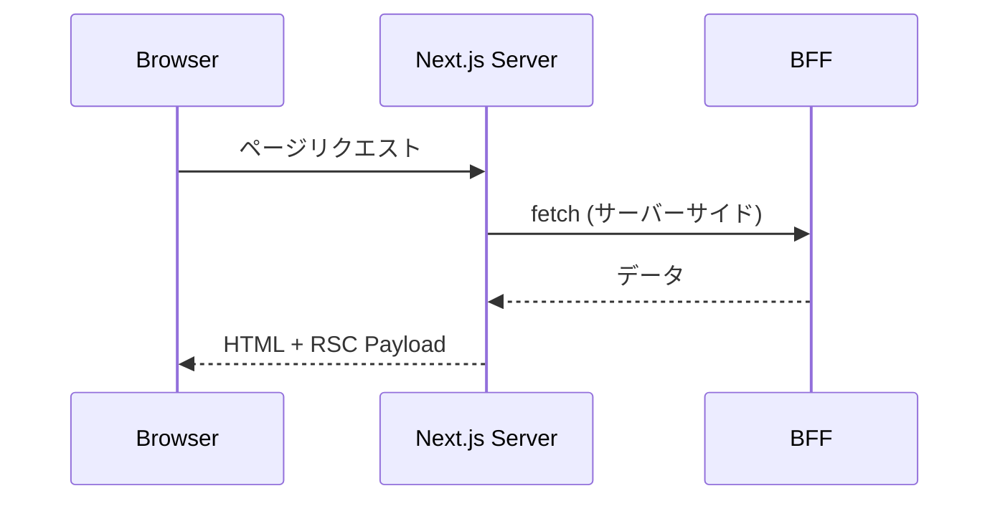
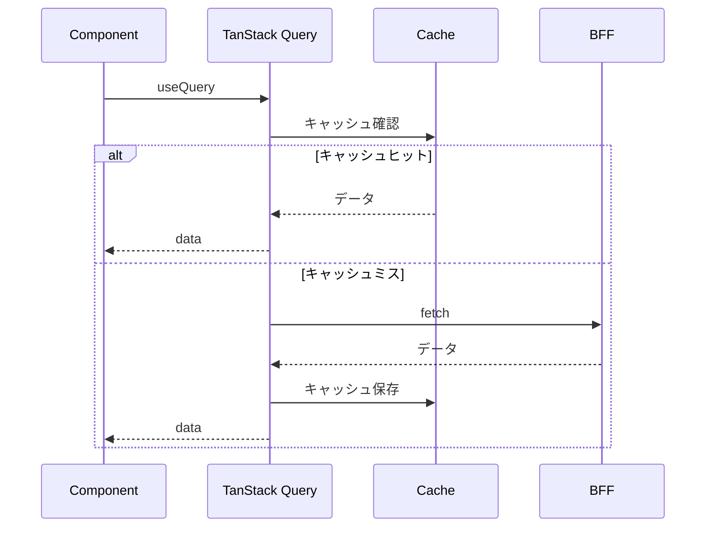
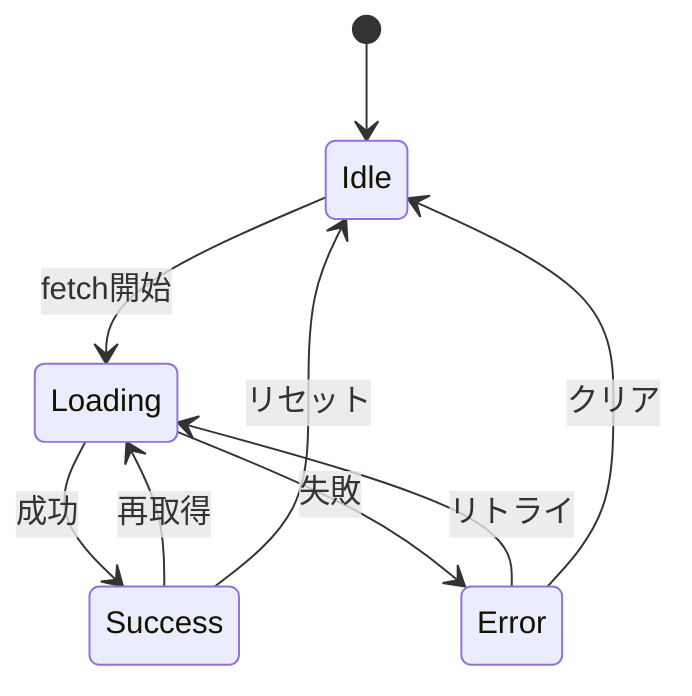

# API統合設計書

## 基本情報

| 項目 | 内容 |
|------|------|
| **機能名** | `[FeatureName]` |
| **作成日** | YYYY-MM-DD |
| **更新日** | YYYY-MM-DD |
| **担当者** | [担当者名] |

## 概要

BFF APIとの通信設計について説明します。

## アーキテクチャ

### 通信フロー



## API Client 設計

### 基本構成

```typescript
// lib/api/client.ts
const BASE_URL = process.env.NEXT_PUBLIC_API_URL || '/api';

interface FetchOptions extends RequestInit {
  params?: Record<string, string>;
}

class ApiClient {
  private baseUrl: string;

  constructor(baseUrl: string) {
    this.baseUrl = baseUrl;
  }

  async request<T>(
    endpoint: string,
    options: FetchOptions = {}
  ): Promise<T> {
    const { params, ...fetchOptions } = options;

    let url = `${this.baseUrl}${endpoint}`;
    if (params) {
      url += `?${new URLSearchParams(params)}`;
    }

    const response = await fetch(url, {
      ...fetchOptions,
      headers: {
        'Content-Type': 'application/json',
        ...fetchOptions.headers,
      },
    });

    if (!response.ok) {
      throw await this.handleError(response);
    }

    return response.json();
  }

  private async handleError(response: Response): Promise<ApiError> {
    const data = await response.json().catch(() => ({}));
    return new ApiError(
      data.error?.message || 'Unknown error',
      response.status,
      data.error?.code
    );
  }

  // 便利メソッド
  get<T>(endpoint: string, params?: Record<string, string>) {
    return this.request<T>(endpoint, { method: 'GET', params });
  }

  post<T>(endpoint: string, body: unknown) {
    return this.request<T>(endpoint, {
      method: 'POST',
      body: JSON.stringify(body),
    });
  }

  put<T>(endpoint: string, body: unknown) {
    return this.request<T>(endpoint, {
      method: 'PUT',
      body: JSON.stringify(body),
    });
  }

  delete<T>(endpoint: string) {
    return this.request<T>(endpoint, { method: 'DELETE' });
  }
}

export const apiClient = new ApiClient(BASE_URL);
```

### エラークラス

```typescript
// lib/api/errors.ts
export class ApiError extends Error {
  constructor(
    message: string,
    public status: number,
    public code?: string
  ) {
    super(message);
    this.name = 'ApiError';
  }

  get isUnauthorized() {
    return this.status === 401;
  }

  get isForbidden() {
    return this.status === 403;
  }

  get isNotFound() {
    return this.status === 404;
  }

  get isValidationError() {
    return this.status === 400 || this.status === 422;
  }

  get isServerError() {
    return this.status >= 500;
  }
}
```

## データフェッチパターン

### Server Component



```typescript
// app/products/page.tsx (Server Component)
async function ProductsPage() {
  const products = await apiClient.get<Product[]>('/products');

  return (
    <ProductList products={products} />
  );
}
```

### Client Component with TanStack Query



```typescript
// hooks/useProducts.ts
export function useProducts(filters?: ProductFilters) {
  return useQuery({
    queryKey: queryKeys.products.list(filters),
    queryFn: () => apiClient.get<Product[]>('/products', filters),
  });
}

// Component
function ProductList() {
  const { data, isLoading, error } = useProducts({ category: 'electronics' });

  if (isLoading) return <Skeleton />;
  if (error) return <ErrorMessage error={error} />;

  return <div>{data?.map(product => <ProductCard key={product.id} product={product} />)}</div>;
}
```

## エラーハンドリング

### エラー分類

| エラー種別 | HTTPステータス | ユーザー向け対応 |
|-----------|--------------|----------------|
| バリデーションエラー | 400, 422 | フィールドエラー表示 |
| 認証エラー | 401 | ログインページへリダイレクト |
| 権限エラー | 403 | エラーメッセージ表示 |
| Not Found | 404 | 404ページ表示 |
| サーバーエラー | 5xx | 汎用エラー表示 + リトライ |

### グローバルエラーハンドリング

```typescript
// providers/QueryProvider.tsx
const queryClient = new QueryClient({
  defaultOptions: {
    queries: {
      retry: (failureCount, error) => {
        if (error instanceof ApiError) {
          // 認証エラーはリトライしない
          if (error.isUnauthorized) return false;
          // サーバーエラーは3回までリトライ
          if (error.isServerError) return failureCount < 3;
        }
        return false;
      },
    },
    mutations: {
      onError: (error) => {
        if (error instanceof ApiError && error.isUnauthorized) {
          // 認証切れ時のリダイレクト
          window.location.href = '/login';
        }
      },
    },
  },
});
```

### コンポーネントレベルのエラー表示

```tsx
function ErrorMessage({ error }: { error: ApiError }) {
  if (error.isValidationError) {
    return (
      <Alert variant="warning">
        入力内容を確認してください
      </Alert>
    );
  }

  if (error.isServerError) {
    return (
      <Alert variant="error">
        サーバーエラーが発生しました。しばらくしてから再試行してください。
      </Alert>
    );
  }

  return (
    <Alert variant="error">
      {error.message}
    </Alert>
  );
}
```

## ローディング状態

### ローディングパターン



### Skeleton UI

```tsx
function ProductListSkeleton() {
  return (
    <div className="grid grid-cols-3 gap-4">
      {[...Array(6)].map((_, i) => (
        <div key={i} className="animate-pulse">
          <div className="bg-gray-200 h-48 rounded" />
          <div className="bg-gray-200 h-4 mt-2 rounded w-3/4" />
          <div className="bg-gray-200 h-4 mt-1 rounded w-1/2" />
        </div>
      ))}
    </div>
  );
}
```

## 型安全性

### API型定義

```typescript
// types/api.ts

// リクエスト型
interface CreateProductRequest {
  name: string;
  price: number;
  description?: string;
}

// レスポンス型
interface Product {
  id: string;
  name: string;
  price: number;
  description: string | null;
  createdAt: string;
  updatedAt: string;
}

interface PaginatedResponse<T> {
  data: T[];
  meta: {
    total: number;
    page: number;
    limit: number;
    totalPages: number;
  };
}

// API関数
async function createProduct(data: CreateProductRequest): Promise<Product> {
  return apiClient.post('/products', data);
}
```

### Zodによるランタイムバリデーション

```typescript
// schemas/product.ts
import { z } from 'zod';

export const productSchema = z.object({
  id: z.string(),
  name: z.string(),
  price: z.number(),
  description: z.string().nullable(),
  createdAt: z.string().datetime(),
  updatedAt: z.string().datetime(),
});

export type Product = z.infer<typeof productSchema>;

// APIレスポンスのバリデーション
async function fetchProducts(): Promise<Product[]> {
  const data = await apiClient.get('/products');
  return z.array(productSchema).parse(data);
}
```

## リトライ戦略

### 指数バックオフ

```typescript
// lib/api/retry.ts
export async function withRetry<T>(
  fn: () => Promise<T>,
  options: {
    maxRetries?: number;
    baseDelay?: number;
    maxDelay?: number;
  } = {}
): Promise<T> {
  const { maxRetries = 3, baseDelay = 1000, maxDelay = 30000 } = options;

  let lastError: Error;

  for (let attempt = 0; attempt < maxRetries; attempt++) {
    try {
      return await fn();
    } catch (error) {
      lastError = error as Error;

      if (error instanceof ApiError && !error.isServerError) {
        throw error; // サーバーエラー以外はリトライしない
      }

      const delay = Math.min(baseDelay * 2 ** attempt, maxDelay);
      await new Promise(resolve => setTimeout(resolve, delay));
    }
  }

  throw lastError!;
}
```

## 関連ドキュメント

- [状態管理設計](./state-management)
- [BFF API設計](../bff/api-design)
- [エラーハンドリング設計](../bff/error-handling)

## 変更履歴

| バージョン | 日付 | 変更内容 |
|-----------|------|---------|
| 1.0.0 | YYYY-MM-DD | 初版作成 |
