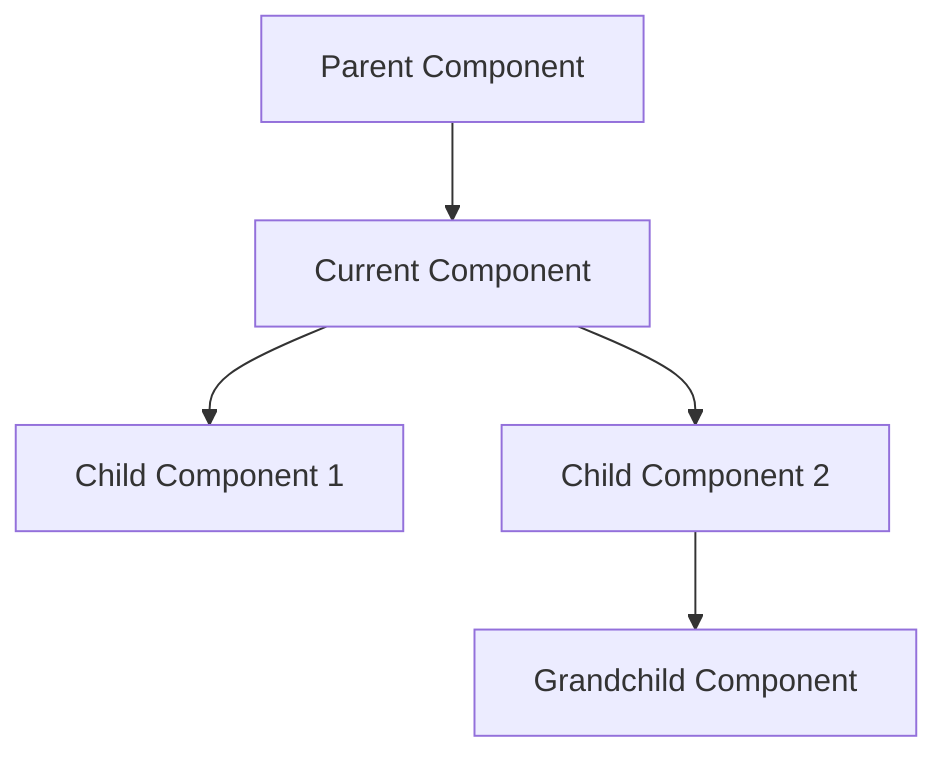
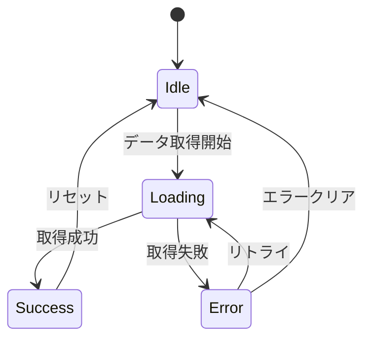
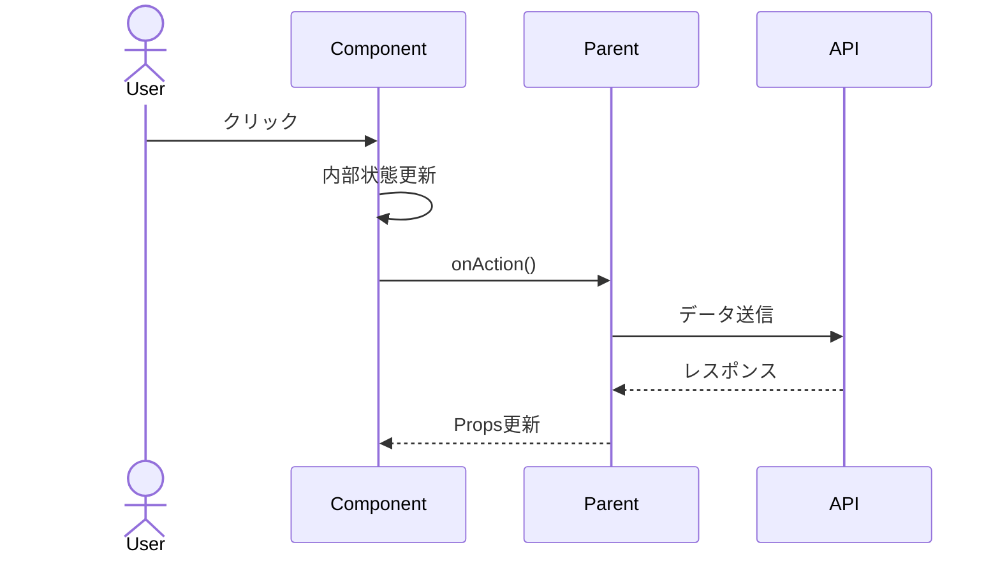

# コンポーネント設計書

## 基本情報

| 項目 | 内容 |
|------|------|
| **コンポーネント名** | `[ComponentName]` |
| **種別** | Atom / Molecule / Organism / Template |
| **作成日** | YYYY-MM-DD |
| **更新日** | YYYY-MM-DD |
| **担当者** | [担当者名] |

## 概要

コンポーネントの目的と責務を簡潔に説明します。

## コンポーネント階層



## Props API

### 必須Props

| Prop名 | 型 | 説明 |
|--------|-----|------|
| `id` | `string` | 一意識別子 |
| `data` | `DataType` | 表示データ |

### オプショナルProps

| Prop名 | 型 | デフォルト値 | 説明 |
|--------|-----|-------------|------|
| `variant` | `'primary' \| 'secondary'` | `'primary'` | 見た目のバリエーション |
| `size` | `'sm' \| 'md' \| 'lg'` | `'md'` | サイズ |
| `disabled` | `boolean` | `false` | 無効状態 |
| `className` | `string` | - | 追加のCSSクラス |
| `onAction` | `() => void` | - | アクション時のコールバック |

### 型定義

```typescript
interface ComponentProps {
  // 必須
  id: string;
  data: DataType;

  // オプショナル
  variant?: 'primary' | 'secondary';
  size?: 'sm' | 'md' | 'lg';
  disabled?: boolean;
  className?: string;
  onAction?: () => void;
}

interface DataType {
  title: string;
  description?: string;
  items: Item[];
}
```

## 状態管理

### 内部State

| State名 | 型 | 初期値 | 用途 |
|---------|-----|-------|------|
| `isOpen` | `boolean` | `false` | 開閉状態 |
| `selectedIndex` | `number` | `0` | 選択中のインデックス |

### 状態遷移図



## 合成パターン

### Compound Components

```tsx
<DataTable>
  <DataTable.Header>
    <DataTable.Column field="name">名前</DataTable.Column>
    <DataTable.Column field="status">ステータス</DataTable.Column>
  </DataTable.Header>
  <DataTable.Body>
    {data.map(item => (
      <DataTable.Row key={item.id} data={item} />
    ))}
  </DataTable.Body>
</DataTable>
```

### Render Props

```tsx
<DataFetcher
  url="/api/data"
  render={({ data, loading, error }) => (
    loading ? <Spinner /> : <DataDisplay data={data} />
  )}
/>
```

## インタラクション

### イベントフロー



### キーボード操作

| キー | 動作 |
|------|------|
| `Enter` | 選択確定 |
| `Escape` | キャンセル/閉じる |
| `ArrowUp/Down` | 項目間移動 |
| `Tab` | フォーカス移動 |

## アクセシビリティ

### ARIA属性

```tsx
<div
  role="button"
  aria-label="操作の説明"
  aria-expanded={isOpen}
  aria-controls="dropdown-id"
  tabIndex={0}
>
```

### チェックリスト

- [ ] 適切なrole属性
- [ ] aria-label/aria-labelledby
- [ ] フォーカス管理
- [ ] ライブリージョン（必要な場合）

## レスポンシブ対応

| ブレークポイント | 変更内容 |
|-----------------|---------|
| `< 640px` (sm) | 縦積みレイアウト |
| `640px - 1024px` (md) | 2カラム |
| `> 1024px` (lg) | 3カラム以上 |

## パフォーマンス考慮事項

### 最適化手法

- [ ] `React.memo` でメモ化
- [ ] `useMemo` で計算結果キャッシュ
- [ ] `useCallback` でコールバック安定化
- [ ] 仮想スクロール（大量データ時）

### 遅延読み込み

```tsx
const HeavyComponent = lazy(() => import('./HeavyComponent'));
```

## テスト方針

### 単体テスト

```typescript
describe('ComponentName', () => {
  it('デフォルトpropsで正しくレンダリングされる', () => {});
  it('disabled時にクリックが無効になる', () => {});
  it('キーボード操作が正しく動作する', () => {});
});
```

### テストケース一覧

| カテゴリ | テストケース | 優先度 |
|---------|------------|-------|
| レンダリング | デフォルト表示 | 高 |
| インタラクション | クリック動作 | 高 |
| アクセシビリティ | キーボード操作 | 中 |
| エッジケース | 空データ | 中 |

## 使用例

### 基本的な使用法

```tsx
import { ComponentName } from '@/components/ComponentName';

export function Example() {
  return (
    <ComponentName
      id="example-1"
      data={{ title: 'サンプル', items: [] }}
      onAction={() => console.log('action')}
    />
  );
}
```

## 関連コンポーネント

- [RelatedComponent1](./component-design): 関連性の説明
- [RelatedComponent2](./component-design): 関連性の説明

## 変更履歴

| バージョン | 日付 | 変更内容 |
|-----------|------|---------|
| 1.0.0 | YYYY-MM-DD | 初版作成 |
