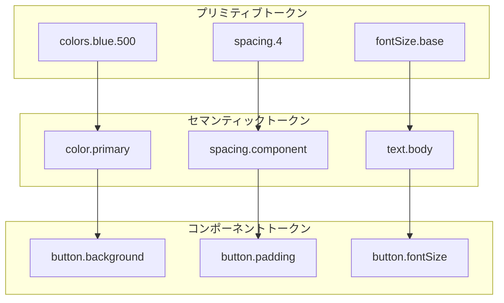
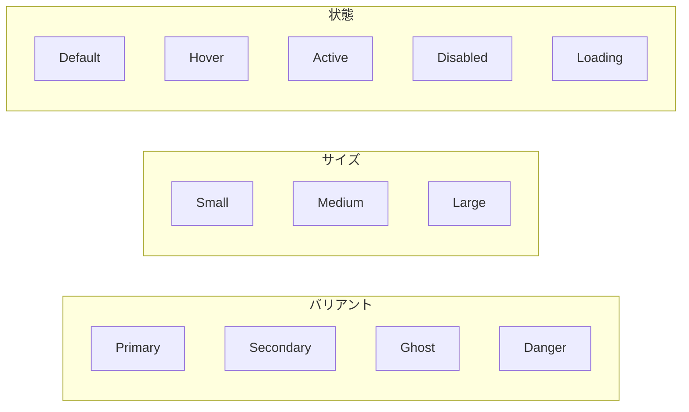

# デザインシステム設計書

## 基本情報

| 項目 | 内容 |
|------|------|
| **システム名** | `[DesignSystemName]` |
| **作成日** | YYYY-MM-DD |
| **更新日** | YYYY-MM-DD |
| **担当者** | [担当者名] |

## 概要

デザインシステムの構成要素と設計原則を説明します。

## デザイントークン

### トークン階層



### トークン定義（CSS Custom Properties）

```css
:root {
  /* プリミティブトークン */
  --color-blue-50: #eff6ff;
  --color-blue-100: #dbeafe;
  --color-blue-500: #3b82f6;
  --color-blue-600: #2563eb;
  --color-blue-700: #1d4ed8;

  --color-gray-50: #f9fafb;
  --color-gray-100: #f3f4f6;
  --color-gray-500: #6b7280;
  --color-gray-900: #111827;

  /* セマンティックトークン */
  --color-primary: var(--color-blue-600);
  --color-primary-hover: var(--color-blue-700);
  --color-text: var(--color-gray-900);
  --color-text-muted: var(--color-gray-500);
  --color-background: var(--color-gray-50);
  --color-surface: white;
}

/* ダークモード */
[data-theme="dark"] {
  --color-primary: var(--color-blue-500);
  --color-text: var(--color-gray-100);
  --color-text-muted: var(--color-gray-400);
  --color-background: var(--color-gray-900);
  --color-surface: var(--color-gray-800);
}
```

## カラーパレット

### ブランドカラー

| 名前 | Hex | 用途 |
|------|-----|------|
| Primary | `#2563eb` | メインアクション、リンク |
| Secondary | `#7c3aed` | サブアクション |
| Accent | `#06b6d4` | ハイライト |

### システムカラー

| 名前 | Hex | 用途 |
|------|-----|------|
| Success | `#22c55e` | 成功状態 |
| Warning | `#f59e0b` | 警告状態 |
| Error | `#ef4444` | エラー状態 |
| Info | `#3b82f6` | 情報状態 |

### グレースケール

| 名前 | Hex | 用途 |
|------|-----|------|
| Gray 50 | `#f9fafb` | 背景 |
| Gray 100 | `#f3f4f6` | サーフェス |
| Gray 300 | `#d1d5db` | ボーダー |
| Gray 500 | `#6b7280` | プレースホルダー |
| Gray 700 | `#374151` | サブテキスト |
| Gray 900 | `#111827` | 本文テキスト |

## タイポグラフィ

### フォントファミリー

```css
:root {
  --font-sans: 'Inter', 'Noto Sans JP', sans-serif;
  --font-mono: 'JetBrains Mono', monospace;
}
```

### フォントサイズスケール

| トークン | サイズ | 行間 | 用途 |
|---------|-------|------|------|
| `text-xs` | 12px | 16px | キャプション |
| `text-sm` | 14px | 20px | 補足テキスト |
| `text-base` | 16px | 24px | 本文 |
| `text-lg` | 18px | 28px | リード文 |
| `text-xl` | 20px | 28px | h4 |
| `text-2xl` | 24px | 32px | h3 |
| `text-3xl` | 30px | 36px | h2 |
| `text-4xl` | 36px | 40px | h1 |

### テキストスタイル

```css
.text-heading {
  font-family: var(--font-sans);
  font-weight: 700;
  letter-spacing: -0.02em;
}

.text-body {
  font-family: var(--font-sans);
  font-weight: 400;
  letter-spacing: 0;
}

.text-code {
  font-family: var(--font-mono);
  font-size: 0.875em;
}
```

## スペーシング

### スペーシングスケール

| トークン | 値 | 用途 |
|---------|-----|------|
| `space-0` | 0 | - |
| `space-1` | 4px | 最小間隔 |
| `space-2` | 8px | 要素内パディング |
| `space-3` | 12px | 小さな間隔 |
| `space-4` | 16px | 標準間隔 |
| `space-6` | 24px | セクション内 |
| `space-8` | 32px | セクション間 |
| `space-12` | 48px | 大きな区切り |
| `space-16` | 64px | ページセクション |

### レイアウトグリッド

```css
.container {
  max-width: 1280px;
  margin: 0 auto;
  padding: 0 var(--space-4);
}

@media (min-width: 640px) {
  .container {
    padding: 0 var(--space-6);
  }
}

@media (min-width: 1024px) {
  .container {
    padding: 0 var(--space-8);
  }
}
```

## コンポーネント

### Button



| プロパティ | Primary | Secondary | Ghost |
|-----------|---------|-----------|-------|
| Background | `--color-primary` | `transparent` | `transparent` |
| Border | `none` | `1px solid --color-primary` | `none` |
| Text | `white` | `--color-primary` | `--color-primary` |
| Hover BG | `--color-primary-hover` | `--color-primary/10` | `--color-gray-100` |

### Input

| 状態 | Border | Background | 備考 |
|------|--------|------------|------|
| Default | `--color-gray-300` | `white` | |
| Focus | `--color-primary` | `white` | + ring |
| Error | `--color-error` | `--color-error/5` | |
| Disabled | `--color-gray-200` | `--color-gray-50` | |

### Card

```css
.card {
  background: var(--color-surface);
  border-radius: var(--radius-lg);
  box-shadow: var(--shadow-sm);
  padding: var(--space-6);
}

.card-hover {
  transition: box-shadow 0.2s, transform 0.2s;
}

.card-hover:hover {
  box-shadow: var(--shadow-md);
  transform: translateY(-2px);
}
```

## シャドウ

| トークン | 値 | 用途 |
|---------|-----|------|
| `shadow-sm` | `0 1px 2px rgba(0,0,0,0.05)` | カード、ボタン |
| `shadow-md` | `0 4px 6px rgba(0,0,0,0.1)` | ホバー状態 |
| `shadow-lg` | `0 10px 15px rgba(0,0,0,0.1)` | ドロップダウン |
| `shadow-xl` | `0 20px 25px rgba(0,0,0,0.1)` | モーダル |

## ボーダー半径

| トークン | 値 | 用途 |
|---------|-----|------|
| `radius-sm` | 4px | 小さな要素 |
| `radius-md` | 8px | ボタン、インプット |
| `radius-lg` | 12px | カード |
| `radius-xl` | 16px | モーダル |
| `radius-full` | 9999px | ピル、アバター |

## アニメーション

### トランジション

```css
:root {
  --duration-fast: 150ms;
  --duration-normal: 200ms;
  --duration-slow: 300ms;

  --ease-in: cubic-bezier(0.4, 0, 1, 1);
  --ease-out: cubic-bezier(0, 0, 0.2, 1);
  --ease-in-out: cubic-bezier(0.4, 0, 0.2, 1);
}

.transition-colors {
  transition: color var(--duration-fast) var(--ease-out),
              background-color var(--duration-fast) var(--ease-out);
}

.transition-transform {
  transition: transform var(--duration-normal) var(--ease-out);
}
```

### アニメーションパターン

| 名前 | 用途 | 時間 |
|------|------|------|
| Fade In | 要素の表示 | 200ms |
| Slide Up | モーダル、トースト | 300ms |
| Scale | ボタンのホバー | 150ms |
| Spin | ローディング | 1s (infinite) |

## アイコン

### アイコンサイズ

| トークン | サイズ | 用途 |
|---------|-------|------|
| `icon-xs` | 12px | インラインアイコン |
| `icon-sm` | 16px | ボタン内 |
| `icon-md` | 20px | 標準 |
| `icon-lg` | 24px | ナビゲーション |
| `icon-xl` | 32px | 空状態 |

### 使用ガイドライン

```tsx
// アイコンボタン
<button aria-label="設定">
  <SettingsIcon className="icon-md" aria-hidden="true" />
</button>

// テキスト付きボタン
<button>
  <PlusIcon className="icon-sm mr-2" aria-hidden="true" />
  追加
</button>
```

## 関連ドキュメント

- [コンポーネント設計](./component-design)
- [アクセシビリティ設計](./accessibility-design)

## 変更履歴

| バージョン | 日付 | 変更内容 |
|-----------|------|---------|
| 1.0.0 | YYYY-MM-DD | 初版作成 |
