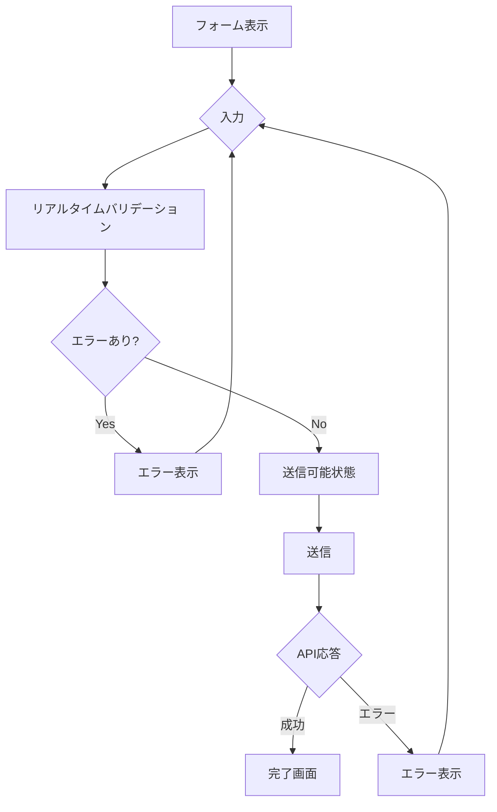
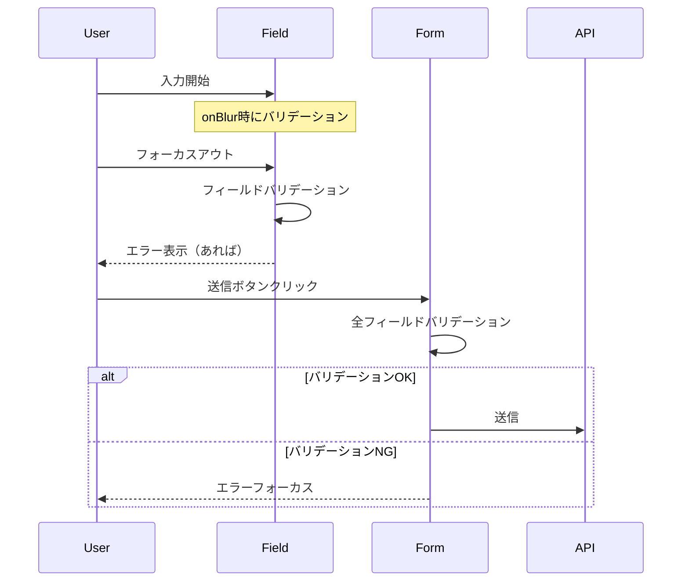
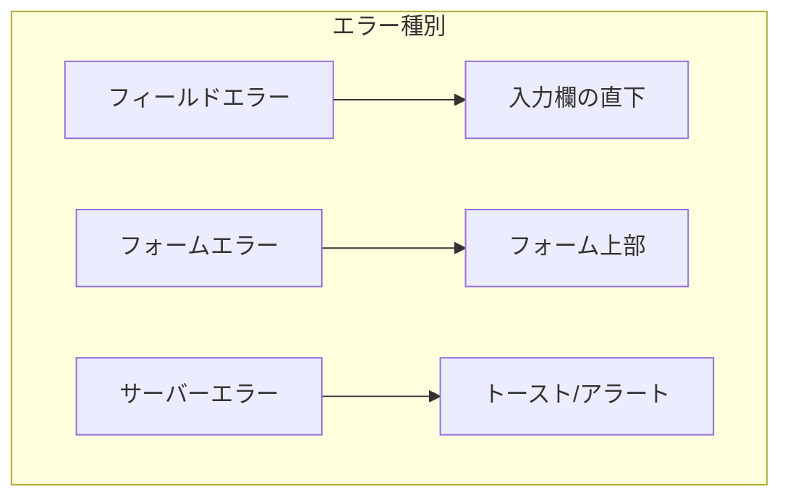
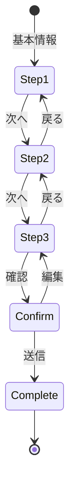

# フォーム設計書

## 基本情報

| 項目 | 内容 |
|------|------|
| **フォーム名** | `[FormName]` |
| **作成日** | YYYY-MM-DD |
| **更新日** | YYYY-MM-DD |
| **担当者** | [担当者名] |

## 概要

フォームの目的と設計方針を説明します。

## フォーム構成

### フィールド一覧

| フィールド名 | 型 | 必須 | バリデーション | 備考 |
|-------------|-----|------|--------------|------|
| `email` | `string` | Yes | email形式 | |
| `password` | `string` | Yes | 8文字以上、英数字混在 | |
| `name` | `string` | Yes | 1-100文字 | |
| `phone` | `string` | No | 電話番号形式 | ハイフンなし |
| `birthDate` | `date` | No | 過去の日付 | |
| `agreeTerms` | `boolean` | Yes | true必須 | |

### フォームフロー



## バリデーション設計

### Zodスキーマ

```typescript
import { z } from 'zod';

export const userFormSchema = z.object({
  email: z
    .string()
    .min(1, 'メールアドレスは必須です')
    .email('有効なメールアドレスを入力してください'),

  password: z
    .string()
    .min(8, 'パスワードは8文字以上で入力してください')
    .regex(
      /^(?=.*[a-zA-Z])(?=.*[0-9])/,
      'パスワードは英字と数字を含む必要があります'
    ),

  name: z
    .string()
    .min(1, '名前は必須です')
    .max(100, '名前は100文字以内で入力してください'),

  phone: z
    .string()
    .regex(/^[0-9]{10,11}$/, '電話番号は10-11桁の数字で入力してください')
    .optional()
    .or(z.literal('')),

  birthDate: z
    .date()
    .max(new Date(), '生年月日は過去の日付を選択してください')
    .optional(),

  agreeTerms: z
    .boolean()
    .refine((val) => val === true, '利用規約に同意してください'),
});

export type UserFormData = z.infer<typeof userFormSchema>;
```

### バリデーションタイミング



| タイミング | トリガー | 対象 |
|-----------|---------|------|
| onChange | 入力中 | 特定フィールドのみ（任意） |
| onBlur | フォーカスアウト | 該当フィールド |
| onSubmit | 送信時 | 全フィールド |

## React Hook Form 実装

### 基本構成

```typescript
import { useForm } from 'react-hook-form';
import { zodResolver } from '@hookform/resolvers/zod';

export function UserForm({ onSubmit }: UserFormProps) {
  const {
    register,
    handleSubmit,
    formState: { errors, isSubmitting, isDirty, isValid },
    setError,
    reset,
  } = useForm<UserFormData>({
    resolver: zodResolver(userFormSchema),
    mode: 'onBlur', // バリデーションタイミング
    defaultValues: {
      email: '',
      password: '',
      name: '',
      phone: '',
      agreeTerms: false,
    },
  });

  const onSubmitHandler = async (data: UserFormData) => {
    try {
      await onSubmit(data);
      reset();
    } catch (error) {
      if (error instanceof ApiError && error.code === 'EMAIL_EXISTS') {
        setError('email', {
          type: 'server',
          message: 'このメールアドレスは既に使用されています',
        });
      }
    }
  };

  return (
    <form onSubmit={handleSubmit(onSubmitHandler)}>
      {/* フィールド */}
    </form>
  );
}
```

### フィールドコンポーネント

```tsx
interface FormFieldProps {
  label: string;
  name: string;
  type?: string;
  required?: boolean;
  error?: string;
  hint?: string;
}

function FormField({
  label,
  name,
  type = 'text',
  required,
  error,
  hint,
  ...inputProps
}: FormFieldProps) {
  const id = `field-${name}`;
  const errorId = `${id}-error`;
  const hintId = `${id}-hint`;

  return (
    <div className="form-field">
      <label htmlFor={id}>
        {label}
        {required && <span className="required" aria-hidden="true">*</span>}
      </label>

      <input
        id={id}
        type={type}
        aria-required={required}
        aria-invalid={!!error}
        aria-describedby={`${hint ? hintId : ''} ${error ? errorId : ''}`.trim()}
        {...inputProps}
      />

      {hint && (
        <span id={hintId} className="hint">
          {hint}
        </span>
      )}

      {error && (
        <span id={errorId} className="error" role="alert">
          {error}
        </span>
      )}
    </div>
  );
}
```

## エラー表示

### エラー表示パターン



### エラーメッセージ設計

| エラー種別 | 表示位置 | スタイル |
|-----------|---------|---------|
| バリデーションエラー | フィールド直下 | 赤テキスト + アイコン |
| サーバーエラー（フィールド） | フィールド直下 | 赤テキスト |
| サーバーエラー（全般） | フォーム上部 | アラートボックス |
| ネットワークエラー | トースト | エラートースト |

### エラーフォーカス

```typescript
// エラー時に最初のエラーフィールドにフォーカス
useEffect(() => {
  const firstError = Object.keys(errors)[0];
  if (firstError) {
    const element = document.querySelector(`[name="${firstError}"]`);
    element?.focus();
  }
}, [errors]);
```

## マルチステップフォーム

### ステップ構成



### ステップ実装

```typescript
type Step = 'basic' | 'detail' | 'confirm';

function MultiStepForm() {
  const [step, setStep] = useState<Step>('basic');
  const [formData, setFormData] = useState<Partial<FormData>>({});

  const updateFormData = (data: Partial<FormData>) => {
    setFormData((prev) => ({ ...prev, ...data }));
  };

  const nextStep = () => {
    const steps: Step[] = ['basic', 'detail', 'confirm'];
    const currentIndex = steps.indexOf(step);
    if (currentIndex < steps.length - 1) {
      setStep(steps[currentIndex + 1]);
    }
  };

  const prevStep = () => {
    const steps: Step[] = ['basic', 'detail', 'confirm'];
    const currentIndex = steps.indexOf(step);
    if (currentIndex > 0) {
      setStep(steps[currentIndex - 1]);
    }
  };

  return (
    <div>
      <StepIndicator currentStep={step} />

      {step === 'basic' && (
        <BasicInfoStep
          data={formData}
          onNext={(data) => {
            updateFormData(data);
            nextStep();
          }}
        />
      )}

      {step === 'detail' && (
        <DetailStep
          data={formData}
          onNext={(data) => {
            updateFormData(data);
            nextStep();
          }}
          onBack={prevStep}
        />
      )}

      {step === 'confirm' && (
        <ConfirmStep
          data={formData}
          onSubmit={handleSubmit}
          onBack={prevStep}
        />
      )}
    </div>
  );
}
```

## 自動保存

### 実装パターン

```typescript
function AutoSaveForm() {
  const form = useForm<FormData>();
  const { watch } = form;

  // デバウンスして自動保存
  const formValues = watch();

  useEffect(() => {
    const timeoutId = setTimeout(() => {
      localStorage.setItem('form-draft', JSON.stringify(formValues));
    }, 1000);

    return () => clearTimeout(timeoutId);
  }, [formValues]);

  // 初期値の復元
  useEffect(() => {
    const draft = localStorage.getItem('form-draft');
    if (draft) {
      form.reset(JSON.parse(draft));
    }
  }, []);

  return <form>{/* フィールド */}</form>;
}
```

## ファイルアップロード

### ドラッグ&ドロップ

```tsx
function FileUpload({ onUpload }: { onUpload: (files: File[]) => void }) {
  const [isDragging, setIsDragging] = useState(false);

  const handleDrop = (e: React.DragEvent) => {
    e.preventDefault();
    setIsDragging(false);
    const files = Array.from(e.dataTransfer.files);
    onUpload(files);
  };

  return (
    <div
      className={`dropzone ${isDragging ? 'dragging' : ''}`}
      onDragOver={(e) => {
        e.preventDefault();
        setIsDragging(true);
      }}
      onDragLeave={() => setIsDragging(false)}
      onDrop={handleDrop}
      role="button"
      tabIndex={0}
      aria-label="ファイルをドロップまたはクリックしてアップロード"
    >
      <p>ファイルをドラッグ&ドロップ</p>
      <p>または</p>
      <input
        type="file"
        multiple
        onChange={(e) => onUpload(Array.from(e.target.files || []))}
      />
    </div>
  );
}
```

## テスト

### フォームテスト

```typescript
describe('UserForm', () => {
  it('バリデーションエラーが表示される', async () => {
    const user = userEvent.setup();
    render(<UserForm onSubmit={vi.fn()} />);

    // 空のまま送信
    await user.click(screen.getByRole('button', { name: '送信' }));

    expect(await screen.findByText('メールアドレスは必須です')).toBeInTheDocument();
    expect(await screen.findByText('パスワードは8文字以上で入力してください')).toBeInTheDocument();
  });

  it('正しい入力で送信される', async () => {
    const onSubmit = vi.fn();
    const user = userEvent.setup();
    render(<UserForm onSubmit={onSubmit} />);

    await user.type(screen.getByLabelText('メールアドレス'), 'test@example.com');
    await user.type(screen.getByLabelText('パスワード'), 'password123');
    await user.type(screen.getByLabelText('名前'), 'テスト太郎');
    await user.click(screen.getByLabelText('利用規約に同意する'));
    await user.click(screen.getByRole('button', { name: '送信' }));

    await waitFor(() => {
      expect(onSubmit).toHaveBeenCalledWith({
        email: 'test@example.com',
        password: 'password123',
        name: 'テスト太郎',
        phone: '',
        agreeTerms: true,
      });
    });
  });
});
```

## 関連ドキュメント

- [状態管理設計](./state-management)
- [バリデーション設計](../bff/validation-design)
- [アクセシビリティ設計](./accessibility-design)

## 変更履歴

| バージョン | 日付 | 変更内容 |
|-----------|------|---------|
| 1.0.0 | YYYY-MM-DD | 初版作成 |
