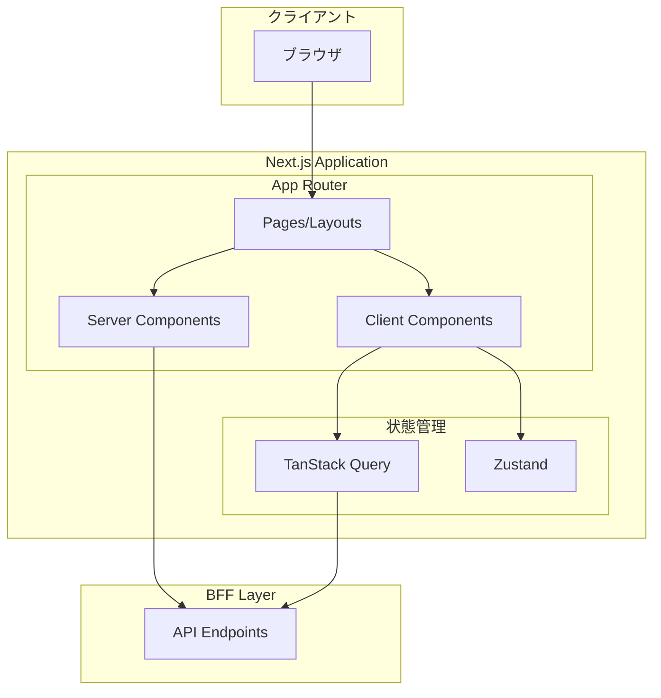

# フロントエンド設計概要

フロントエンド（React/Next.js）の設計に関するドキュメント群です。

## 技術スタック

| カテゴリ | 技術 |
|---------|------|
| **フレームワーク** | Next.js (App Router) |
| **UIライブラリ** | React |
| **状態管理** | Zustand / Jotai |
| **サーバー状態** | TanStack Query |
| **スタイリング** | CSS Modules / Tailwind CSS |
| **テスト** | Jest, Testing Library, Playwright |
| **バリデーション** | Zod |

## アーキテクチャ概要



## ドキュメント一覧

| ドキュメント | 概要 |
|-------------|------|
| [コンポーネント設計](./component-design) | Atomic Design、Props API、合成パターン |
| [ページ設計](./page-design) | レイアウト、ルーティング、データフェッチ |
| [状態管理](./state-management) | グローバル/サーバー状態の設計パターン |
| [ルーティング設計](./routing-design) | App Router、認証フロー、ミドルウェア |
| [API統合](./api-integration) | BFF通信、エラーハンドリング、型安全 |
| [パフォーマンス設計](./performance-design) | Core Web Vitals、最適化戦略 |
| [テスト設計](./testing-design) | 単体/統合/E2Eテスト戦略 |
| [アクセシビリティ設計](./accessibility-design) | WCAG準拠、ARIA、キーボード操作 |
| [デザインシステム](./design-system) | トークン、タイポグラフィ、スペーシング |
| [フォーム設計](./form-design) | バリデーション、エラー表示、マルチステップ |

## ディレクトリ構成例

```
src/
├── app/                    # Next.js App Router
│   ├── layout.tsx
│   ├── page.tsx
│   ├── (auth)/            # 認証グループ
│   └── (main)/            # メインコンテンツグループ
├── components/
│   ├── ui/                # 汎用UIコンポーネント
│   ├── features/          # 機能別コンポーネント
│   └── layouts/           # レイアウトコンポーネント
├── hooks/                 # カスタムフック
├── stores/                # Zustand stores
├── lib/                   # ユーティリティ
├── types/                 # 型定義
└── styles/                # グローバルスタイル
```
