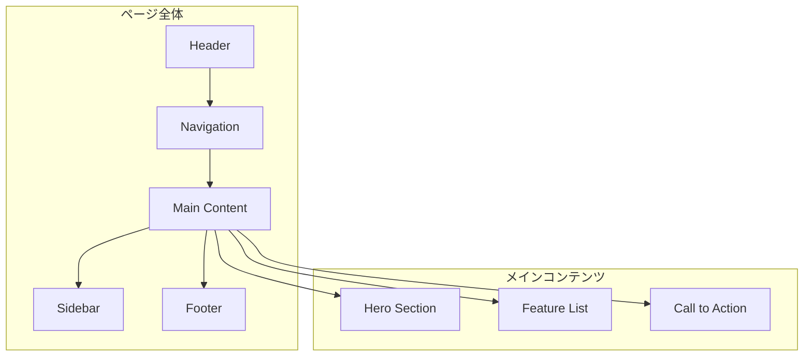
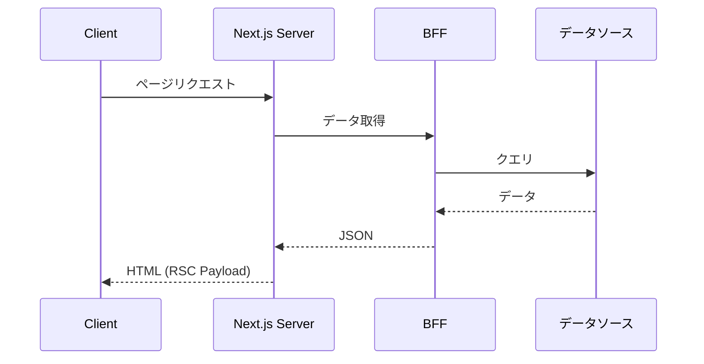
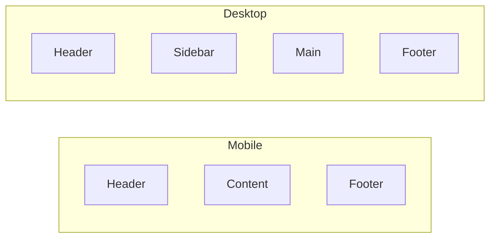
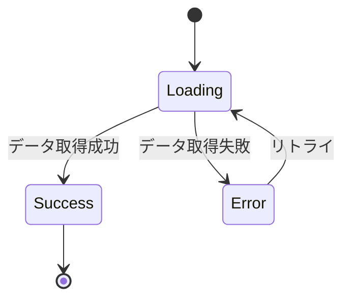
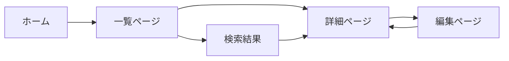

# ページ/画面設計書

## 基本情報

| 項目 | 内容 |
|------|------|
| **ページ名** | `[PageName]` |
| **URL パス** | `/path/to/page` |
| **作成日** | YYYY-MM-DD |
| **更新日** | YYYY-MM-DD |
| **担当者** | [担当者名] |

## 概要

ページの目的と主要機能を説明します。

## ページ構成

### 情報アーキテクチャ



### ワイヤーフレーム

```
+------------------------------------------+
|              Header / Nav                |
+------------------------------------------+
|                                          |
|            Hero Section                  |
|                                          |
+------------------------------------------+
|  Content Area          |    Sidebar     |
|                        |                |
|  - Section 1           |  - Widget 1   |
|  - Section 2           |  - Widget 2   |
|  - Section 3           |               |
|                        |               |
+------------------------------------------+
|              Footer                      |
+------------------------------------------+
```

## ルーティング

### Next.js App Router 構造

```
app/
├── layout.tsx           # 共通レイアウト
├── page.tsx             # ホームページ
├── [locale]/            # i18n対応
│   ├── layout.tsx
│   └── page/
│       ├── page.tsx     # 対象ページ
│       └── loading.tsx  # ローディングUI
```

### 動的ルート

| パラメータ | 型 | 例 | 説明 |
|-----------|-----|-----|------|
| `[id]` | `string` | `abc123` | リソースID |
| `[...slug]` | `string[]` | `['a', 'b']` | 可変パス |

## データフェッチ

### サーバーコンポーネント



### データ取得パターン

| データ種別 | 取得方法 | キャッシュ戦略 |
|-----------|---------|--------------|
| ユーザー情報 | Server Component | no-store |
| 商品一覧 | Server Component | revalidate: 60 |
| 静的コンテンツ | generateStaticParams | static |

## レイアウト設計

### レスポンシブブレークポイント

| ブレークポイント | 幅 | レイアウト |
|-----------------|-----|-----------|
| Mobile | < 640px | シングルカラム |
| Tablet | 640px - 1024px | 2カラム |
| Desktop | > 1024px | 3カラム + サイドバー |

### レイアウト図



## 状態管理

### ページ状態

| 状態 | 型 | 管理方法 | 説明 |
|------|-----|---------|------|
| `filters` | `FilterState` | URL Query | フィルター条件 |
| `selectedItem` | `Item \| null` | Zustand | 選択中アイテム |
| `serverData` | `Data[]` | TanStack Query | サーバーデータ |

### URL状態管理

```typescript
// nuqs等でのURL状態管理
const [page, setPage] = useQueryState('page', parseAsInteger.withDefault(1));
const [sort, setSort] = useQueryState('sort', parseAsString.withDefault('date'));
```

## SEO / メタデータ

### 静的メタデータ

```typescript
export const metadata: Metadata = {
  title: 'ページタイトル | サイト名',
  description: 'ページの説明文（120-160文字）',
  openGraph: {
    title: 'OGP タイトル',
    description: 'OGP 説明',
    images: ['/og-image.png'],
  },
};
```

### 動的メタデータ

```typescript
export async function generateMetadata({ params }): Promise<Metadata> {
  const data = await fetchData(params.id);
  return {
    title: data.title,
    description: data.description,
  };
}
```

## ローディング / エラー状態

### ローディングUI



### Suspense境界

```tsx
<Suspense fallback={<PageSkeleton />}>
  <DataSection />
</Suspense>
```

### Error Boundary

```tsx
<ErrorBoundary fallback={<ErrorMessage />}>
  <RiskyComponent />
</ErrorBoundary>
```

## アクセシビリティ

### ランドマーク

```html
<header role="banner">...</header>
<nav role="navigation">...</nav>
<main role="main">...</main>
<aside role="complementary">...</aside>
<footer role="contentinfo">...</footer>
```

### スキップリンク

```tsx
<a href="#main-content" className="skip-link">
  メインコンテンツへスキップ
</a>
```

## パフォーマンス要件

### Core Web Vitals 目標

| 指標 | 目標値 | 測定方法 |
|------|-------|---------|
| LCP | < 2.5s | Lighthouse |
| FID | < 100ms | Web Vitals |
| CLS | < 0.1 | Lighthouse |
| TTFB | < 600ms | DevTools |

### 最適化戦略

- [ ] 画像最適化（next/image）
- [ ] フォント最適化（next/font）
- [ ] コード分割（dynamic import）
- [ ] プリフェッチ（Link prefetch）

## セキュリティ考慮事項

- [ ] XSS対策（サニタイズ）
- [ ] CSRF対策（トークン）
- [ ] 認証状態チェック
- [ ] 権限チェック

## 画面遷移



## 関連ドキュメント

- [APIエンドポイント仕様](../bff/api-design)
- [認証フロー](./routing-design)
- [共通コンポーネント](./component-design)

## 変更履歴

| バージョン | 日付 | 変更内容 |
|-----------|------|---------|
| 1.0.0 | YYYY-MM-DD | 初版作成 |
