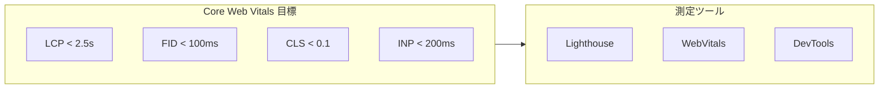
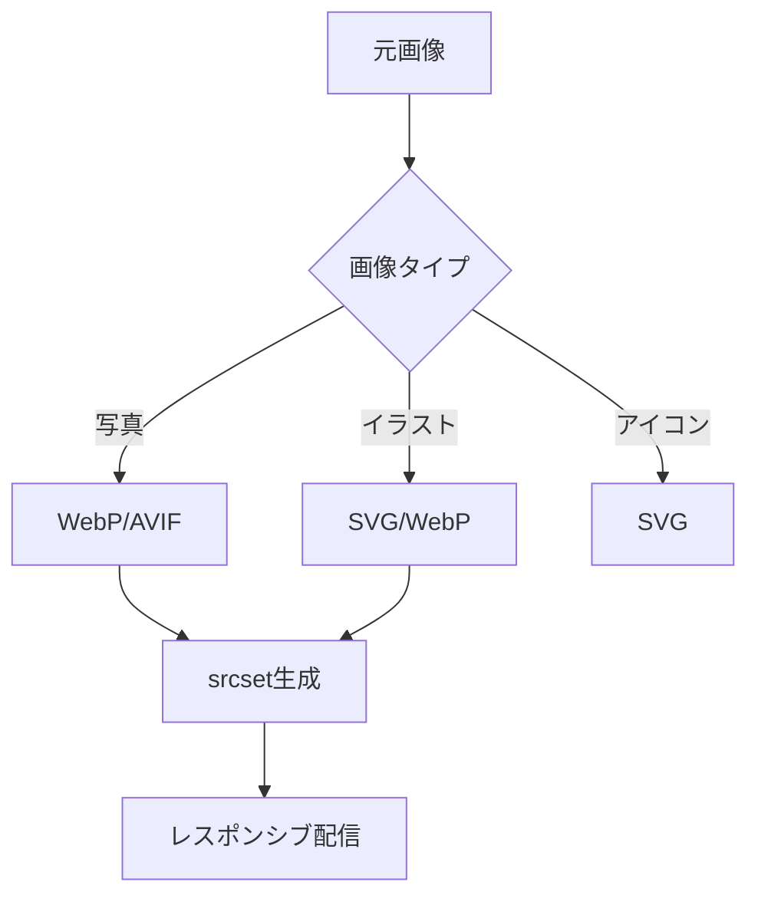
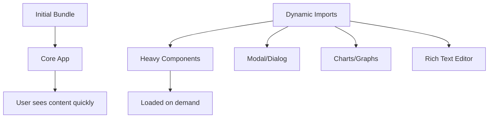

# パフォーマンス設計書

## 基本情報

| 項目 | 内容 |
|------|------|
| **機能名** | `[FeatureName]` |
| **作成日** | YYYY-MM-DD |
| **更新日** | YYYY-MM-DD |
| **担当者** | [担当者名] |

## 概要

パフォーマンス設計の目的と最適化方針を説明します。

## パフォーマンス目標

### Core Web Vitals



| 指標 | 説明 | 目標値 | Good | Needs Improvement | Poor |
|------|------|-------|------|-------------------|------|
| LCP | Largest Contentful Paint | < 2.5s | ≤ 2.5s | 2.5s - 4s | > 4s |
| FID | First Input Delay | < 100ms | ≤ 100ms | 100ms - 300ms | > 300ms |
| CLS | Cumulative Layout Shift | < 0.1 | ≤ 0.1 | 0.1 - 0.25 | > 0.25 |
| INP | Interaction to Next Paint | < 200ms | ≤ 200ms | 200ms - 500ms | > 500ms |
| TTFB | Time to First Byte | < 600ms | ≤ 600ms | 600ms - 1.8s | > 1.8s |

## パフォーマンスバジェット

### JavaScript バンドルサイズ

| バンドル | 目標サイズ | 現在 | ステータス |
|---------|-----------|------|----------|
| Initial (gzip) | < 100KB | - | - |
| Vendor (gzip) | < 150KB | - | - |
| Total (gzip) | < 300KB | - | - |

### ページ重量

| リソース | 目標 | 備考 |
|---------|------|------|
| HTML | < 50KB | 圧縮後 |
| CSS | < 50KB | 圧縮後 |
| JavaScript | < 300KB | 圧縮後 |
| 画像 | < 500KB | ファーストビュー |
| フォント | < 100KB | サブセット後 |

## 画像最適化

### Next.js Image

```tsx
import Image from 'next/image';

<Image
  src="/hero.jpg"
  alt="Hero image"
  width={1200}
  height={600}
  priority // LCP画像
  placeholder="blur"
  blurDataURL={blurDataUrl}
/>
```

### 画像フォーマット戦略



| 用途 | フォーマット | 品質 | 備考 |
|------|------------|------|------|
| Hero画像 | WebP/AVIF | 80% | priority指定 |
| サムネイル | WebP | 75% | lazy loading |
| アイコン | SVG | - | インライン化 |
| OGP画像 | PNG | 90% | 1200x630px |

## フォント最適化

### next/font 使用

```typescript
// app/layout.tsx
import { Inter, Noto_Sans_JP } from 'next/font/google';

const inter = Inter({
  subsets: ['latin'],
  display: 'swap',
  variable: '--font-inter',
});

const notoSansJP = Noto_Sans_JP({
  subsets: ['latin'],
  weight: ['400', '700'],
  display: 'swap',
  variable: '--font-noto-sans-jp',
});
```

### フォントサブセット

| フォント | サブセット | サイズ目標 |
|---------|-----------|----------|
| Inter | latin | < 20KB |
| Noto Sans JP | latin + 常用漢字 | < 80KB |

## コード分割

### Dynamic Import



```typescript
// 重いコンポーネントの遅延読み込み
import dynamic from 'next/dynamic';

const ChartComponent = dynamic(
  () => import('@/components/Chart'),
  {
    loading: () => <ChartSkeleton />,
    ssr: false,
  }
);

const RichTextEditor = dynamic(
  () => import('@/components/RichTextEditor'),
  { ssr: false }
);
```

### Route-based Code Splitting

```
app/
├── page.tsx          # / (Initial)
├── dashboard/
│   └── page.tsx      # /dashboard (Lazy)
└── admin/
    └── page.tsx      # /admin (Lazy)
```

## キャッシュ戦略

### Next.js キャッシュ

| キャッシュ層 | 設定 | 用途 |
|------------|------|------|
| Full Route Cache | static | 静的ページ |
| Data Cache | revalidate | API レスポンス |
| Router Cache | client | ナビゲーション |

```typescript
// データキャッシュの設定
fetch('https://api.example.com/data', {
  next: {
    revalidate: 60, // 60秒後に再検証
    tags: ['products'], // キャッシュタグ
  },
});

// キャッシュの無効化
import { revalidateTag } from 'next/cache';
revalidateTag('products');
```

### ブラウザキャッシュヘッダー

| リソース | Cache-Control | 備考 |
|---------|---------------|------|
| HTML | no-cache | 常に検証 |
| JS/CSS (hashed) | max-age=31536000 | 1年 |
| 画像 | max-age=86400 | 1日 |
| フォント | max-age=31536000 | 1年 |

## レンダリング最適化

### React最適化

```typescript
// メモ化
const MemoizedComponent = memo(ExpensiveComponent);

// 計算結果のメモ化
const sortedData = useMemo(
  () => data.sort((a, b) => a.name.localeCompare(b.name)),
  [data]
);

// コールバックの安定化
const handleClick = useCallback(() => {
  doSomething(id);
}, [id]);
```

### 仮想スクロール

```tsx
import { useVirtualizer } from '@tanstack/react-virtual';

function VirtualList({ items }: { items: Item[] }) {
  const parentRef = useRef<HTMLDivElement>(null);

  const virtualizer = useVirtualizer({
    count: items.length,
    getScrollElement: () => parentRef.current,
    estimateSize: () => 50,
  });

  return (
    <div ref={parentRef} style={{ height: '400px', overflow: 'auto' }}>
      <div style={{ height: `${virtualizer.getTotalSize()}px` }}>
        {virtualizer.getVirtualItems().map((virtualItem) => (
          <div
            key={virtualItem.key}
            style={{
              position: 'absolute',
              top: virtualItem.start,
              height: virtualItem.size,
            }}
          >
            {items[virtualItem.index].name}
          </div>
        ))}
      </div>
    </div>
  );
}
```

## 測定と監視

### パフォーマンス測定

```typescript
// Web Vitals レポート
import { onCLS, onFID, onLCP, onINP, onTTFB } from 'web-vitals';

function reportWebVitals(metric: Metric) {
  console.log(metric);
  // Analytics に送信
  sendToAnalytics(metric);
}

onCLS(reportWebVitals);
onFID(reportWebVitals);
onLCP(reportWebVitals);
onINP(reportWebVitals);
onTTFB(reportWebVitals);
```

### 監視ダッシュボード

- [ ] Lighthouse CI 設定
- [ ] Web Vitals ダッシュボード
- [ ] バンドルサイズ監視
- [ ] エラーレート監視

## チェックリスト

### ビルド時

- [ ] バンドルサイズがバジェット内
- [ ] 未使用コードの除去（Tree Shaking）
- [ ] 圧縮（gzip/brotli）有効
- [ ] ソースマップ設定

### ランタイム

- [ ] LCP画像に priority 設定
- [ ] 画像に適切な size 属性
- [ ] フォントに display: swap
- [ ] 重いコンポーネントの遅延読み込み

### 監視

- [ ] Core Web Vitals のトラッキング
- [ ] エラー監視の設定
- [ ] パフォーマンス回帰テスト

## 関連ドキュメント

- [画像最適化ガイド](../guides/getting-started)
- [キャッシュ設計](../bff/cache-design)

## 変更履歴

| バージョン | 日付 | 変更内容 |
|-----------|------|---------|
| 1.0.0 | YYYY-MM-DD | 初版作成 |
