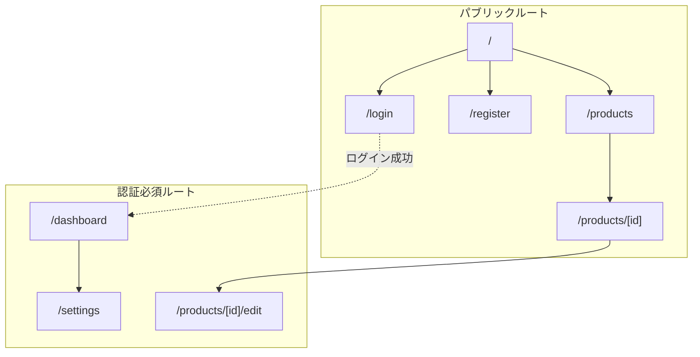
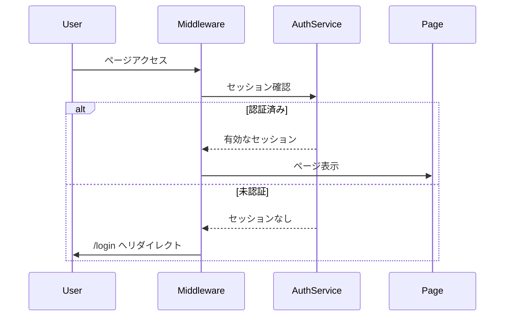
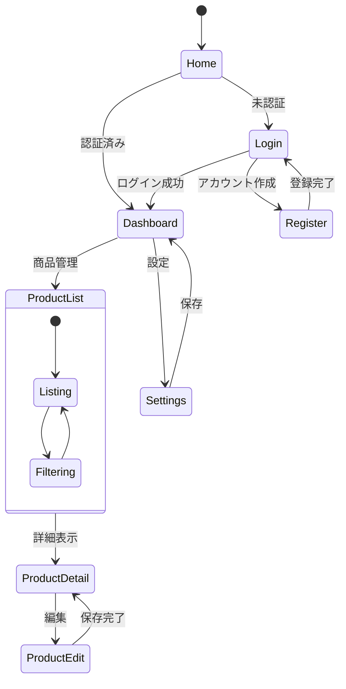

# ルーティング設計書

## 基本情報

| 項目 | 内容 |
|------|------|
| **機能名** | `[FeatureName]` |
| **作成日** | YYYY-MM-DD |
| **更新日** | YYYY-MM-DD |
| **担当者** | [担当者名] |

## 概要

ルーティング設計の目的と全体方針を説明します。

## App Router 構造

### ディレクトリ構成

```
app/
├── layout.tsx              # ルートレイアウト
├── page.tsx                # ホームページ (/)
├── loading.tsx             # グローバルローディング
├── error.tsx               # グローバルエラー
├── not-found.tsx           # 404ページ
│
├── (auth)/                 # 認証グループ（レイアウト共有）
│   ├── layout.tsx
│   ├── login/
│   │   └── page.tsx        # /login
│   └── register/
│       └── page.tsx        # /register
│
├── (main)/                 # メインコンテンツグループ
│   ├── layout.tsx
│   ├── dashboard/
│   │   └── page.tsx        # /dashboard
│   └── settings/
│       └── page.tsx        # /settings
│
├── products/
│   ├── page.tsx            # /products
│   └── [id]/
│       ├── page.tsx        # /products/[id]
│       └── edit/
│           └── page.tsx    # /products/[id]/edit
│
└── api/                    # Route Handlers
    └── [...]/
```

### ルートマップ



## 認証フロー

### 認証状態チェック



### Middleware 実装

```typescript
// middleware.ts
import { NextResponse } from 'next/server';
import type { NextRequest } from 'next/server';

const protectedRoutes = ['/dashboard', '/settings', '/products/*/edit'];
const publicRoutes = ['/login', '/register'];

export function middleware(request: NextRequest) {
  const { pathname } = request.nextUrl;
  const token = request.cookies.get('auth-token');

  // 認証必須ルートのチェック
  const isProtected = protectedRoutes.some(route =>
    new RegExp(`^${route.replace('*', '.*')}$`).test(pathname)
  );

  if (isProtected && !token) {
    const loginUrl = new URL('/login', request.url);
    loginUrl.searchParams.set('redirect', pathname);
    return NextResponse.redirect(loginUrl);
  }

  // 認証済みユーザーの公開ルートアクセス
  if (publicRoutes.includes(pathname) && token) {
    return NextResponse.redirect(new URL('/dashboard', request.url));
  }

  return NextResponse.next();
}

export const config = {
  matcher: ['/((?!api|_next/static|_next/image|favicon.ico).*)'],
};
```

## 動的ルーティング

### パラメータ定義

| パターン | 例 | パラメータ |
|---------|-----|-----------|
| `[id]` | `/products/123` | `{ id: '123' }` |
| `[...slug]` | `/docs/a/b/c` | `{ slug: ['a', 'b', 'c'] }` |
| `[[...slug]]` | `/docs` or `/docs/a` | `{ slug: [] }` or `{ slug: ['a'] }` |

### 静的パラメータ生成

```typescript
// app/products/[id]/page.tsx
export async function generateStaticParams() {
  const products = await fetchProducts();
  return products.map((product) => ({
    id: product.id,
  }));
}
```

## 画面遷移

### 遷移図



### ナビゲーション実装

```tsx
// クライアントコンポーネント
'use client';
import { useRouter, usePathname } from 'next/navigation';

export function Navigation() {
  const router = useRouter();
  const pathname = usePathname();

  return (
    <nav>
      <Link href="/dashboard" className={pathname === '/dashboard' ? 'active' : ''}>
        ダッシュボード
      </Link>
      <button onClick={() => router.push('/products')}>
        商品一覧
      </button>
      <button onClick={() => router.back()}>
        戻る
      </button>
    </nav>
  );
}
```

## 並列ルート / インターセプトルート

### 並列ルート

```
app/
├── @modal/
│   ├── default.tsx
│   └── (.)products/[id]/
│       └── page.tsx    # モーダル表示
├── products/
│   └── [id]/
│       └── page.tsx    # フルページ表示
└── layout.tsx          # modal と children を受け取る
```

### レイアウト

```tsx
// app/layout.tsx
export default function Layout({
  children,
  modal,
}: {
  children: React.ReactNode;
  modal: React.ReactNode;
}) {
  return (
    <html>
      <body>
        {children}
        {modal}
      </body>
    </html>
  );
}
```

## Route Handlers

### API ルート設計

| メソッド | パス | 説明 |
|---------|------|------|
| GET | `/api/products` | 商品一覧取得 |
| POST | `/api/products` | 商品作成 |
| GET | `/api/products/[id]` | 商品詳細取得 |
| PUT | `/api/products/[id]` | 商品更新 |
| DELETE | `/api/products/[id]` | 商品削除 |

### 実装例

```typescript
// app/api/products/route.ts
import { NextRequest, NextResponse } from 'next/server';

export async function GET(request: NextRequest) {
  const searchParams = request.nextUrl.searchParams;
  const page = searchParams.get('page') || '1';

  const products = await fetchProducts({ page: parseInt(page) });
  return NextResponse.json(products);
}

export async function POST(request: NextRequest) {
  const body = await request.json();
  const product = await createProduct(body);
  return NextResponse.json(product, { status: 201 });
}
```

## エラーハンドリング

### エラーバウンダリ

```tsx
// app/products/error.tsx
'use client';

export default function Error({
  error,
  reset,
}: {
  error: Error & { digest?: string };
  reset: () => void;
}) {
  return (
    <div>
      <h2>エラーが発生しました</h2>
      <p>{error.message}</p>
      <button onClick={reset}>再試行</button>
    </div>
  );
}
```

### Not Found

```tsx
// app/products/[id]/not-found.tsx
export default function NotFound() {
  return (
    <div>
      <h2>商品が見つかりません</h2>
      <Link href="/products">商品一覧に戻る</Link>
    </div>
  );
}
```

## SEOとメタデータ

### 動的メタデータ

```typescript
// app/products/[id]/page.tsx
export async function generateMetadata({ params }): Promise<Metadata> {
  const product = await fetchProduct(params.id);

  return {
    title: `${product.name} | 商品詳細`,
    description: product.description,
    openGraph: {
      title: product.name,
      images: [product.image],
    },
  };
}
```

## 関連ドキュメント

- [ページ設計](./page-design)
- [認証設計](../bff/authentication-design)
- [API設計](../bff/api-design)

## 変更履歴

| バージョン | 日付 | 変更内容 |
|-----------|------|---------|
| 1.0.0 | YYYY-MM-DD | 初版作成 |
