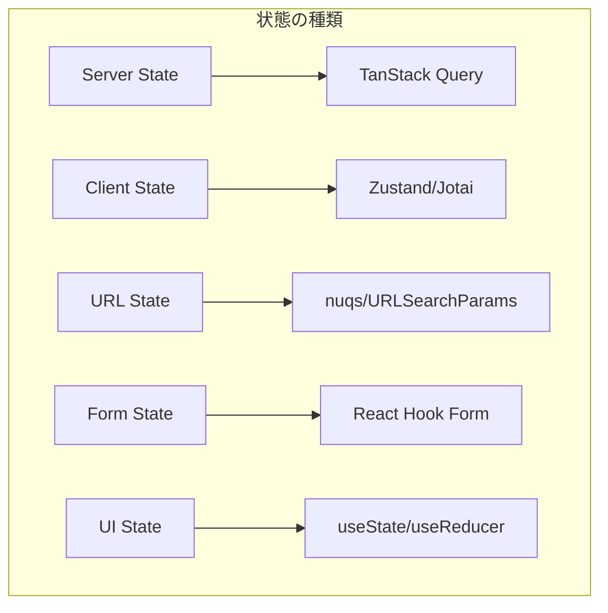
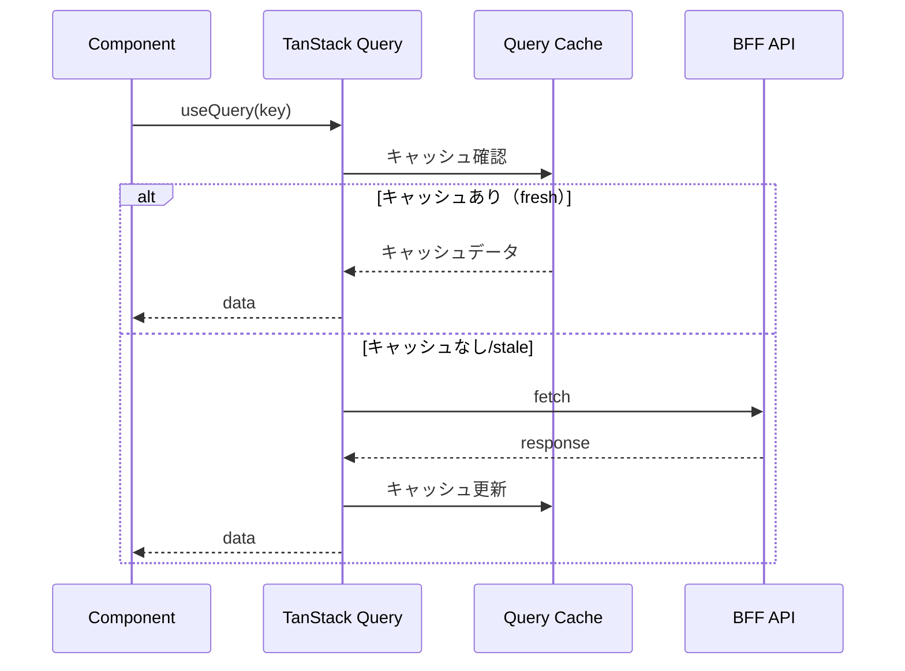
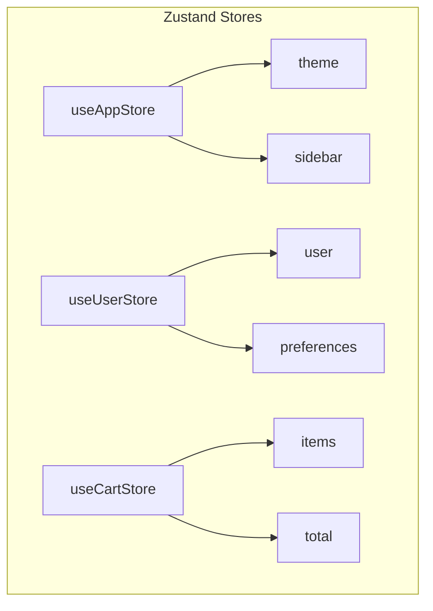
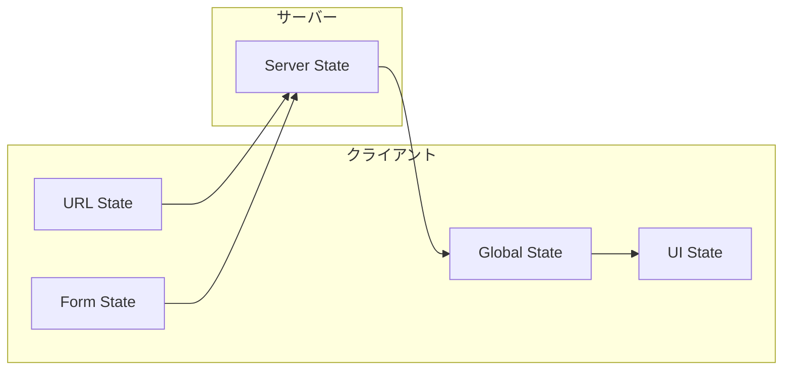

# 状態管理設計書

## 基本情報

| 項目 | 内容 |
|------|------|
| **機能名** | `[FeatureName]` |
| **作成日** | YYYY-MM-DD |
| **更新日** | YYYY-MM-DD |
| **担当者** | [担当者名] |

## 概要

状態管理の目的と全体方針を説明します。

## 状態の分類



## Server State（サーバー状態）

### TanStack Query 設定

```typescript
// queryClient.ts
export const queryClient = new QueryClient({
  defaultOptions: {
    queries: {
      staleTime: 1000 * 60 * 5, // 5分
      gcTime: 1000 * 60 * 30,   // 30分
      retry: 3,
      refetchOnWindowFocus: false,
    },
  },
});
```

### Query キー設計

```typescript
// queryKeys.ts
export const queryKeys = {
  users: {
    all: ['users'] as const,
    list: (filters: UserFilters) => [...queryKeys.users.all, 'list', filters] as const,
    detail: (id: string) => [...queryKeys.users.all, 'detail', id] as const,
  },
  products: {
    all: ['products'] as const,
    list: (params: ProductParams) => [...queryKeys.products.all, 'list', params] as const,
  },
} as const;
```

### データフローダイアグラム



### Mutation パターン

```typescript
// Optimistic Update
const mutation = useMutation({
  mutationFn: updateUser,
  onMutate: async (newData) => {
    await queryClient.cancelQueries({ queryKey: queryKeys.users.detail(id) });
    const previous = queryClient.getQueryData(queryKeys.users.detail(id));
    queryClient.setQueryData(queryKeys.users.detail(id), newData);
    return { previous };
  },
  onError: (err, newData, context) => {
    queryClient.setQueryData(queryKeys.users.detail(id), context?.previous);
  },
  onSettled: () => {
    queryClient.invalidateQueries({ queryKey: queryKeys.users.all });
  },
});
```

## Client State（クライアント状態）

### Zustand Store 設計

```typescript
// stores/useAppStore.ts
interface AppState {
  // State
  theme: 'light' | 'dark';
  sidebarOpen: boolean;

  // Actions
  setTheme: (theme: 'light' | 'dark') => void;
  toggleSidebar: () => void;
}

export const useAppStore = create<AppState>()(
  devtools(
    persist(
      (set) => ({
        theme: 'light',
        sidebarOpen: true,
        setTheme: (theme) => set({ theme }),
        toggleSidebar: () => set((state) => ({ sidebarOpen: !state.sidebarOpen })),
      }),
      { name: 'app-store' }
    )
  )
);
```

### 状態スライス



## URL State（URL状態）

### 管理対象

| パラメータ | 型 | デフォルト | 用途 |
|-----------|-----|-----------|------|
| `page` | `number` | `1` | ページネーション |
| `sort` | `string` | `'created'` | ソート順 |
| `filter` | `string[]` | `[]` | フィルター |
| `search` | `string` | `''` | 検索クエリ |

### 実装パターン

```typescript
// nuqs使用例
import { parseAsInteger, parseAsString, useQueryStates } from 'nuqs';

const [params, setParams] = useQueryStates({
  page: parseAsInteger.withDefault(1),
  sort: parseAsString.withDefault('created'),
  search: parseAsString.withDefault(''),
});
```

## Form State（フォーム状態）

### React Hook Form 設計

```typescript
// バリデーションスキーマ
const schema = z.object({
  email: z.string().email('有効なメールアドレスを入力してください'),
  password: z.string().min(8, '8文字以上で入力してください'),
});

type FormData = z.infer<typeof schema>;

// フォーム設定
const form = useForm<FormData>({
  resolver: zodResolver(schema),
  defaultValues: {
    email: '',
    password: '',
  },
});
```

## 状態間の連携



## 状態の永続化

### 永続化対象

| 状態 | 保存先 | TTL |
|------|-------|-----|
| テーマ設定 | localStorage | 永続 |
| 認証トークン | Cookie (httpOnly) | 7日 |
| カート情報 | localStorage | 24時間 |
| 検索履歴 | sessionStorage | セッション |

## デバッグ・開発ツール

- [ ] React DevTools
- [ ] TanStack Query DevTools
- [ ] Zustand DevTools

```typescript
// DevTools設定
import { ReactQueryDevtools } from '@tanstack/react-query-devtools';

<QueryClientProvider client={queryClient}>
  <App />
  <ReactQueryDevtools initialIsOpen={false} />
</QueryClientProvider>
```

## テスト方針

### Store テスト

```typescript
describe('useAppStore', () => {
  beforeEach(() => {
    useAppStore.setState({ theme: 'light', sidebarOpen: true });
  });

  it('テーマを切り替えられる', () => {
    useAppStore.getState().setTheme('dark');
    expect(useAppStore.getState().theme).toBe('dark');
  });
});
```

## 関連ドキュメント

- [API統合設計](./api-integration)
- [フォーム設計](./form-design)

## 変更履歴

| バージョン | 日付 | 変更内容 |
|-----------|------|---------|
| 1.0.0 | YYYY-MM-DD | 初版作成 |
