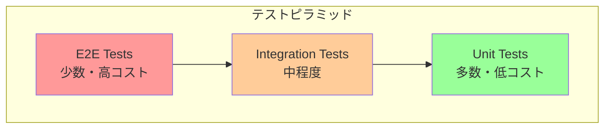
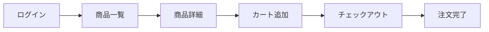

# テスト設計書

## 基本情報

| 項目 | 内容 |
|------|------|
| **機能名** | `[FeatureName]` |
| **作成日** | YYYY-MM-DD |
| **更新日** | YYYY-MM-DD |
| **担当者** | [担当者名] |

## 概要

テスト戦略と設計方針を説明します。

## テストピラミッド



### テスト比率目標

| テスト種別 | 比率 | 実行頻度 | ツール |
|-----------|------|---------|-------|
| Unit | 70% | コミット時 | Jest/Vitest |
| Integration | 20% | PR時 | Testing Library |
| E2E | 10% | デプロイ前 | Playwright |

## 単体テスト

### テスト対象

| 対象 | 優先度 | テスト内容 |
|------|-------|----------|
| ユーティリティ関数 | 高 | 入出力の検証 |
| カスタムフック | 高 | 状態・副作用 |
| 状態管理（Store） | 高 | アクション・セレクタ |
| バリデーション | 高 | 正常系・異常系 |
| コンポーネント（UI） | 中 | レンダリング結果 |

### Jest/Vitest 設定

```typescript
// vitest.config.ts
import { defineConfig } from 'vitest/config';
import react from '@vitejs/plugin-react';

export default defineConfig({
  plugins: [react()],
  test: {
    environment: 'jsdom',
    globals: true,
    setupFiles: ['./src/test/setup.ts'],
    coverage: {
      provider: 'v8',
      reporter: ['text', 'html'],
      exclude: ['node_modules/', 'src/test/'],
    },
  },
});
```

### ユーティリティ関数のテスト

```typescript
// utils/format.test.ts
import { describe, it, expect } from 'vitest';
import { formatCurrency, formatDate } from './format';

describe('formatCurrency', () => {
  it('数値を通貨形式にフォーマットする', () => {
    expect(formatCurrency(1000)).toBe('¥1,000');
    expect(formatCurrency(1234567)).toBe('¥1,234,567');
  });

  it('小数点を含む場合は切り捨てる', () => {
    expect(formatCurrency(1000.5)).toBe('¥1,000');
  });

  it('負の数を正しく処理する', () => {
    expect(formatCurrency(-1000)).toBe('-¥1,000');
  });
});

describe('formatDate', () => {
  it('日付を指定フォーマットに変換する', () => {
    const date = new Date('2024-01-15');
    expect(formatDate(date, 'YYYY-MM-DD')).toBe('2024-01-15');
    expect(formatDate(date, 'YYYY年MM月DD日')).toBe('2024年01月15日');
  });
});
```

### カスタムフックのテスト

```typescript
// hooks/useCounter.test.ts
import { renderHook, act } from '@testing-library/react';
import { useCounter } from './useCounter';

describe('useCounter', () => {
  it('初期値が正しく設定される', () => {
    const { result } = renderHook(() => useCounter(10));
    expect(result.current.count).toBe(10);
  });

  it('incrementで1増加する', () => {
    const { result } = renderHook(() => useCounter(0));
    act(() => {
      result.current.increment();
    });
    expect(result.current.count).toBe(1);
  });

  it('decrementで1減少する', () => {
    const { result } = renderHook(() => useCounter(5));
    act(() => {
      result.current.decrement();
    });
    expect(result.current.count).toBe(4);
  });
});
```

## 統合テスト

### Testing Library

```typescript
// components/LoginForm.test.tsx
import { render, screen, waitFor } from '@testing-library/react';
import userEvent from '@testing-library/user-event';
import { LoginForm } from './LoginForm';

describe('LoginForm', () => {
  it('正しい入力でログインが成功する', async () => {
    const onSubmit = vi.fn();
    const user = userEvent.setup();

    render(<LoginForm onSubmit={onSubmit} />);

    await user.type(screen.getByLabelText('メールアドレス'), 'test@example.com');
    await user.type(screen.getByLabelText('パスワード'), 'password123');
    await user.click(screen.getByRole('button', { name: 'ログイン' }));

    await waitFor(() => {
      expect(onSubmit).toHaveBeenCalledWith({
        email: 'test@example.com',
        password: 'password123',
      });
    });
  });

  it('バリデーションエラーが表示される', async () => {
    const user = userEvent.setup();
    render(<LoginForm onSubmit={vi.fn()} />);

    await user.click(screen.getByRole('button', { name: 'ログイン' }));

    expect(await screen.findByText('メールアドレスは必須です')).toBeInTheDocument();
    expect(await screen.findByText('パスワードは必須です')).toBeInTheDocument();
  });
});
```

### API モック

```typescript
// test/mocks/handlers.ts
import { http, HttpResponse } from 'msw';

export const handlers = [
  http.get('/api/users', () => {
    return HttpResponse.json([
      { id: '1', name: 'User 1' },
      { id: '2', name: 'User 2' },
    ]);
  }),

  http.post('/api/login', async ({ request }) => {
    const body = await request.json();
    if (body.email === 'test@example.com') {
      return HttpResponse.json({ token: 'mock-token' });
    }
    return HttpResponse.json(
      { error: 'Invalid credentials' },
      { status: 401 }
    );
  }),
];
```

## E2Eテスト

### Playwright 設定

```typescript
// playwright.config.ts
import { defineConfig, devices } from '@playwright/test';

export default defineConfig({
  testDir: './e2e',
  timeout: 30000,
  retries: process.env.CI ? 2 : 0,
  workers: process.env.CI ? 1 : undefined,
  reporter: 'html',
  use: {
    baseURL: 'http://localhost:3000',
    trace: 'on-first-retry',
    screenshot: 'only-on-failure',
  },
  projects: [
    { name: 'chromium', use: { ...devices['Desktop Chrome'] } },
    { name: 'firefox', use: { ...devices['Desktop Firefox'] } },
    { name: 'webkit', use: { ...devices['Desktop Safari'] } },
    { name: 'mobile', use: { ...devices['iPhone 13'] } },
  ],
  webServer: {
    command: 'pnpm dev',
    url: 'http://localhost:3000',
    reuseExistingServer: !process.env.CI,
  },
});
```

### E2Eテストシナリオ



```typescript
// e2e/checkout.spec.ts
import { test, expect } from '@playwright/test';

test.describe('チェックアウトフロー', () => {
  test.beforeEach(async ({ page }) => {
    // ログイン
    await page.goto('/login');
    await page.fill('[name="email"]', 'test@example.com');
    await page.fill('[name="password"]', 'password123');
    await page.click('button[type="submit"]');
    await expect(page).toHaveURL('/dashboard');
  });

  test('商品をカートに追加して購入できる', async ({ page }) => {
    // 商品一覧へ
    await page.goto('/products');
    await expect(page.getByRole('heading', { name: '商品一覧' })).toBeVisible();

    // 商品をカートに追加
    await page.click('[data-testid="product-card-1"]');
    await page.click('button:has-text("カートに追加")');
    await expect(page.getByText('カートに追加しました')).toBeVisible();

    // チェックアウト
    await page.click('[data-testid="cart-icon"]');
    await page.click('button:has-text("購入手続きへ")');

    // 注文確定
    await page.fill('[name="address"]', '東京都渋谷区...');
    await page.click('button:has-text("注文を確定")');

    // 完了確認
    await expect(page.getByText('ご注文ありがとうございます')).toBeVisible();
  });
});
```

## テストカバレッジ

### カバレッジ目標

| メトリクス | 目標 | 最低ライン |
|-----------|------|----------|
| Line Coverage | 80% | 70% |
| Branch Coverage | 75% | 65% |
| Function Coverage | 85% | 75% |

### カバレッジレポート

```bash
# カバレッジ付きテスト実行
pnpm test --coverage

# カバレッジレポート生成
pnpm test --coverage --reporter=html
```

## CI/CD 統合

### GitHub Actions

```yaml
# .github/workflows/test.yml
name: Test
on:
  pull_request:
    branches: [main]

jobs:
  unit-test:
    runs-on: ubuntu-latest
    steps:
      - uses: actions/checkout@v4
      - uses: pnpm/action-setup@v2
      - uses: actions/setup-node@v4
        with:
          node-version: 24
          cache: 'pnpm'
      - run: pnpm install
      - run: pnpm test --coverage
      - uses: codecov/codecov-action@v4

  e2e-test:
    runs-on: ubuntu-latest
    steps:
      - uses: actions/checkout@v4
      - uses: pnpm/action-setup@v2
      - uses: actions/setup-node@v4
      - run: pnpm install
      - run: pnpm exec playwright install --with-deps
      - run: pnpm build
      - run: pnpm exec playwright test
      - uses: actions/upload-artifact@v4
        if: failure()
        with:
          name: playwright-report
          path: playwright-report/
```

## テストデータ管理

### Factory パターン

```typescript
// test/factories/user.ts
import { faker } from '@faker-js/faker';

export const createUser = (overrides = {}) => ({
  id: faker.string.uuid(),
  name: faker.person.fullName(),
  email: faker.internet.email(),
  createdAt: faker.date.past().toISOString(),
  ...overrides,
});

export const createUsers = (count: number) =>
  Array.from({ length: count }, () => createUser());
```

## 関連ドキュメント

- [コンポーネント設計](./component-design)
- [CI/CD設計](../guides/getting-started)

## 変更履歴

| バージョン | 日付 | 変更内容 |
|-----------|------|---------|
| 1.0.0 | YYYY-MM-DD | 初版作成 |
