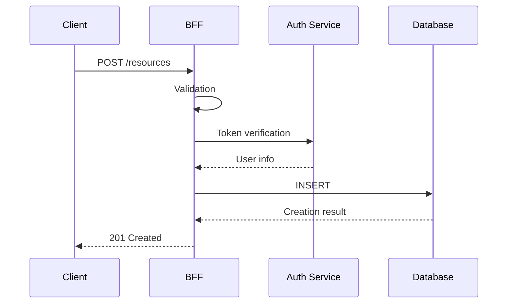
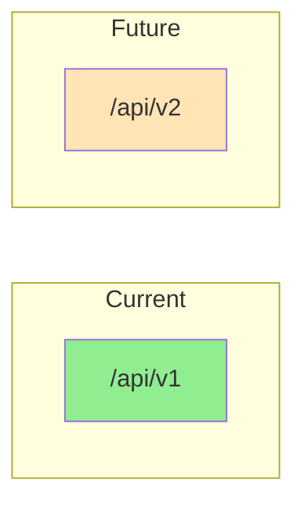

# API Design Document

## Basic Information

| Item | Content |
|------|---------|
| **API Name** | `[API Name]` |
| **Version** | v1 |
| **Base Path** | `/api/v1` |
| **Created** | YYYY-MM-DD |
| **Updated** | YYYY-MM-DD |
| **Author** | [Author Name] |

## Overview

Describes the purpose and features provided by the API.

## Endpoint List

| Method | Path | Description | Auth |
|--------|------|-------------|------|
| GET | `/resources` | Get resource list | Required |
| GET | `/resources/:id` | Get resource details | Required |
| POST | `/resources` | Create resource | Required |
| PUT | `/resources/:id` | Update resource | Required |
| DELETE | `/resources/:id` | Delete resource | Required |

## Request/Response Flow



## API Details

### GET /resources

Retrieves a list of resources.

#### Request

**Query Parameters**

| Parameter | Type | Required | Default | Description |
|-----------|------|----------|---------|-------------|
| `page` | `number` | No | `1` | Page number |
| `limit` | `number` | No | `20` | Items per page (max: 100) |
| `sort` | `string` | No | `createdAt` | Sort field |
| `order` | `'asc' \| 'desc'` | No | `desc` | Sort order |
| `filter` | `string` | No | - | Filter conditions (JSON) |

**Headers**

| Header | Required | Description |
|--------|----------|-------------|
| `Authorization` | Yes | `Bearer <token>` |
| `Accept-Language` | No | Response language (`ja`, `en`) |
| `X-Request-ID` | No | Request tracking ID |

#### Response

**Success (200 OK)**

```json
{
  "data": [
    {
      "id": "res_123",
      "name": "Resource Name",
      "status": "active",
      "createdAt": "2024-01-01T00:00:00Z",
      "updatedAt": "2024-01-01T00:00:00Z"
    }
  ],
  "meta": {
    "total": 100,
    "page": 1,
    "limit": 20,
    "totalPages": 5
  }
}
```

### POST /resources

Creates a new resource.

#### Request

**Body (application/json)**

```json
{
  "name": "Resource Name",
  "description": "Description text",
  "type": "A"
}
```

**Zod Schema**

```typescript
const createResourceSchema = z.object({
  name: z.string().min(1).max(100),
  description: z.string().max(1000).optional(),
  type: z.enum(['A', 'B', 'C']),
  metadata: z.record(z.unknown()).optional(),
});
```

#### Response

**Success (201 Created)**

```json
{
  "data": {
    "id": "res_456",
    "name": "New Resource",
    "status": "active",
    "createdAt": "2024-01-01T00:00:00Z"
  }
}
```

### GET /resources/:id

Retrieves resource details.

#### Path Parameters

| Parameter | Type | Description |
|-----------|------|-------------|
| `id` | `string` | Resource ID |

#### Response

**Success (200 OK)**

```json
{
  "data": {
    "id": "res_123",
    "name": "Resource Name",
    "description": "Description text",
    "type": "A",
    "status": "active",
    "metadata": {},
    "createdAt": "2024-01-01T00:00:00Z",
    "updatedAt": "2024-01-01T00:00:00Z"
  }
}
```

**Error (404 Not Found)**

```json
{
  "error": {
    "code": "RESOURCE_NOT_FOUND",
    "message": "The specified resource was not found",
    "requestId": "req_abc123"
  }
}
```

### PUT /resources/:id

Updates a resource.

#### Request

```json
{
  "name": "Updated Name",
  "description": "Updated description"
}
```

#### Response

**Success (200 OK)**

```json
{
  "data": {
    "id": "res_123",
    "name": "Updated Name",
    "updatedAt": "2024-01-02T00:00:00Z"
  }
}
```

### DELETE /resources/:id

Deletes a resource.

#### Response

**Success (204 No Content)**

(No body)

## Type Definitions

```typescript
// Request types
interface CreateResourceRequest {
  name: string;
  description?: string;
  type: 'A' | 'B' | 'C';
  metadata?: Record<string, unknown>;
}

interface UpdateResourceRequest {
  name?: string;
  description?: string;
  type?: 'A' | 'B' | 'C';
}

// Response types
interface Resource {
  id: string;
  name: string;
  description: string | null;
  type: 'A' | 'B' | 'C';
  status: 'active' | 'inactive';
  metadata: Record<string, unknown>;
  createdAt: string;
  updatedAt: string;
}

interface PaginatedResponse<T> {
  data: T[];
  meta: {
    total: number;
    page: number;
    limit: number;
    totalPages: number;
  };
}

interface SingleResponse<T> {
  data: T;
}
```

## Error Responses

### Standard Error Format

```typescript
interface ErrorResponse {
  error: {
    code: string;
    message: string;
    details?: Record<string, string[]>;
    requestId: string;
  };
}
```

### Error Code List

| HTTP Status | Error Code | Description |
|-------------|------------|-------------|
| 400 | `VALIDATION_ERROR` | Validation error |
| 400 | `INVALID_REQUEST` | Invalid request |
| 401 | `UNAUTHORIZED` | Authentication error |
| 401 | `TOKEN_EXPIRED` | Token expired |
| 403 | `FORBIDDEN` | Permission error |
| 404 | `RESOURCE_NOT_FOUND` | Resource not found |
| 409 | `CONFLICT` | Conflict error |
| 422 | `UNPROCESSABLE_ENTITY` | Unprocessable entity |
| 429 | `RATE_LIMITED` | Rate limited |
| 500 | `INTERNAL_ERROR` | Server error |

## Versioning

### Strategy



| Version | Status | End of Support |
|---------|--------|----------------|
| v1 | Stable | - |
| v2 | Planning | - |

### Breaking Change Rules

- No breaking changes in minor versions
- Create new version when breaking changes are needed
- Support previous versions for at least 6 months

## Rate Limiting

### Limits

| Plan | Requests/min | Requests/day |
|------|--------------|--------------|
| Free | 60 | 1,000 |
| Pro | 300 | 10,000 |
| Enterprise | 1,000 | 100,000 |

### Response Headers

```
X-RateLimit-Limit: 60
X-RateLimit-Remaining: 45
X-RateLimit-Reset: 1640000000
Retry-After: 60
```

## Authentication & Authorization

### Authentication Method

- Bearer Token (JWT)

### Permission Matrix

| Endpoint | guest | user | admin |
|----------|-------|------|-------|
| GET /resources | - | Read | Read |
| GET /resources/:id | - | Read | Read |
| POST /resources | - | Create | Create |
| PUT /resources/:id | - | Own | All |
| DELETE /resources/:id | - | Own | All |

## Related Documents

- [Authentication Design](./authentication-design)
- [Validation Design](./validation-design)
- [Error Handling](./error-handling)

## Change History

| Version | Date | Changes |
|---------|------|---------|
| 1.0.0 | YYYY-MM-DD | Initial release |
