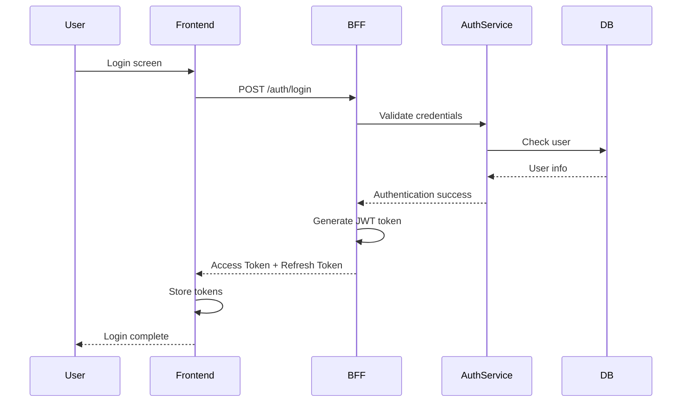
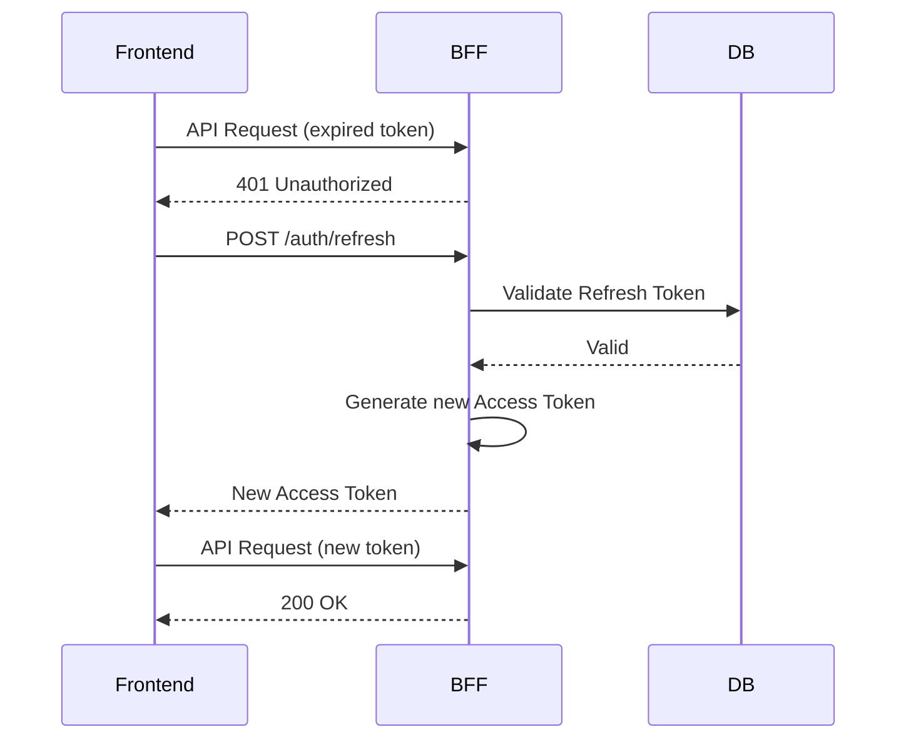
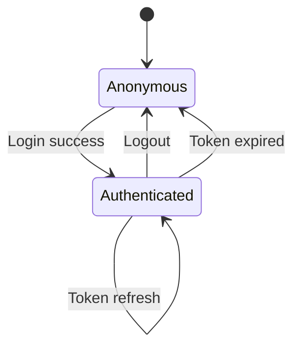
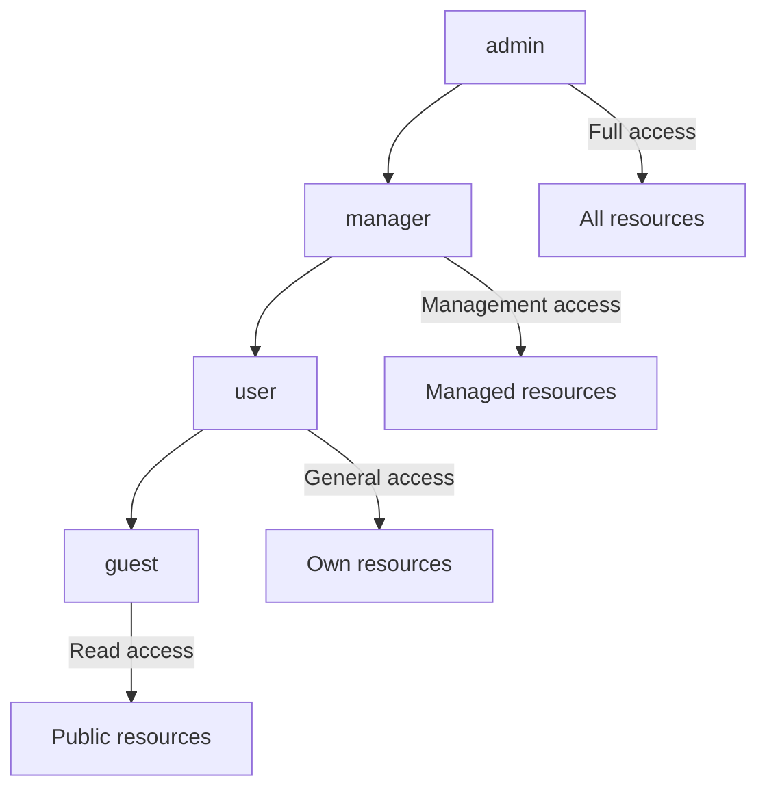
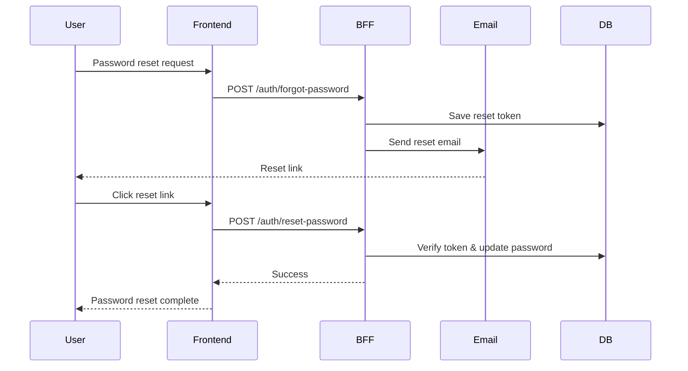
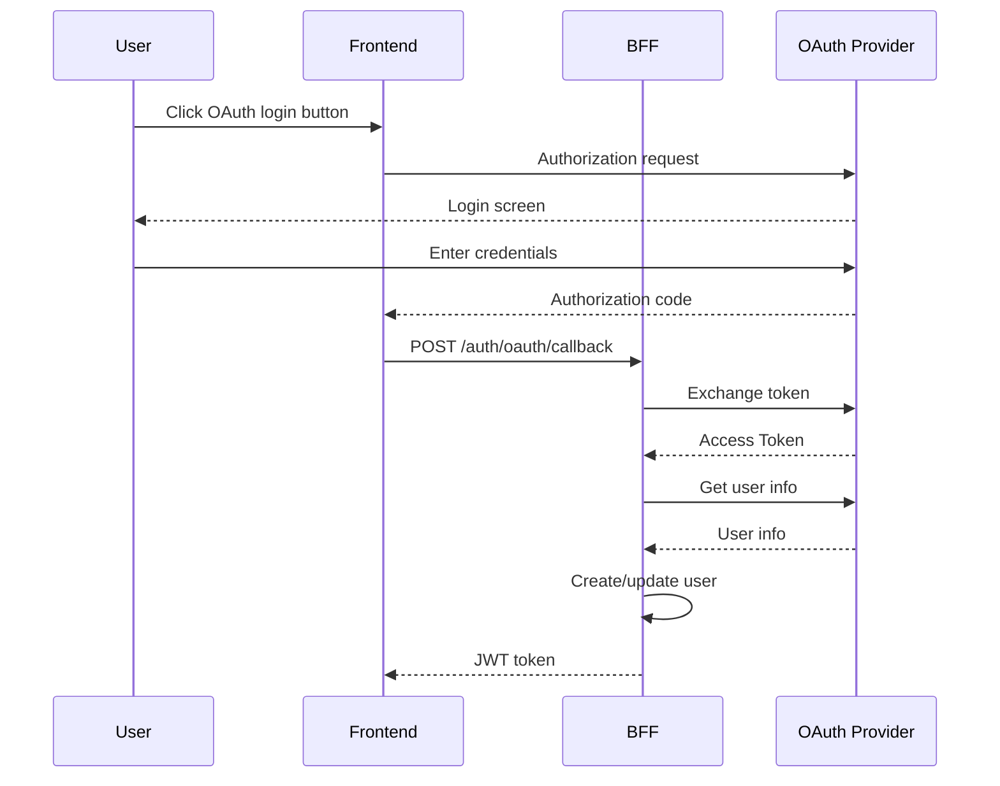

# Authentication Design Document

## Basic Information

| Item | Content |
|------|---------|
| **Feature Name** | `[FeatureName]` |
| **Created** | YYYY-MM-DD |
| **Updated** | YYYY-MM-DD |
| **Author** | [Author Name] |

## Overview

Describes the design principles and implementation guidelines for authentication and authorization.

## Authentication Flow

### Overall Flow



### Token Refresh Flow



## JWT Design

### Token Structure

```typescript
// Access Token Payload
interface AccessTokenPayload {
  sub: string;        // User ID
  email: string;      // Email address
  roles: string[];    // Roles
  iat: number;        // Issued at
  exp: number;        // Expiration
  jti: string;        // Token ID
}

// Refresh Token Payload
interface RefreshTokenPayload {
  sub: string;        // User ID
  tokenFamily: string; // Token family (for rotation)
  iat: number;
  exp: number;
  jti: string;
}
```

### Token Settings

| Token Type | Expiration | Storage Location |
|------------|------------|------------------|
| Access Token | 15 min | Memory / Cookie (httpOnly) |
| Refresh Token | 7 days | Cookie (httpOnly, secure) |

### JWT Generation & Verification

```typescript
import jwt from 'jsonwebtoken';

const JWT_SECRET = process.env.JWT_SECRET!;
const JWT_REFRESH_SECRET = process.env.JWT_REFRESH_SECRET!;

// Generate Access Token
function generateAccessToken(user: User): string {
  return jwt.sign(
    {
      sub: user.id,
      email: user.email,
      roles: user.roles,
    },
    JWT_SECRET,
    {
      expiresIn: '15m',
      jwtid: generateUUID(),
    }
  );
}

// Generate Refresh Token
function generateRefreshToken(userId: string, tokenFamily: string): string {
  return jwt.sign(
    {
      sub: userId,
      tokenFamily,
    },
    JWT_REFRESH_SECRET,
    {
      expiresIn: '7d',
      jwtid: generateUUID(),
    }
  );
}

// Verify Token
function verifyAccessToken(token: string): AccessTokenPayload {
  try {
    return jwt.verify(token, JWT_SECRET) as AccessTokenPayload;
  } catch (error) {
    if (error instanceof jwt.TokenExpiredError) {
      throw new AuthError('TOKEN_EXPIRED', 'Token has expired');
    }
    throw new AuthError('INVALID_TOKEN', 'Invalid token');
  }
}
```

## Session Management

### Session States



### Session Information

```typescript
interface Session {
  id: string;
  userId: string;
  tokenFamily: string;
  userAgent: string;
  ipAddress: string;
  createdAt: Date;
  lastAccessAt: Date;
  expiresAt: Date;
}

// Session management with Redis
class SessionService {
  async createSession(userId: string, metadata: SessionMetadata): Promise<Session> {
    const session: Session = {
      id: generateUUID(),
      userId,
      tokenFamily: generateUUID(),
      ...metadata,
      createdAt: new Date(),
      lastAccessAt: new Date(),
      expiresAt: addDays(new Date(), 7),
    };

    await redis.set(
      `session:${session.id}`,
      JSON.stringify(session),
      'EX',
      7 * 24 * 60 * 60 // 7 days
    );

    return session;
  }

  async invalidateSession(sessionId: string): Promise<void> {
    await redis.del(`session:${sessionId}`);
  }

  async invalidateAllUserSessions(userId: string): Promise<void> {
    const keys = await redis.keys(`session:*`);
    for (const key of keys) {
      const session = await redis.get(key);
      if (session && JSON.parse(session).userId === userId) {
        await redis.del(key);
      }
    }
  }
}
```

## RBAC (Role-Based Access Control)

### Role Hierarchy



### Permission Definitions

```typescript
const permissions = {
  // Resource permissions
  'resources:read': ['guest', 'user', 'manager', 'admin'],
  'resources:create': ['user', 'manager', 'admin'],
  'resources:update': ['user', 'manager', 'admin'],
  'resources:delete': ['manager', 'admin'],

  // User management permissions
  'users:read': ['manager', 'admin'],
  'users:create': ['admin'],
  'users:update': ['admin'],
  'users:delete': ['admin'],

  // System permissions
  'system:settings': ['admin'],
  'system:logs': ['admin'],
} as const;

type Permission = keyof typeof permissions;

function hasPermission(userRoles: string[], permission: Permission): boolean {
  const allowedRoles = permissions[permission];
  return userRoles.some(role => allowedRoles.includes(role));
}
```

### Permission Check Middleware

```typescript
function requirePermission(permission: Permission) {
  return (req: Request, res: Response, next: NextFunction) => {
    const user = req.user;

    if (!user) {
      return res.status(401).json({
        error: { code: 'UNAUTHORIZED', message: 'Authentication required' }
      });
    }

    if (!hasPermission(user.roles, permission)) {
      return res.status(403).json({
        error: { code: 'FORBIDDEN', message: 'You do not have permission to perform this action' }
      });
    }

    next();
  };
}

// Usage example
router.delete(
  '/resources/:id',
  authenticate,
  requirePermission('resources:delete'),
  deleteResource
);
```

## Password Management

### Password Policy

| Item | Requirement |
|------|-------------|
| Minimum length | 8 characters |
| Maximum length | 128 characters |
| Required characters | Letters + numbers |
| Recommended | Include symbols |
| Prohibited | Common passwords |

### Password Hashing

```typescript
import bcrypt from 'bcrypt';

const SALT_ROUNDS = 12;

async function hashPassword(password: string): Promise<string> {
  return bcrypt.hash(password, SALT_ROUNDS);
}

async function verifyPassword(password: string, hash: string): Promise<boolean> {
  return bcrypt.compare(password, hash);
}
```

### Password Reset Flow



## OAuth2.0 / OIDC Integration

### Supported Providers

| Provider | Use Case | Scopes |
|----------|----------|--------|
| Google | Social login | openid, email, profile |
| GitHub | Developer login | read:user, user:email |

### OAuth Flow



## Security Measures

### Implementation Checklist

- [ ] Hash passwords with bcrypt
- [ ] JWT secret has sufficient length (256bit+)
- [ ] Rotate Refresh Tokens
- [ ] Rate limit login attempts
- [ ] Session fixation attack prevention
- [ ] CSRF token verification
- [ ] Secure Cookie settings

### Brute Force Prevention

```typescript
import rateLimit from 'express-rate-limit';

const loginLimiter = rateLimit({
  windowMs: 15 * 60 * 1000, // 15 minutes
  max: 5, // 5 attempts
  message: {
    error: {
      code: 'TOO_MANY_REQUESTS',
      message: 'Too many login attempts. Please try again after 15 minutes.',
    },
  },
  keyGenerator: (req) => req.body.email || req.ip,
});

router.post('/auth/login', loginLimiter, login);
```

## Related Documents

- [API Design](./api-design)
- [Security Design](./security-design)
- [Middleware Design](./middleware-design)

## Change History

| Version | Date | Changes |
|---------|------|---------|
| 1.0.0 | YYYY-MM-DD | Initial release |
