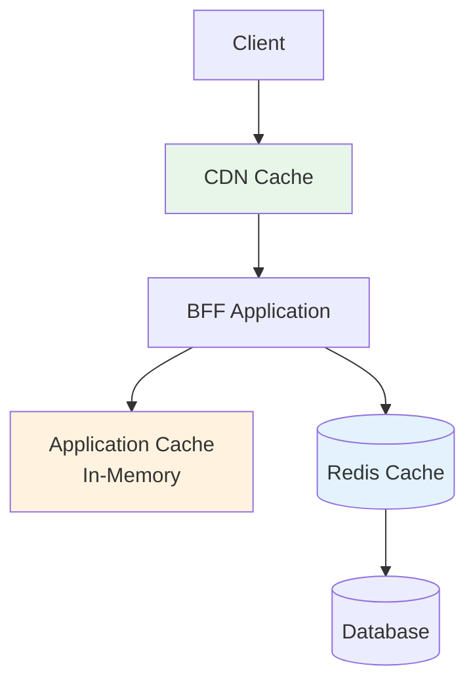
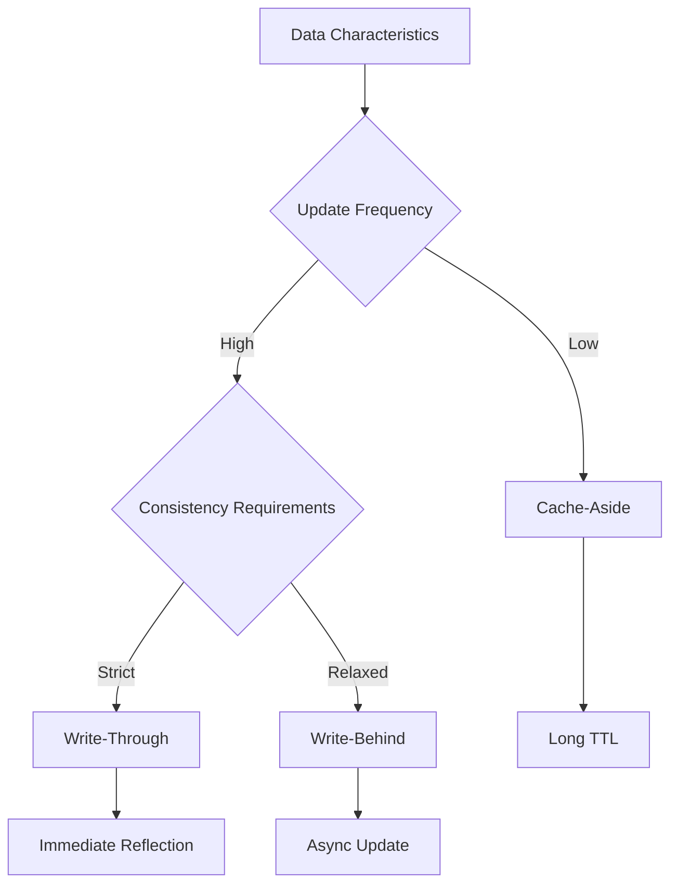
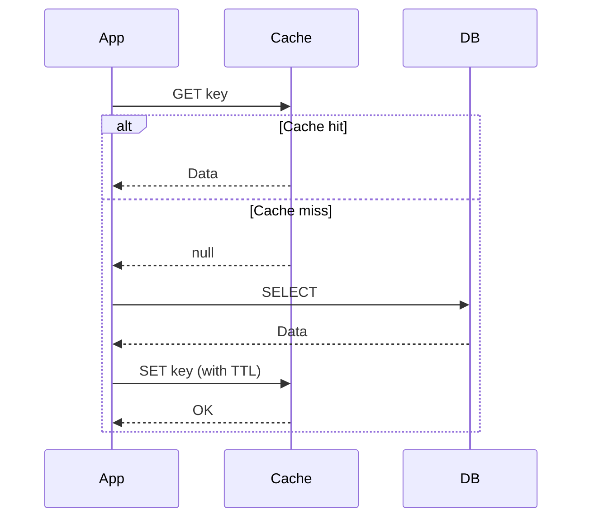
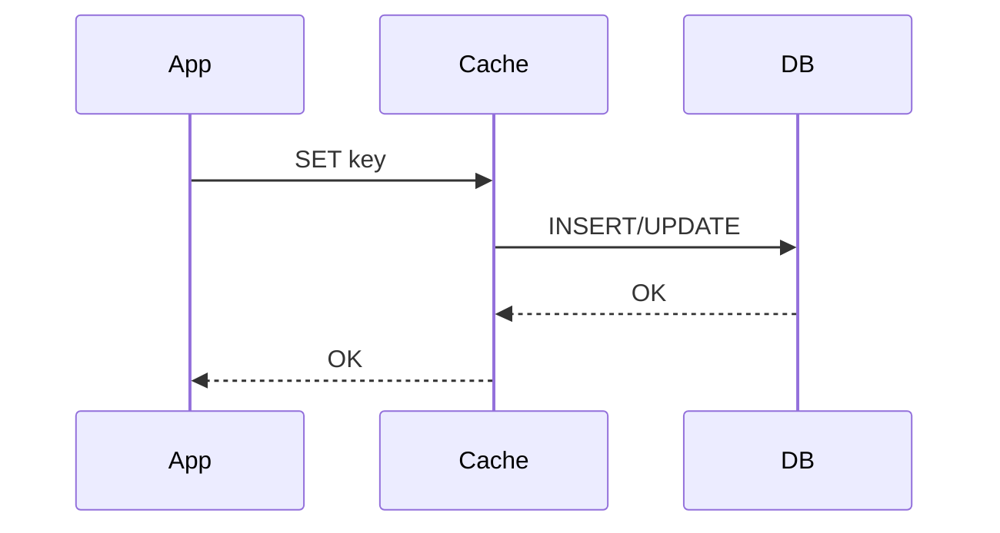
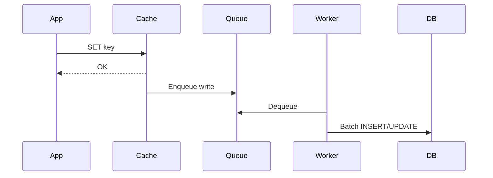
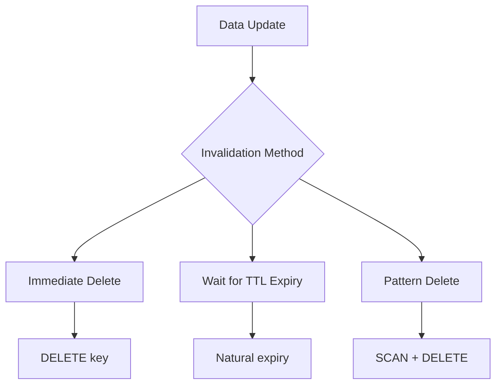

# Cache Design Document

## Basic Information

| Item | Content |
|------|---------|
| **Feature Name** | `[FeatureName]` |
| **Created** | YYYY-MM-DD |
| **Updated** | YYYY-MM-DD |
| **Author** | [Author Name] |

## Overview

Describes the caching strategy and design principles.

## Cache Architecture

### Cache Layers



### Cache Strategy Selection



## Redis Configuration

### Connection Settings

```typescript
import Redis from 'ioredis';

const redis = new Redis({
  host: process.env.REDIS_HOST || 'localhost',
  port: parseInt(process.env.REDIS_PORT || '6379'),
  password: process.env.REDIS_PASSWORD,
  db: parseInt(process.env.REDIS_DB || '0'),
  retryStrategy: (times) => {
    const delay = Math.min(times * 50, 2000);
    return delay;
  },
  maxRetriesPerRequest: 3,
});

redis.on('error', (err) => {
  logger.error('Redis connection error:', err);
});

redis.on('connect', () => {
  logger.info('Redis connected');
});
```

### Cluster Configuration (Production)

```typescript
const redis = new Redis.Cluster([
  { host: 'redis-1', port: 6379 },
  { host: 'redis-2', port: 6379 },
  { host: 'redis-3', port: 6379 },
], {
  redisOptions: {
    password: process.env.REDIS_PASSWORD,
  },
  scaleReads: 'slave', // Read from slave nodes
});
```

## Cache Key Design

### Naming Convention

```
{prefix}:{entity}:{identifier}:{version?}
```

| Component | Description | Example |
|-----------|-------------|---------|
| prefix | Application identifier | `app` |
| entity | Entity type | `user`, `product` |
| identifier | Unique identifier | `123`, `list` |
| version | Cache version | `v1` |

### Key Examples

```typescript
const cacheKeys = {
  // Single resource
  user: (id: string) => `app:user:${id}`,
  product: (id: string) => `app:product:${id}`,

  // Lists
  userList: (page: number, limit: number) =>
    `app:users:list:p${page}:l${limit}`,
  productsByCategory: (categoryId: string) =>
    `app:products:category:${categoryId}`,

  // Aggregations
  productCount: () => `app:products:count`,
  userStats: (userId: string) => `app:user:${userId}:stats`,

  // Sessions
  session: (sessionId: string) => `session:${sessionId}`,
  userSessions: (userId: string) => `sessions:user:${userId}`,
};
```

## Cache Patterns

### Cache-Aside (Lazy Loading)



```typescript
class CacheAsideRepository<T> {
  constructor(
    private cache: Redis,
    private db: DatabaseClient,
    private options: { ttl: number }
  ) {}

  async get(key: string, fetcher: () => Promise<T>): Promise<T> {
    // 1. Try to get from cache
    const cached = await this.cache.get(key);
    if (cached) {
      return JSON.parse(cached);
    }

    // 2. On cache miss, fetch from DB
    const data = await fetcher();

    // 3. Store in cache
    await this.cache.set(
      key,
      JSON.stringify(data),
      'EX',
      this.options.ttl
    );

    return data;
  }
}
```

### Write-Through



```typescript
async function writeThrough<T>(
  key: string,
  data: T,
  dbOperation: () => Promise<void>
): Promise<void> {
  // 1. Write to DB
  await dbOperation();

  // 2. Update cache
  await cache.set(key, JSON.stringify(data), 'EX', TTL);
}
```

### Write-Behind (Write-Back)



```typescript
// Queue-based async write
async function writeBehind<T>(key: string, data: T): Promise<void> {
  // 1. Write to cache immediately
  await cache.set(key, JSON.stringify(data), 'EX', TTL);

  // 2. Add to queue (async DB reflection)
  await queue.add('db-write', { key, data });
}
```

## TTL (Time to Live) Design

### TTL Configuration Guidelines

| Data Type | TTL | Reason |
|-----------|-----|--------|
| Static master | 24 hours | Low update frequency |
| User info | 1 hour | Moderate freshness needed |
| Product info | 5 min | Price/stock fluctuations |
| Session | 7 days | Security requirements |
| Temporary data | 5 min | Only needed short-term |

### TTL Implementation

```typescript
const TTL = {
  STATIC_MASTER: 60 * 60 * 24,    // 24 hours
  USER_INFO: 60 * 60,              // 1 hour
  PRODUCT_INFO: 60 * 5,            // 5 min
  SESSION: 60 * 60 * 24 * 7,       // 7 days
  TEMPORARY: 60 * 5,               // 5 min
} as const;
```

## Cache Invalidation

### Invalidation Strategies



### Implementation Example

```typescript
class CacheInvalidator {
  constructor(private cache: Redis) {}

  // Delete single key
  async invalidate(key: string): Promise<void> {
    await this.cache.del(key);
  }

  // Pattern match delete
  async invalidatePattern(pattern: string): Promise<void> {
    let cursor = '0';
    do {
      const [nextCursor, keys] = await this.cache.scan(
        cursor,
        'MATCH',
        pattern,
        'COUNT',
        100
      );
      cursor = nextCursor;

      if (keys.length > 0) {
        await this.cache.del(...keys);
      }
    } while (cursor !== '0');
  }

  // Bulk delete related keys
  async invalidateRelated(entityType: string, entityId: string): Promise<void> {
    const patterns = [
      `app:${entityType}:${entityId}`,
      `app:${entityType}:${entityId}:*`,
      `app:${entityType}:list:*`,
    ];

    for (const pattern of patterns) {
      await this.invalidatePattern(pattern);
    }
  }
}
```

## Cache Monitoring

### Metrics

| Metric | Description | Target Value |
|--------|-------------|--------------|
| Hit Rate | Cache hit rate | > 90% |
| Miss Rate | Cache miss rate | < 10% |
| Eviction Rate | Eviction rate | < 5% |
| Memory Usage | Memory usage | < 80% |

### Monitoring Implementation

```typescript
class CacheMetrics {
  private hits = 0;
  private misses = 0;

  recordHit(): void {
    this.hits++;
  }

  recordMiss(): void {
    this.misses++;
  }

  getHitRate(): number {
    const total = this.hits + this.misses;
    return total > 0 ? this.hits / total : 0;
  }

  async reportMetrics(): Promise<void> {
    const info = await redis.info('memory');
    const memory = parseRedisMemoryInfo(info);

    metrics.gauge('cache.hit_rate', this.getHitRate());
    metrics.gauge('cache.memory_usage', memory.usedMemory);
    metrics.gauge('cache.memory_peak', memory.peakMemory);
  }
}
```

## Error Handling

### Fallback

```typescript
async function getWithFallback<T>(
  key: string,
  fetcher: () => Promise<T>
): Promise<T> {
  try {
    const cached = await cache.get(key);
    if (cached) {
      return JSON.parse(cached);
    }
  } catch (error) {
    // Log cache error and continue
    logger.warn('Cache read error:', error);
  }

  // Fetch from DB
  const data = await fetcher();

  // Ignore cache save failures
  cache.set(key, JSON.stringify(data), 'EX', TTL).catch((error) => {
    logger.warn('Cache write error:', error);
  });

  return data;
}
```

## Related Documents

- [Performance Design](../frontend/performance-design)
- [API Design](./api-design)

## Change History

| Version | Date | Changes |
|---------|------|---------|
| 1.0.0 | YYYY-MM-DD | Initial release |
