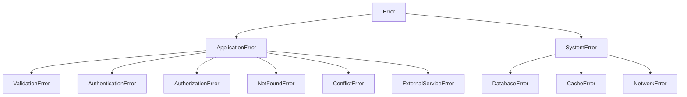
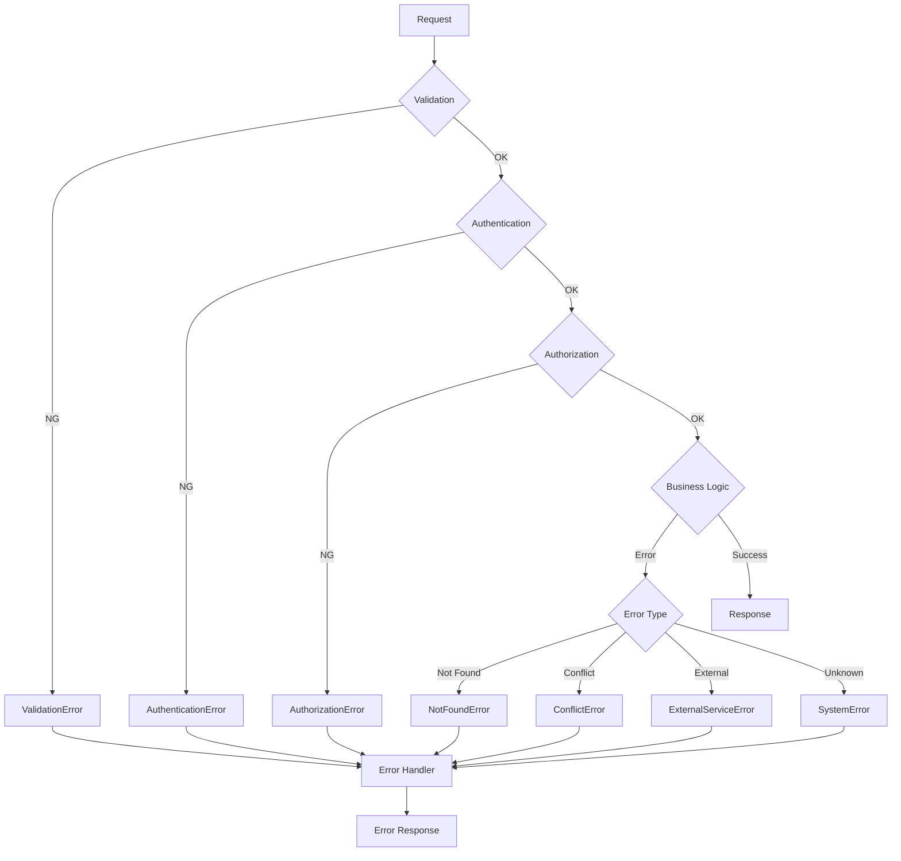

# Error Handling Design Document

## Basic Information

| Item | Content |
|------|---------|
| **Feature Name** | `[FeatureName]` |
| **Created** | YYYY-MM-DD |
| **Updated** | YYYY-MM-DD |
| **Author** | [Author Name] |

## Overview

Describes the design principles and implementation guidelines for error handling.

## Error Classification

### Error Hierarchy



### Error Type Mapping

| Error Class | HTTP Status | Error Code | Description |
|-------------|-------------|------------|-------------|
| ValidationError | 400 | `VALIDATION_ERROR` | Input validation error |
| AuthenticationError | 401 | `UNAUTHORIZED` | Authentication error |
| AuthorizationError | 403 | `FORBIDDEN` | Permission error |
| NotFoundError | 404 | `NOT_FOUND` | Resource not found |
| ConflictError | 409 | `CONFLICT` | Conflict error |
| ExternalServiceError | 502 | `EXTERNAL_SERVICE_ERROR` | External service error |
| SystemError | 500 | `INTERNAL_ERROR` | System error |

## Error Response Format

### Standard Format

```typescript
interface ErrorResponse {
  error: {
    code: string;           // Error code
    message: string;        // User-facing message
    details?: ErrorDetail[]; // Detail information
    requestId: string;      // Request tracking ID
    timestamp: string;      // Error occurrence time
  };
}

interface ErrorDetail {
  field?: string;    // Field where error occurred
  code: string;      // Detail error code
  message: string;   // Detail message
}
```

### Response Examples

**Validation Error (400)**

```json
{
  "error": {
    "code": "VALIDATION_ERROR",
    "message": "Invalid input",
    "details": [
      {
        "field": "email",
        "code": "INVALID_FORMAT",
        "message": "Please enter a valid email address"
      },
      {
        "field": "password",
        "code": "TOO_SHORT",
        "message": "Password must be at least 8 characters"
      }
    ],
    "requestId": "req_abc123",
    "timestamp": "2024-01-01T00:00:00Z"
  }
}
```

**Authentication Error (401)**

```json
{
  "error": {
    "code": "UNAUTHORIZED",
    "message": "Authentication required",
    "requestId": "req_def456",
    "timestamp": "2024-01-01T00:00:00Z"
  }
}
```

**Server Error (500)**

```json
{
  "error": {
    "code": "INTERNAL_ERROR",
    "message": "A server error occurred",
    "requestId": "req_ghi789",
    "timestamp": "2024-01-01T00:00:00Z"
  }
}
```

## Custom Error Classes

### Base Class

```typescript
export class ApplicationError extends Error {
  constructor(
    public code: string,
    message: string,
    public statusCode: number = 500,
    public details?: ErrorDetail[]
  ) {
    super(message);
    this.name = this.constructor.name;
    Error.captureStackTrace(this, this.constructor);
  }

  toJSON(): ErrorResponse['error'] {
    return {
      code: this.code,
      message: this.message,
      details: this.details,
      requestId: '', // Set by middleware
      timestamp: new Date().toISOString(),
    };
  }
}
```

### Derived Classes

```typescript
export class ValidationError extends ApplicationError {
  constructor(message: string, details?: ErrorDetail[]) {
    super('VALIDATION_ERROR', message, 400, details);
  }
}

export class AuthenticationError extends ApplicationError {
  constructor(message: string = 'Authentication required') {
    super('UNAUTHORIZED', message, 401);
  }
}

export class AuthorizationError extends ApplicationError {
  constructor(message: string = 'You do not have permission to perform this action') {
    super('FORBIDDEN', message, 403);
  }
}

export class NotFoundError extends ApplicationError {
  constructor(resource: string = 'Resource') {
    super('NOT_FOUND', `${resource} not found`, 404);
  }
}

export class ConflictError extends ApplicationError {
  constructor(message: string) {
    super('CONFLICT', message, 409);
  }
}

export class ExternalServiceError extends ApplicationError {
  constructor(service: string, originalError?: Error) {
    super('EXTERNAL_SERVICE_ERROR', `An error occurred with external service (${service})`, 502);
    if (originalError) {
      this.cause = originalError;
    }
  }
}
```

## Error Handling Middleware

### Express Implementation

```typescript
import { Request, Response, NextFunction } from 'express';

export function errorHandler(
  error: Error,
  req: Request,
  res: Response,
  next: NextFunction
): void {
  // Get or generate request ID
  const requestId = req.id || generateRequestId();

  // ApplicationError case
  if (error instanceof ApplicationError) {
    const errorResponse = error.toJSON();
    errorResponse.requestId = requestId;

    // Log output (warn for 4xx, error for 5xx)
    if (error.statusCode >= 500) {
      logger.error('Server error', {
        error: errorResponse,
        stack: error.stack,
        requestId,
      });
    } else {
      logger.warn('Client error', {
        error: errorResponse,
        requestId,
      });
    }

    res.status(error.statusCode).json({ error: errorResponse });
    return;
  }

  // Unexpected error
  logger.error('Unexpected error', {
    error: error.message,
    stack: error.stack,
    requestId,
  });

  res.status(500).json({
    error: {
      code: 'INTERNAL_ERROR',
      message: 'An unexpected error occurred',
      requestId,
      timestamp: new Date().toISOString(),
    },
  });
}
```

## Error Flow

### Processing Flow



## Error Logging

### Log Structure

```typescript
interface ErrorLog {
  level: 'warn' | 'error';
  message: string;
  error: {
    code: string;
    message: string;
    stack?: string;
  };
  request: {
    id: string;
    method: string;
    path: string;
    query: Record<string, string>;
    body?: unknown; // Sensitive info masked
    headers: {
      'user-agent': string;
      'x-forwarded-for': string;
    };
  };
  user?: {
    id: string;
    roles: string[];
  };
  timestamp: string;
}
```

### Log Output Example

```typescript
function logError(error: ApplicationError, req: Request): void {
  const logData: ErrorLog = {
    level: error.statusCode >= 500 ? 'error' : 'warn',
    message: error.message,
    error: {
      code: error.code,
      message: error.message,
      stack: error.statusCode >= 500 ? error.stack : undefined,
    },
    request: {
      id: req.id,
      method: req.method,
      path: req.path,
      query: req.query as Record<string, string>,
      body: maskSensitiveData(req.body),
      headers: {
        'user-agent': req.headers['user-agent'] || '',
        'x-forwarded-for': req.headers['x-forwarded-for'] as string || '',
      },
    },
    user: req.user ? {
      id: req.user.id,
      roles: req.user.roles,
    } : undefined,
    timestamp: new Date().toISOString(),
  };

  logger[logData.level](logData);
}
```

## Retry Strategy

### Retryable Errors

| Error Type | Retry | Reason |
|------------|-------|--------|
| NetworkError | Yes | Temporary connection error |
| DatabaseError (connection) | Yes | Temporary connection error |
| ExternalServiceError | Yes | Temporary external service failure |
| ValidationError | No | Input issue |
| AuthenticationError | No | Authentication issue |
| NotFoundError | No | Resource doesn't exist |

### Exponential Backoff

```typescript
async function withRetry<T>(
  operation: () => Promise<T>,
  options: {
    maxRetries?: number;
    baseDelay?: number;
    maxDelay?: number;
    retryable?: (error: Error) => boolean;
  } = {}
): Promise<T> {
  const {
    maxRetries = 3,
    baseDelay = 1000,
    maxDelay = 30000,
    retryable = isRetryableError,
  } = options;

  let lastError: Error;

  for (let attempt = 0; attempt <= maxRetries; attempt++) {
    try {
      return await operation();
    } catch (error) {
      lastError = error as Error;

      if (!retryable(lastError) || attempt === maxRetries) {
        throw lastError;
      }

      const delay = Math.min(baseDelay * 2 ** attempt, maxDelay);
      const jitter = Math.random() * delay * 0.1;

      logger.warn(`Retry attempt ${attempt + 1}/${maxRetries}`, {
        error: lastError.message,
        delay: delay + jitter,
      });

      await sleep(delay + jitter);
    }
  }

  throw lastError!;
}

function isRetryableError(error: Error): boolean {
  if (error instanceof ApplicationError) {
    return error.statusCode >= 500;
  }
  return error.name === 'NetworkError' || error.name === 'TimeoutError';
}
```

## Monitoring & Alerts

### Error Metrics

| Metric | Description | Alert Threshold |
|--------|-------------|-----------------|
| error_rate | Error rate | > 1% |
| 5xx_rate | 5xx error rate | > 0.1% |
| 4xx_rate | 4xx error rate | > 5% |
| error_count | Errors/minute | > 100 |

## Related Documents

- [Logging Design](./logging-design)
- [API Design](./api-design)
- [Middleware Design](./middleware-design)

## Change History

| Version | Date | Changes |
|---------|------|---------|
| 1.0.0 | YYYY-MM-DD | Initial release |
