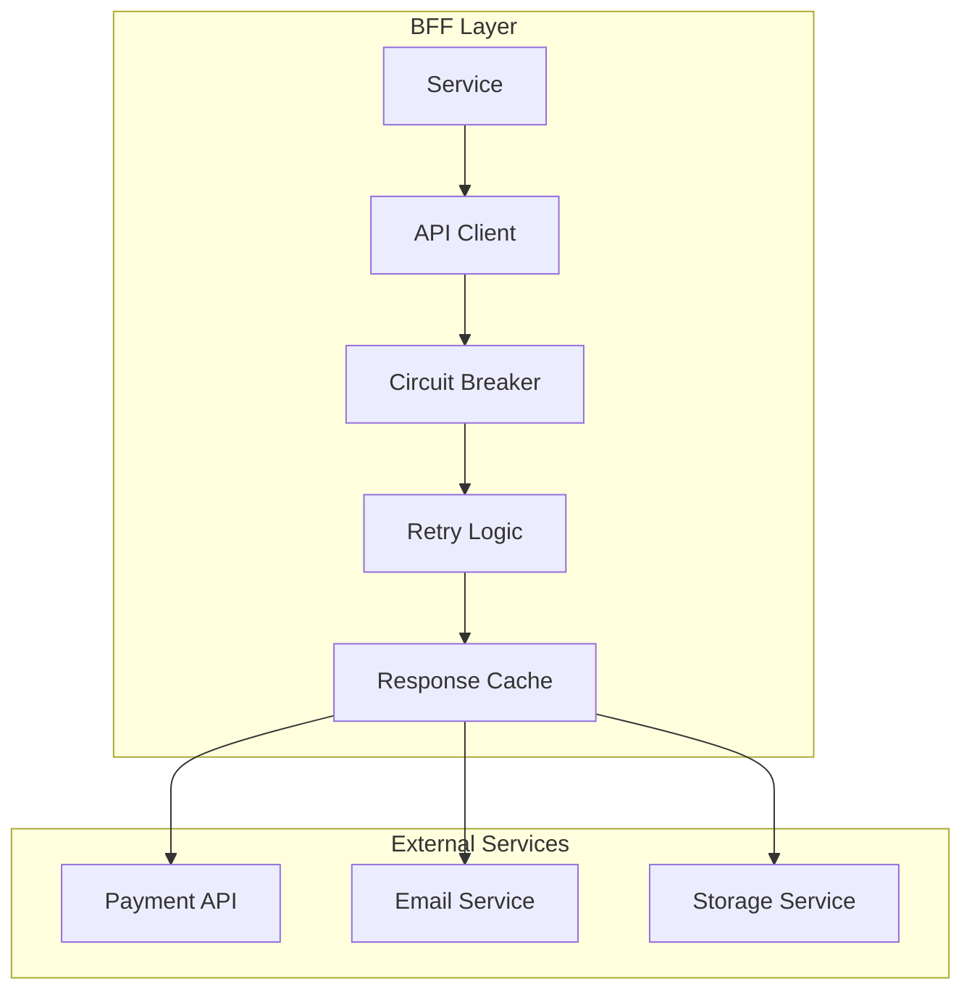
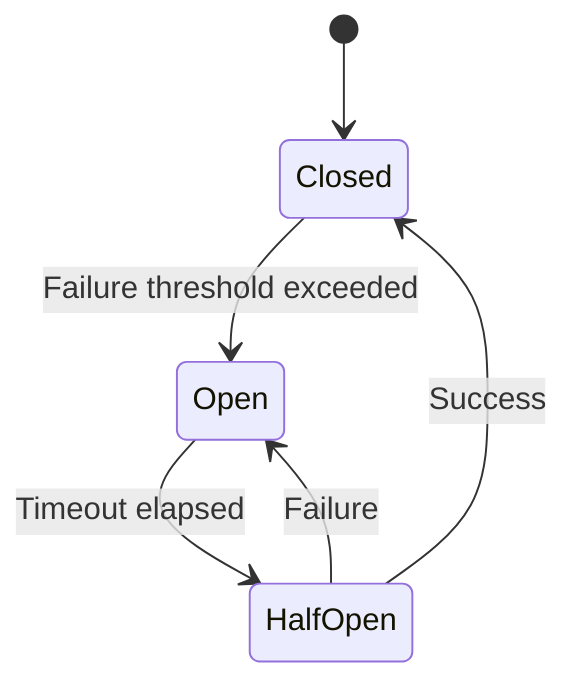
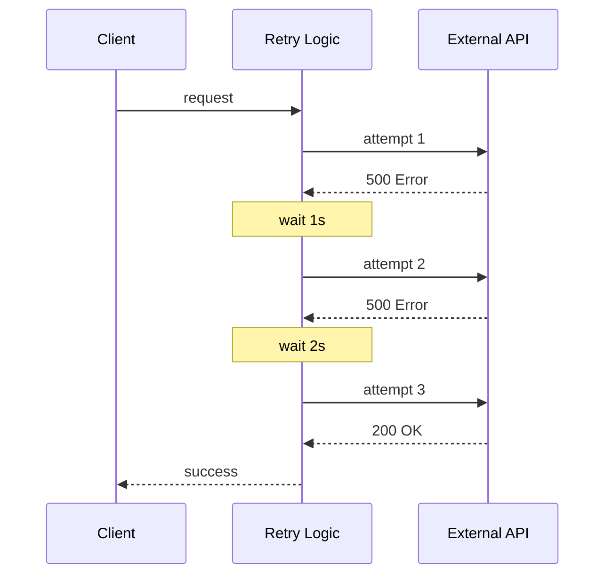
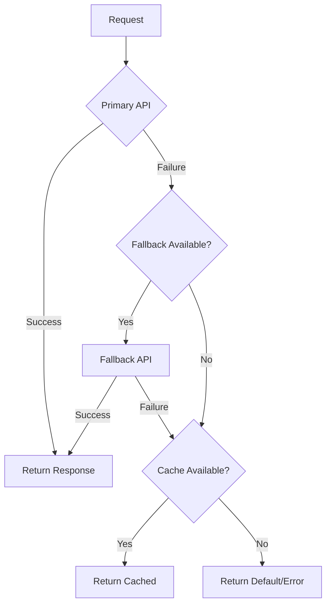

# External API Integration Design Document

## Basic Information

| Item | Content |
|------|---------|
| **Feature Name** | `[FeatureName]` |
| **Created** | YYYY-MM-DD |
| **Updated** | YYYY-MM-DD |
| **Author** | [Author Name] |

## Overview

Describes the design principles and implementation guidelines for external API integration.

## Integration Architecture

### External API Integration Pattern



## API Client Design

### Basic Client

```typescript
// lib/api-client.ts
import axios, { AxiosInstance, AxiosRequestConfig, AxiosError } from 'axios';

interface ApiClientConfig {
  baseURL: string;
  timeout?: number;
  headers?: Record<string, string>;
}

export class ApiClient {
  private client: AxiosInstance;
  private name: string;

  constructor(name: string, config: ApiClientConfig) {
    this.name = name;
    this.client = axios.create({
      baseURL: config.baseURL,
      timeout: config.timeout || 30000,
      headers: {
        'Content-Type': 'application/json',
        ...config.headers,
      },
    });

    this.setupInterceptors();
  }

  private setupInterceptors(): void {
    // Request interceptor
    this.client.interceptors.request.use(
      (config) => {
        const requestId = getRequestId();
        if (requestId) {
          config.headers['X-Request-ID'] = requestId;
        }
        logger.debug({
          type: 'external_api_request',
          service: this.name,
          method: config.method,
          url: config.url,
        });
        return config;
      },
      (error) => Promise.reject(error)
    );

    // Response interceptor
    this.client.interceptors.response.use(
      (response) => {
        logger.debug({
          type: 'external_api_response',
          service: this.name,
          status: response.status,
          url: response.config.url,
        });
        return response;
      },
      (error: AxiosError) => {
        logger.error({
          type: 'external_api_error',
          service: this.name,
          status: error.response?.status,
          url: error.config?.url,
          message: error.message,
        });
        return Promise.reject(this.transformError(error));
      }
    );
  }

  private transformError(error: AxiosError): ExternalServiceError {
    const status = error.response?.status;
    const data = error.response?.data as Record<string, unknown> | undefined;

    return new ExternalServiceError(this.name, {
      status,
      message: data?.message as string || error.message,
      code: data?.code as string,
      originalError: error,
    });
  }

  async get<T>(url: string, config?: AxiosRequestConfig): Promise<T> {
    const response = await this.client.get<T>(url, config);
    return response.data;
  }

  async post<T>(url: string, data?: unknown, config?: AxiosRequestConfig): Promise<T> {
    const response = await this.client.post<T>(url, data, config);
    return response.data;
  }

  async put<T>(url: string, data?: unknown, config?: AxiosRequestConfig): Promise<T> {
    const response = await this.client.put<T>(url, data, config);
    return response.data;
  }

  async delete<T>(url: string, config?: AxiosRequestConfig): Promise<T> {
    const response = await this.client.delete<T>(url, config);
    return response.data;
  }
}
```

## Circuit Breaker

### State Transitions



### Implementation

```typescript
// lib/circuit-breaker.ts
enum CircuitState {
  CLOSED = 'CLOSED',
  OPEN = 'OPEN',
  HALF_OPEN = 'HALF_OPEN',
}

interface CircuitBreakerOptions {
  failureThreshold: number;    // Failure threshold
  successThreshold: number;    // Success threshold (Half-Open)
  timeout: number;             // Open state timeout (ms)
}

export class CircuitBreaker {
  private state: CircuitState = CircuitState.CLOSED;
  private failureCount = 0;
  private successCount = 0;
  private lastFailureTime?: number;

  constructor(
    private name: string,
    private options: CircuitBreakerOptions = {
      failureThreshold: 5,
      successThreshold: 3,
      timeout: 30000,
    }
  ) {}

  async execute<T>(operation: () => Promise<T>): Promise<T> {
    if (this.state === CircuitState.OPEN) {
      if (this.shouldAttemptReset()) {
        this.state = CircuitState.HALF_OPEN;
      } else {
        throw new CircuitBreakerOpenError(this.name);
      }
    }

    try {
      const result = await operation();
      this.onSuccess();
      return result;
    } catch (error) {
      this.onFailure();
      throw error;
    }
  }

  private shouldAttemptReset(): boolean {
    return (
      this.lastFailureTime !== undefined &&
      Date.now() - this.lastFailureTime >= this.options.timeout
    );
  }

  private onSuccess(): void {
    if (this.state === CircuitState.HALF_OPEN) {
      this.successCount++;
      if (this.successCount >= this.options.successThreshold) {
        this.reset();
      }
    } else {
      this.failureCount = 0;
    }
  }

  private onFailure(): void {
    this.failureCount++;
    this.lastFailureTime = Date.now();

    if (this.state === CircuitState.HALF_OPEN) {
      this.state = CircuitState.OPEN;
      this.successCount = 0;
    } else if (this.failureCount >= this.options.failureThreshold) {
      this.state = CircuitState.OPEN;
      logger.warn({
        type: 'circuit_breaker_opened',
        service: this.name,
        failureCount: this.failureCount,
      });
    }
  }

  private reset(): void {
    this.state = CircuitState.CLOSED;
    this.failureCount = 0;
    this.successCount = 0;
    logger.info({
      type: 'circuit_breaker_reset',
      service: this.name,
    });
  }

  getState(): CircuitState {
    return this.state;
  }
}
```

## Retry Strategy

### Retry Flow



### Implementation

```typescript
// lib/retry.ts
interface RetryOptions {
  maxRetries: number;
  baseDelay: number;
  maxDelay: number;
  backoffFactor: number;
  retryCondition?: (error: Error) => boolean;
}

export async function withRetry<T>(
  operation: () => Promise<T>,
  options: Partial<RetryOptions> = {}
): Promise<T> {
  const {
    maxRetries = 3,
    baseDelay = 1000,
    maxDelay = 30000,
    backoffFactor = 2,
    retryCondition = isRetryableError,
  } = options;

  let lastError: Error;

  for (let attempt = 0; attempt <= maxRetries; attempt++) {
    try {
      return await operation();
    } catch (error) {
      lastError = error as Error;

      if (!retryCondition(lastError) || attempt === maxRetries) {
        throw lastError;
      }

      const delay = Math.min(baseDelay * backoffFactor ** attempt, maxDelay);
      const jitter = Math.random() * delay * 0.1;

      logger.warn({
        type: 'retry_attempt',
        attempt: attempt + 1,
        maxRetries,
        delay: delay + jitter,
        error: lastError.message,
      });

      await sleep(delay + jitter);
    }
  }

  throw lastError!;
}

function isRetryableError(error: Error): boolean {
  if (error instanceof ExternalServiceError) {
    const status = error.status;
    // Retry for 5xx errors or timeout
    return status === undefined || status >= 500 || error.code === 'TIMEOUT';
  }
  return false;
}
```

## Timeout Configuration

### Timeout Design

| Service | Connection Timeout | Read Timeout | Overall Timeout |
|---------|-------------------|--------------|-----------------|
| Payment API | 5s | 30s | 60s |
| Email Service | 3s | 10s | 15s |
| Storage Service | 5s | 60s | 120s |
| Default | 5s | 30s | 60s |

### Implementation

```typescript
// Timeout wrapper
async function withTimeout<T>(
  operation: () => Promise<T>,
  timeoutMs: number
): Promise<T> {
  const timeoutPromise = new Promise<never>((_, reject) => {
    setTimeout(() => {
      reject(new TimeoutError(`Operation timed out after ${timeoutMs}ms`));
    }, timeoutMs);
  });

  return Promise.race([operation(), timeoutPromise]);
}
```

## Fallback

### Fallback Strategy



### Implementation Example

```typescript
class ExternalServiceWithFallback {
  constructor(
    private primary: ApiClient,
    private fallback?: ApiClient,
    private cache: CacheService
  ) {}

  async getData(id: string): Promise<Data> {
    const cacheKey = `external:data:${id}`;

    try {
      // Try primary API
      const data = await this.primary.get<Data>(`/data/${id}`);
      // Update cache on success
      await this.cache.set(cacheKey, data, { ttl: 3600 });
      return data;
    } catch (primaryError) {
      logger.warn({
        type: 'primary_api_failed',
        error: primaryError.message,
      });

      // Try fallback API
      if (this.fallback) {
        try {
          return await this.fallback.get<Data>(`/data/${id}`);
        } catch (fallbackError) {
          logger.warn({
            type: 'fallback_api_failed',
            error: fallbackError.message,
          });
        }
      }

      // Try to get from cache
      const cached = await this.cache.get<Data>(cacheKey);
      if (cached) {
        logger.info({ type: 'serving_from_cache', cacheKey });
        return cached;
      }

      // All failed
      throw primaryError;
    }
  }
}
```

## Health Check

### External Service Monitoring

```typescript
interface HealthStatus {
  service: string;
  status: 'healthy' | 'degraded' | 'unhealthy';
  latency?: number;
  lastCheck: string;
  error?: string;
}

class ExternalServiceHealthCheck {
  async check(client: ApiClient, endpoint: string): Promise<HealthStatus> {
    const start = Date.now();

    try {
      await client.get(endpoint);
      return {
        service: client.name,
        status: 'healthy',
        latency: Date.now() - start,
        lastCheck: new Date().toISOString(),
      };
    } catch (error) {
      return {
        service: client.name,
        status: 'unhealthy',
        latency: Date.now() - start,
        lastCheck: new Date().toISOString(),
        error: error.message,
      };
    }
  }
}
```

## Related Documents

- [API Design](./api-design)
- [Error Handling](./error-handling)
- [Cache Design](./cache-design)

## Change History

| Version | Date | Changes |
|---------|------|---------|
| 1.0.0 | YYYY-MM-DD | Initial release |
