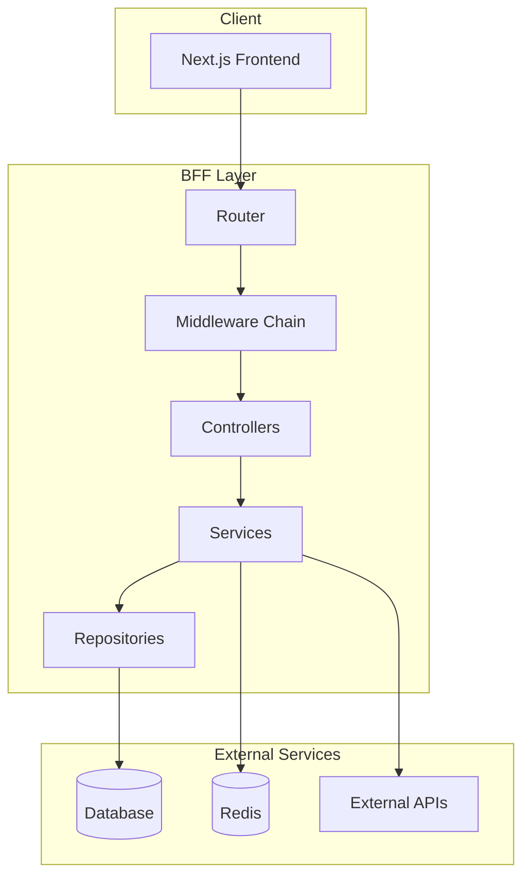
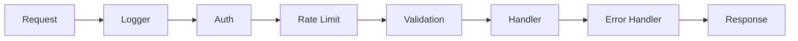

# BFF Design Overview

Documentation for Backend for Frontend (BFF) design.

## Technology Stack

| Category | Technology |
|----------|------------|
| **Runtime** | Node.js |
| **Framework** | Express / Fastify / NestJS |
| **Language** | TypeScript |
| **Validation** | Zod |
| **ORM** | Prisma / Drizzle |
| **Cache** | Redis |
| **Logging** | Pino / Winston |

## Architecture Overview



## Middleware Chain



## Document List

| Document | Overview |
|----------|----------|
| [API Design](./api-design) | RESTful API, endpoint definitions |
| [Authentication Design](./authentication-design) | JWT, sessions, RBAC |
| [Cache Design](./cache-design) | Redis, caching strategies |
| [Error Handling](./error-handling) | Error codes, response formats |
| [Validation Design](./validation-design) | Input validation, sanitization |
| [Logging Design](./logging-design) | Structured logging, correlation IDs |
| [Security Design](./security-design) | CORS, rate limiting |
| [Database Integration](./database-integration) | ORM, transactions |
| [External API Integration](./external-api-integration) | Circuit breaker |
| [Middleware Design](./middleware-design) | Auth, logging, error handling |

## Directory Structure Example

```
src/
├── app.ts                 # Application entry
├── config/                # Configuration
│   ├── index.ts
│   └── env.ts
├── routes/                # Routing
│   ├── index.ts
│   └── v1/
├── controllers/           # Controllers
├── services/              # Business logic
├── repositories/          # Data access
├── middlewares/           # Middleware
│   ├── auth.ts
│   ├── validation.ts
│   └── errorHandler.ts
├── schemas/               # Zod schemas
├── types/                 # Type definitions
├── utils/                 # Utilities
└── lib/                   # External library wrappers
    ├── prisma.ts
    └── redis.ts
```
