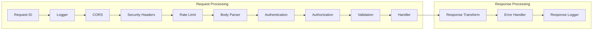

# Middleware Design Document

## Basic Information

| Item | Content |
|------|---------|
| **Feature Name** | `[FeatureName]` |
| **Created** | YYYY-MM-DD |
| **Updated** | YYYY-MM-DD |
| **Author** | [Author Name] |

## Overview

Describes the design principles and implementation guidelines for middleware.

## Middleware Chain

### Execution Order



### Configuration Example

```typescript
// app.ts
import express from 'express';

const app = express();

// 1. Request ID
app.use(requestIdMiddleware);

// 2. Logger
app.use(httpLogger);

// 3. CORS
app.use(cors(corsOptions));

// 4. Security Headers
app.use(helmet(helmetOptions));

// 5. Rate Limit
app.use(rateLimiter);

// 6. Body Parser
app.use(express.json({ limit: '10mb' }));
app.use(express.urlencoded({ extended: true }));

// 7. Routes (auth, authorization, validation per route)
app.use('/api/v1', apiRoutes);

// 8. 404 Handler
app.use(notFoundHandler);

// 9. Error Handler
app.use(errorHandler);
```

## Request ID Middleware

```typescript
// middlewares/requestId.ts
import { v4 as uuidv4 } from 'uuid';
import { AsyncLocalStorage } from 'async_hooks';

export const requestContext = new AsyncLocalStorage<{ requestId: string }>();

export function requestIdMiddleware(
  req: Request,
  res: Response,
  next: NextFunction
): void {
  const requestId = (req.headers['x-request-id'] as string) || `req_${uuidv4()}`;

  req.id = requestId;
  res.setHeader('X-Request-ID', requestId);

  requestContext.run({ requestId }, () => {
    next();
  });
}

// Utility
export function getRequestId(): string | undefined {
  return requestContext.getStore()?.requestId;
}
```

## Authentication Middleware

### JWT Authentication

```typescript
// middlewares/auth.ts
import jwt from 'jsonwebtoken';

export interface AuthenticatedUser {
  id: string;
  email: string;
  roles: string[];
}

declare global {
  namespace Express {
    interface Request {
      user?: AuthenticatedUser;
    }
  }
}

export function authenticate(
  req: Request,
  res: Response,
  next: NextFunction
): void {
  const authHeader = req.headers.authorization;

  if (!authHeader?.startsWith('Bearer ')) {
    res.status(401).json({
      error: {
        code: 'UNAUTHORIZED',
        message: 'Authentication required',
        requestId: req.id,
        timestamp: new Date().toISOString(),
      },
    });
    return;
  }

  const token = authHeader.slice(7);

  try {
    const payload = jwt.verify(token, process.env.JWT_SECRET!) as jwt.JwtPayload;

    req.user = {
      id: payload.sub!,
      email: payload.email,
      roles: payload.roles || [],
    };

    next();
  } catch (error) {
    if (error instanceof jwt.TokenExpiredError) {
      res.status(401).json({
        error: {
          code: 'TOKEN_EXPIRED',
          message: 'Token has expired',
          requestId: req.id,
          timestamp: new Date().toISOString(),
        },
      });
      return;
    }

    res.status(401).json({
      error: {
        code: 'INVALID_TOKEN',
        message: 'Invalid token',
        requestId: req.id,
        timestamp: new Date().toISOString(),
      },
    });
  }
}

// Optional authentication (accessible without auth)
export function optionalAuth(
  req: Request,
  res: Response,
  next: NextFunction
): void {
  const authHeader = req.headers.authorization;

  if (!authHeader?.startsWith('Bearer ')) {
    return next();
  }

  const token = authHeader.slice(7);

  try {
    const payload = jwt.verify(token, process.env.JWT_SECRET!) as jwt.JwtPayload;
    req.user = {
      id: payload.sub!,
      email: payload.email,
      roles: payload.roles || [],
    };
  } catch {
    // Ignore auth failure
  }

  next();
}
```

## Authorization Middleware

### Role-based Authorization

```typescript
// middlewares/authorize.ts
type Permission = string;

const rolePermissions: Record<string, Permission[]> = {
  admin: ['*'],
  manager: ['users:read', 'resources:*'],
  user: ['resources:read', 'resources:create', 'resources:update:own'],
};

function hasPermission(roles: string[], required: Permission): boolean {
  for (const role of roles) {
    const permissions = rolePermissions[role] || [];

    for (const permission of permissions) {
      if (permission === '*') return true;
      if (permission === required) return true;

      // Wildcard matching (e.g., resources:*)
      if (permission.endsWith(':*')) {
        const prefix = permission.slice(0, -1);
        if (required.startsWith(prefix)) return true;
      }
    }
  }

  return false;
}

export function authorize(permission: Permission) {
  return (req: Request, res: Response, next: NextFunction): void => {
    if (!req.user) {
      res.status(401).json({
        error: {
          code: 'UNAUTHORIZED',
          message: 'Authentication required',
          requestId: req.id,
          timestamp: new Date().toISOString(),
        },
      });
      return;
    }

    if (!hasPermission(req.user.roles, permission)) {
      res.status(403).json({
        error: {
          code: 'FORBIDDEN',
          message: 'You do not have permission to perform this action',
          requestId: req.id,
          timestamp: new Date().toISOString(),
        },
      });
      return;
    }

    next();
  };
}

// Resource owner check
export function authorizeOwner(getResourceOwnerId: (req: Request) => Promise<string>) {
  return async (req: Request, res: Response, next: NextFunction): Promise<void> => {
    if (!req.user) {
      res.status(401).json({
        error: { code: 'UNAUTHORIZED', message: 'Authentication required' },
      });
      return;
    }

    // Admins can access all resources
    if (req.user.roles.includes('admin')) {
      return next();
    }

    const ownerId = await getResourceOwnerId(req);
    if (ownerId !== req.user.id) {
      res.status(403).json({
        error: { code: 'FORBIDDEN', message: 'You do not have permission to access this resource' },
      });
      return;
    }

    next();
  };
}
```

## Validation Middleware

```typescript
// middlewares/validate.ts
import { z, ZodSchema, ZodError } from 'zod';

export function validate<T extends ZodSchema>(schema: T) {
  return async (
    req: Request,
    res: Response,
    next: NextFunction
  ): Promise<void> => {
    try {
      const validated = await schema.parseAsync({
        body: req.body,
        query: req.query,
        params: req.params,
      });

      req.validated = validated;
      next();
    } catch (error) {
      if (error instanceof ZodError) {
        const details = error.errors.map((err) => ({
          field: err.path.join('.'),
          code: err.code.toUpperCase(),
          message: err.message,
        }));

        res.status(400).json({
          error: {
            code: 'VALIDATION_ERROR',
            message: 'Invalid input',
            details,
            requestId: req.id,
            timestamp: new Date().toISOString(),
          },
        });
        return;
      }

      next(error);
    }
  };
}
```

## Error Handling Middleware

```typescript
// middlewares/errorHandler.ts
export function errorHandler(
  error: Error,
  req: Request,
  res: Response,
  _next: NextFunction
): void {
  const requestId = req.id || 'unknown';

  // ApplicationError case
  if (error instanceof ApplicationError) {
    if (error.statusCode >= 500) {
      logger.error({
        error: error.toJSON(),
        stack: error.stack,
        requestId,
      });
    } else {
      logger.warn({
        error: error.toJSON(),
        requestId,
      });
    }

    res.status(error.statusCode).json({
      error: {
        ...error.toJSON(),
        requestId,
      },
    });
    return;
  }

  // Unexpected error
  logger.error({
    type: 'unhandled_error',
    error: error.message,
    stack: error.stack,
    requestId,
  });

  res.status(500).json({
    error: {
      code: 'INTERNAL_ERROR',
      message: 'An unexpected error occurred',
      requestId,
      timestamp: new Date().toISOString(),
    },
  });
}

// 404 Handler
export function notFoundHandler(
  req: Request,
  res: Response,
  _next: NextFunction
): void {
  res.status(404).json({
    error: {
      code: 'NOT_FOUND',
      message: `${req.method} ${req.path} not found`,
      requestId: req.id,
      timestamp: new Date().toISOString(),
    },
  });
}
```

## Logging Middleware

```typescript
// middlewares/logger.ts
import pino from 'pino-http';

export const httpLogger = pino({
  logger,
  genReqId: (req) => req.id,
  customLogLevel: (req, res, error) => {
    if (res.statusCode >= 500 || error) return 'error';
    if (res.statusCode >= 400) return 'warn';
    return 'info';
  },
  serializers: {
    req: (req) => ({
      method: req.method,
      url: req.url,
      headers: {
        'user-agent': req.headers['user-agent'],
      },
    }),
    res: (res) => ({
      statusCode: res.statusCode,
    }),
  },
});
```

## Middleware Combination Example

### Route Definition

```typescript
// routes/users.ts
import { Router } from 'express';

const router = Router();

// No authentication required
router.post('/register', validate(registerSchema), register);
router.post('/login', validate(loginSchema), login);

// Authentication required
router.use(authenticate);

router.get('/me', getCurrentUser);
router.put('/me', validate(updateUserSchema), updateCurrentUser);

// Admin only
router.get('/', authorize('users:read'), getUsers);
router.delete('/:id', authorize('users:delete'), deleteUser);

export { router as userRouter };
```

## Related Documents

- [Authentication Design](./authentication-design)
- [Validation Design](./validation-design)
- [Error Handling](./error-handling)
- [Logging Design](./logging-design)

## Change History

| Version | Date | Changes |
|---------|------|---------|
| 1.0.0 | YYYY-MM-DD | Initial release |
