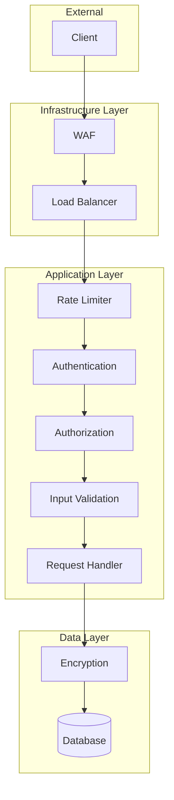
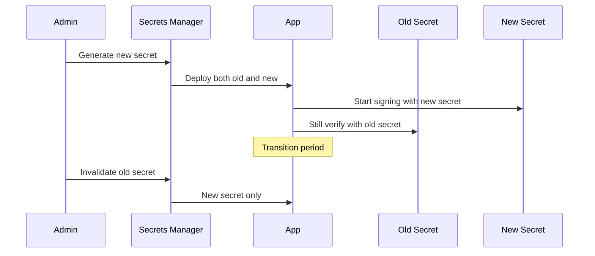

# Security Design Document

## Basic Information

| Item | Content |
|------|---------|
| **Feature Name** | `[FeatureName]` |
| **Created** | YYYY-MM-DD |
| **Updated** | YYYY-MM-DD |
| **Author** | [Author Name] |

## Overview

Describes the design principles and implementation guidelines for security measures.

## Security Architecture

### Defense in Depth



## CORS Configuration

### Configuration Items

| Setting | Development | Production |
|---------|-------------|------------|
| origin | `*` or `localhost:3000` | Allowlist |
| methods | All | Only required |
| credentials | true | true |
| maxAge | 600 | 86400 |

### Implementation

```typescript
import cors from 'cors';

const allowedOrigins = process.env.NODE_ENV === 'production'
  ? ['https://example.com', 'https://admin.example.com']
  : ['http://localhost:3000', 'http://localhost:3001'];

const corsOptions: cors.CorsOptions = {
  origin: (origin, callback) => {
    // origin is undefined for same-origin requests
    if (!origin || allowedOrigins.includes(origin)) {
      callback(null, true);
    } else {
      callback(new Error('CORS not allowed'));
    }
  },
  methods: ['GET', 'POST', 'PUT', 'DELETE', 'PATCH', 'OPTIONS'],
  allowedHeaders: ['Content-Type', 'Authorization', 'X-Request-ID'],
  credentials: true,
  maxAge: 86400, // 24 hours
};

app.use(cors(corsOptions));
```

## Rate Limiting

### Limit Design

| Endpoint | Limit | Window | Target |
|----------|-------|--------|--------|
| Global | 1000 req | 15 min | IP |
| Auth | 5 req | 15 min | IP + Email |
| API | 100 req | 1 min | User |
| File upload | 10 req | 1 hour | User |

### Implementation

```typescript
import rateLimit from 'express-rate-limit';
import RedisStore from 'rate-limit-redis';

// Global rate limit
const globalLimiter = rateLimit({
  windowMs: 15 * 60 * 1000, // 15 minutes
  max: 1000,
  standardHeaders: true,
  legacyHeaders: false,
  store: new RedisStore({
    sendCommand: (...args: string[]) => redisClient.call(...args),
  }),
  message: {
    error: {
      code: 'RATE_LIMITED',
      message: 'Too many requests. Please try again later.',
    },
  },
});

// Auth endpoint limiter
const authLimiter = rateLimit({
  windowMs: 15 * 60 * 1000,
  max: 5,
  keyGenerator: (req) => `auth:${req.body.email || req.ip}`,
  skipSuccessfulRequests: true, // Don't count successful requests
});

// API endpoint limiter (authenticated users)
const apiLimiter = rateLimit({
  windowMs: 60 * 1000, // 1 minute
  max: 100,
  keyGenerator: (req) => `api:${req.user?.id || req.ip}`,
});

app.use(globalLimiter);
app.use('/api/auth', authLimiter);
app.use('/api/v1', apiLimiter);
```

## Security Headers

### Helmet Configuration

```typescript
import helmet from 'helmet';

app.use(
  helmet({
    contentSecurityPolicy: {
      directives: {
        defaultSrc: ["'self'"],
        scriptSrc: ["'self'", "'unsafe-inline'"], // Adjust as needed
        styleSrc: ["'self'", "'unsafe-inline'"],
        imgSrc: ["'self'", 'data:', 'https:'],
        connectSrc: ["'self'", 'https://api.example.com'],
        fontSrc: ["'self'", 'https://fonts.gstatic.com'],
        objectSrc: ["'none'"],
        mediaSrc: ["'self'"],
        frameSrc: ["'none'"],
      },
    },
    crossOriginEmbedderPolicy: true,
    crossOriginOpenerPolicy: true,
    crossOriginResourcePolicy: { policy: 'same-site' },
    dnsPrefetchControl: { allow: false },
    frameguard: { action: 'deny' },
    hsts: {
      maxAge: 31536000,
      includeSubDomains: true,
      preload: true,
    },
    ieNoOpen: true,
    noSniff: true,
    originAgentCluster: true,
    permittedCrossDomainPolicies: { permittedPolicies: 'none' },
    referrerPolicy: { policy: 'strict-origin-when-cross-origin' },
    xssFilter: true,
  })
);
```

### Header List

| Header | Value | Description |
|--------|-------|-------------|
| Strict-Transport-Security | max-age=31536000; includeSubDomains | Force HTTPS |
| X-Content-Type-Options | nosniff | Prevent MIME sniffing |
| X-Frame-Options | DENY | Prevent clickjacking |
| X-XSS-Protection | 1; mode=block | XSS prevention |
| Content-Security-Policy | ... | Resource loading restrictions |
| Referrer-Policy | strict-origin-when-cross-origin | Referrer restrictions |

## XSS Prevention

### Input Sanitization

```typescript
import DOMPurify from 'isomorphic-dompurify';

// HTML sanitization
function sanitizeHtml(input: string): string {
  return DOMPurify.sanitize(input, {
    ALLOWED_TAGS: [], // Remove all HTML tags
  });
}

// Rich text (allow some tags)
function sanitizeRichText(input: string): string {
  return DOMPurify.sanitize(input, {
    ALLOWED_TAGS: ['b', 'i', 'u', 'a', 'p', 'br', 'ul', 'ol', 'li'],
    ALLOWED_ATTR: ['href'],
  });
}
```

### Output Escaping

```typescript
// JSON responses are automatically escaped
res.json({ message: userInput });

// When outputting in HTML
import { encode } from 'html-entities';
const safeOutput = encode(userInput);
```

## CSRF Prevention

### Token-based

```typescript
import csrf from 'csurf';
import cookieParser from 'cookie-parser';

app.use(cookieParser());

const csrfProtection = csrf({
  cookie: {
    httpOnly: true,
    secure: process.env.NODE_ENV === 'production',
    sameSite: 'strict',
  },
});

// CSRF token endpoint
app.get('/api/csrf-token', csrfProtection, (req, res) => {
  res.json({ csrfToken: req.csrfToken() });
});

// Endpoints requiring CSRF protection
app.post('/api/v1/users', csrfProtection, createUser);
```

### SameSite Cookie

```typescript
// Cookie settings
res.cookie('session', sessionId, {
  httpOnly: true,
  secure: process.env.NODE_ENV === 'production',
  sameSite: 'strict', // or 'lax'
  maxAge: 7 * 24 * 60 * 60 * 1000, // 7 days
});
```

## SQL Injection Prevention

### Parameterized Queries

```typescript
// ❌ Dangerous: string concatenation
const query = `SELECT * FROM users WHERE email = '${email}'`;

// ✅ Safe: Prisma
const user = await prisma.user.findUnique({
  where: { email },
});

// ✅ Safe: parameterized query
const [rows] = await pool.execute(
  'SELECT * FROM users WHERE email = ?',
  [email]
);
```

## Secret Management

### Environment Variable Management

```typescript
// Required environment variable check
const requiredEnvVars = [
  'DATABASE_URL',
  'JWT_SECRET',
  'REDIS_URL',
];

for (const envVar of requiredEnvVars) {
  if (!process.env[envVar]) {
    throw new Error(`Missing required environment variable: ${envVar}`);
  }
}

// Secret access
const config = {
  database: {
    url: process.env.DATABASE_URL!,
  },
  jwt: {
    secret: process.env.JWT_SECRET!,
    expiresIn: '15m',
  },
  redis: {
    url: process.env.REDIS_URL!,
  },
};
```

### Secret Rotation



## Security Checklist

### Implementation Checks

- [ ] Force HTTPS
- [ ] Security headers configured
- [ ] CORS properly configured
- [ ] Rate limiting implemented
- [ ] Input validation
- [ ] Output escaping
- [ ] CSRF protection
- [ ] SQL injection prevention
- [ ] Password hashing
- [ ] Session management

### Monitoring & Auditing

- [ ] Intrusion detection
- [ ] Audit logging
- [ ] Regular vulnerability scanning
- [ ] Penetration testing

## Related Documents

- [Authentication Design](./authentication-design)
- [Validation Design](./validation-design)
- [Logging Design](./logging-design)

## Change History

| Version | Date | Changes |
|---------|------|---------|
| 1.0.0 | YYYY-MM-DD | Initial release |
