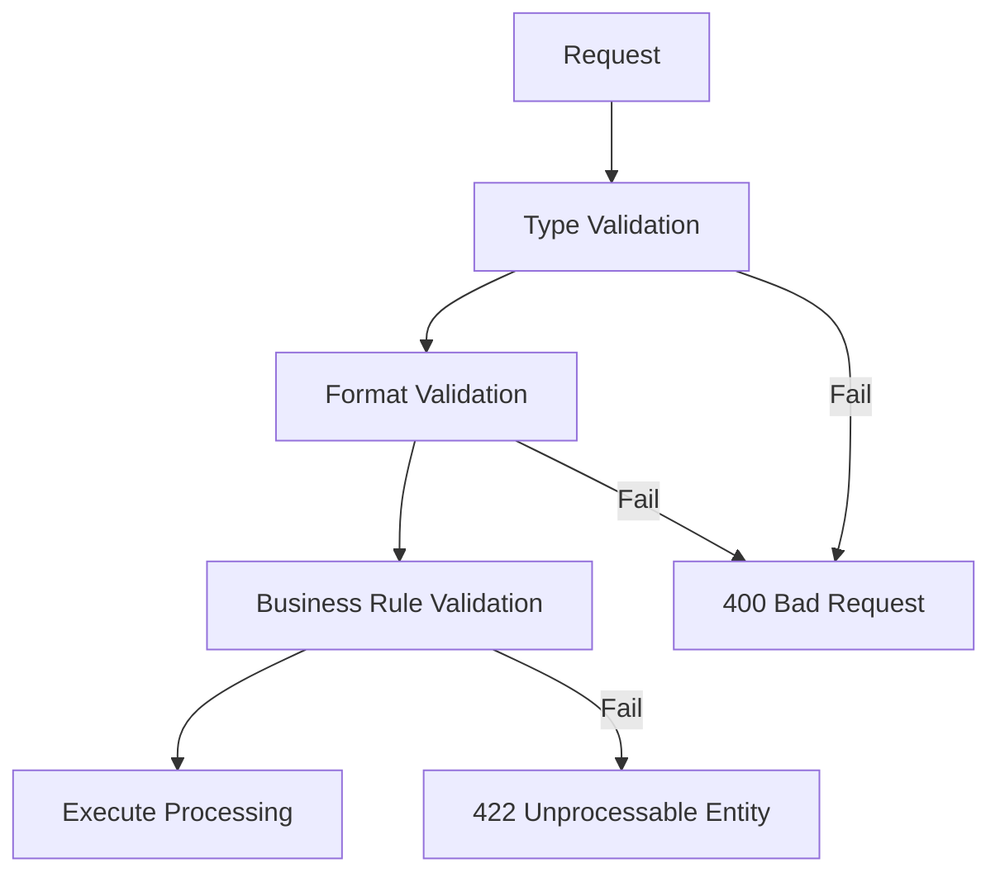
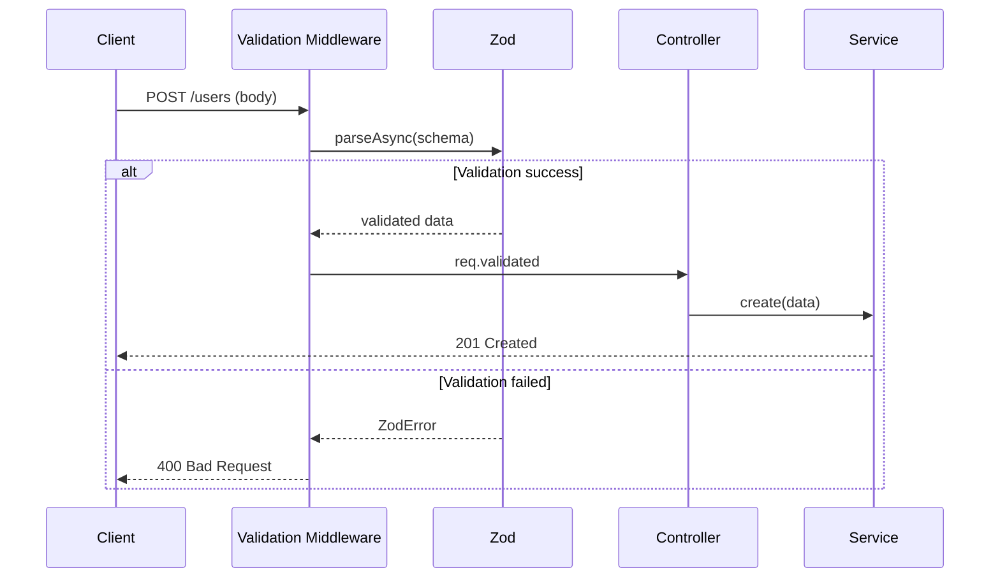

# Validation Design Document

## Basic Information

| Item | Content |
|------|---------|
| **Feature Name** | `[FeatureName]` |
| **Created** | YYYY-MM-DD |
| **Updated** | YYYY-MM-DD |
| **Author** | [Author Name] |

## Overview

Describes the design principles and implementation guidelines for input validation.

## Validation Strategy

### Validation Layers



### Validation Types

| Type | Description | Example |
|------|-------------|---------|
| Type validation | Data type verification | string, number, boolean |
| Format validation | Format verification | email, URL, date |
| Range validation | Value range verification | min/max values, character count |
| Pattern validation | Regex verification | Phone number, postal code |
| Business rules | Domain-specific verification | Existence check, duplicate check |

## Zod Schema Design

### Basic Schemas

```typescript
import { z } from 'zod';

// Common validation rules
const schemas = {
  // ID
  id: z.string().uuid('Invalid ID format'),

  // Email address
  email: z
    .string()
    .min(1, 'Email is required')
    .email('Please enter a valid email address')
    .max(255, 'Email must be 255 characters or less'),

  // Password
  password: z
    .string()
    .min(8, 'Password must be at least 8 characters')
    .max(128, 'Password must be 128 characters or less')
    .regex(
      /^(?=.*[a-zA-Z])(?=.*[0-9])/,
      'Password must contain letters and numbers'
    ),

  // Phone number
  phone: z
    .string()
    .regex(/^[0-9]{10,11}$/, 'Phone number must be 10-11 digits')
    .optional(),

  // Postal code
  postalCode: z
    .string()
    .regex(/^[0-9]{7}$/, 'Postal code must be 7 digits'),

  // Date
  date: z.coerce.date(),

  // Pagination
  page: z.coerce.number().int().positive().default(1),
  limit: z.coerce.number().int().min(1).max(100).default(20),
};
```

### Request Schemas

```typescript
// User creation request
export const createUserSchema = z.object({
  body: z.object({
    email: schemas.email,
    password: schemas.password,
    name: z.string().min(1, 'Name is required').max(100),
    phone: schemas.phone,
    birthDate: schemas.date.optional(),
    role: z.enum(['user', 'admin']).default('user'),
  }),
});

// User update request
export const updateUserSchema = z.object({
  params: z.object({
    id: schemas.id,
  }),
  body: z.object({
    name: z.string().min(1).max(100).optional(),
    phone: schemas.phone,
    birthDate: schemas.date.optional(),
  }),
});

// List users request
export const listUsersSchema = z.object({
  query: z.object({
    page: schemas.page,
    limit: schemas.limit,
    sort: z.enum(['createdAt', 'name', 'email']).default('createdAt'),
    order: z.enum(['asc', 'desc']).default('desc'),
    search: z.string().max(100).optional(),
  }),
});

// Type extraction
export type CreateUserInput = z.infer<typeof createUserSchema>['body'];
export type UpdateUserInput = z.infer<typeof updateUserSchema>['body'];
export type ListUsersQuery = z.infer<typeof listUsersSchema>['query'];
```

### Custom Validation

```typescript
// Prohibit future dates
const pastDate = z.date().refine(
  (date) => date <= new Date(),
  'Please select a date in the past'
);

// Unique constraint validation
const uniqueEmail = z.string().email().refine(
  async (email) => {
    const exists = await userRepository.existsByEmail(email);
    return !exists;
  },
  'This email address is already in use'
);

// Conditional validation
const conditionalSchema = z.object({
  type: z.enum(['individual', 'corporate']),
  companyName: z.string().optional(),
}).refine(
  (data) => {
    if (data.type === 'corporate') {
      return !!data.companyName;
    }
    return true;
  },
  {
    message: 'Company name is required for corporate accounts',
    path: ['companyName'],
  }
);
```

## Validation Middleware

### Express Implementation

```typescript
import { Request, Response, NextFunction } from 'express';
import { z, ZodError, ZodSchema } from 'zod';

interface ValidatedRequest<T> extends Request {
  validated: T;
}

export function validate<T extends ZodSchema>(schema: T) {
  return async (
    req: Request,
    res: Response,
    next: NextFunction
  ): Promise<void> => {
    try {
      const validated = await schema.parseAsync({
        body: req.body,
        query: req.query,
        params: req.params,
      });

      (req as ValidatedRequest<z.infer<T>>).validated = validated;
      next();
    } catch (error) {
      if (error instanceof ZodError) {
        const details = error.errors.map((err) => ({
          field: err.path.join('.'),
          code: err.code.toUpperCase(),
          message: err.message,
        }));

        res.status(400).json({
          error: {
            code: 'VALIDATION_ERROR',
            message: 'Invalid input',
            details,
            requestId: req.id,
            timestamp: new Date().toISOString(),
          },
        });
        return;
      }
      next(error);
    }
  };
}

// Usage example
router.post(
  '/users',
  validate(createUserSchema),
  async (req: ValidatedRequest<typeof createUserSchema>, res) => {
    const { body } = req.validated;
    const user = await userService.create(body);
    res.status(201).json({ data: user });
  }
);
```

## Sanitization

### Input Sanitization

```typescript
import DOMPurify from 'isomorphic-dompurify';

// HTML sanitization
const sanitizeHtml = (input: string): string => {
  return DOMPurify.sanitize(input, { ALLOWED_TAGS: [] });
};

// Trim + HTML removal
const sanitizeString = z.string().transform((val) => {
  return sanitizeHtml(val.trim());
});

// Schema with sanitization
export const sanitizedUserSchema = z.object({
  name: z.string().transform((val) => sanitizeHtml(val.trim())),
  bio: z.string().transform((val) => DOMPurify.sanitize(val, {
    ALLOWED_TAGS: ['b', 'i', 'a'],
    ALLOWED_ATTR: ['href'],
  })).optional(),
});
```

### SQL Injection Prevention

```typescript
// Use ORM like Prisma / Drizzle
// Parameterized queries are applied automatically

// ❌ Dangerous: string concatenation
const query = `SELECT * FROM users WHERE email = '${email}'`;

// ✅ Safe: parameterized
const user = await prisma.user.findUnique({
  where: { email },
});
```

## Error Messages

### Message Design

| Error Type | Message Example |
|------------|-----------------|
| Required | `[Field name] is required` |
| Format | `Please enter a valid [format name]` |
| Range (min) | `[Field name] must be at least [value]` |
| Range (max) | `[Field name] must be at most [value]` |
| Length (min) | `[Field name] must be at least [value] characters` |
| Length (max) | `[Field name] must be [value] characters or less` |
| Duplicate | `This [field name] is already in use` |

### i18n Support

```typescript
const messages = {
  ja: {
    required: '{field}は必須です',
    email: '有効なメールアドレスを入力してください',
    min: '{field}は{min}以上で入力してください',
    max: '{field}は{max}以下で入力してください',
  },
  en: {
    required: '{field} is required',
    email: 'Please enter a valid email address',
    min: '{field} must be at least {min}',
    max: '{field} must be at most {max}',
  },
};

function getMessage(
  key: keyof typeof messages['ja'],
  locale: 'ja' | 'en',
  params: Record<string, string | number> = {}
): string {
  let message = messages[locale][key];
  for (const [param, value] of Object.entries(params)) {
    message = message.replace(`{${param}}`, String(value));
  }
  return message;
}
```

## Validation Flow



## Testing

### Schema Tests

```typescript
describe('createUserSchema', () => {
  describe('email', () => {
    it('accepts valid email address', () => {
      const result = createUserSchema.safeParse({
        body: {
          email: 'test@example.com',
          password: 'password123',
          name: 'Test User',
        },
      });
      expect(result.success).toBe(true);
    });

    it('rejects invalid email address', () => {
      const result = createUserSchema.safeParse({
        body: {
          email: 'invalid-email',
          password: 'password123',
          name: 'Test User',
        },
      });
      expect(result.success).toBe(false);
      expect(result.error?.issues[0].path).toContain('email');
    });
  });

  describe('password', () => {
    it('rejects password with less than 8 characters', () => {
      const result = createUserSchema.safeParse({
        body: {
          email: 'test@example.com',
          password: 'short',
          name: 'Test User',
        },
      });
      expect(result.success).toBe(false);
    });
  });
});
```

## Related Documents

- [API Design](./api-design)
- [Error Handling](./error-handling)
- [Form Design](../frontend/form-design)

## Change History

| Version | Date | Changes |
|---------|------|---------|
| 1.0.0 | YYYY-MM-DD | Initial release |
