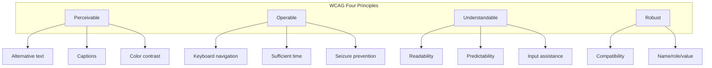
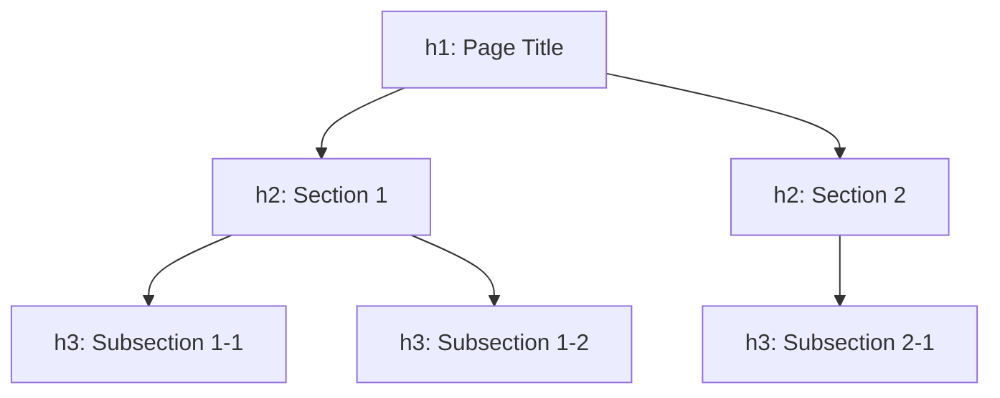
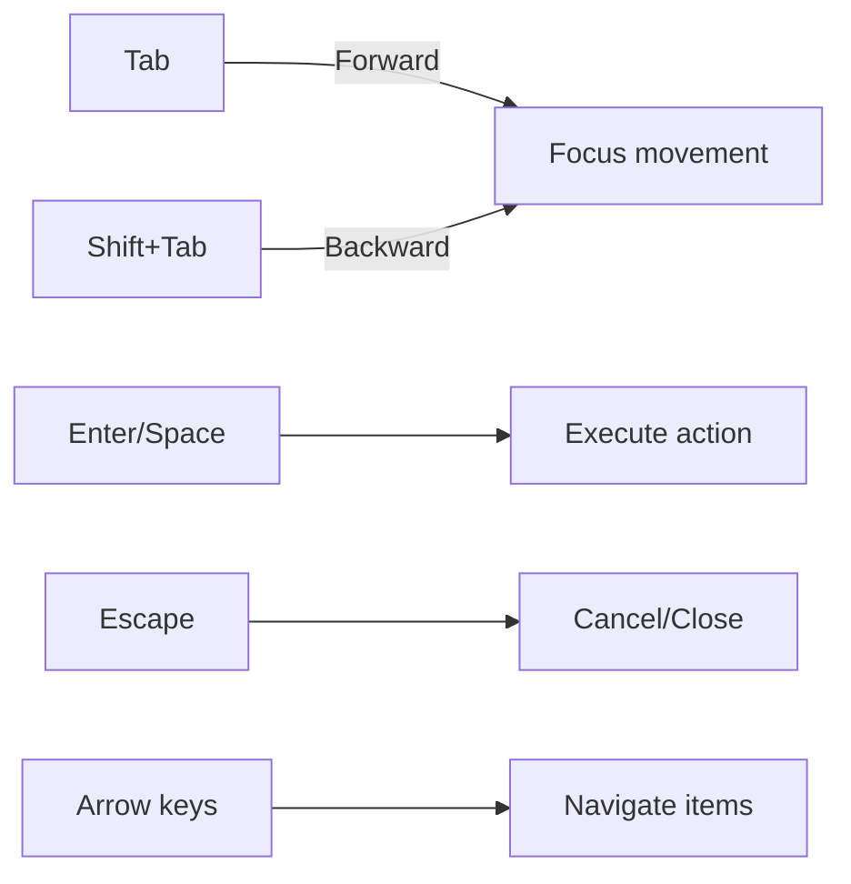
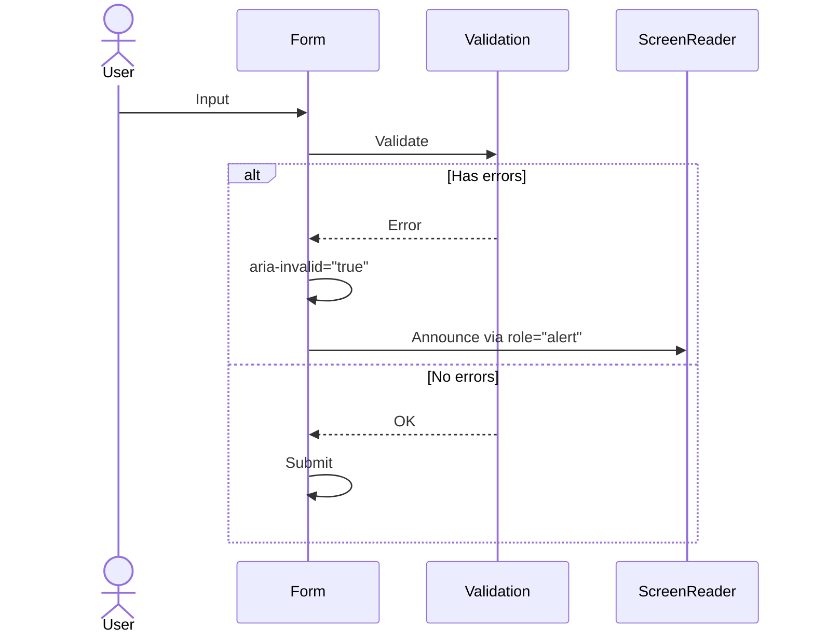

# Accessibility Design Document

## Basic Information

| Item | Content |
|------|---------|
| **Feature Name** | `[FeatureName]` |
| **Created** | YYYY-MM-DD |
| **Updated** | YYYY-MM-DD |
| **Author** | [Author Name] |

## Overview

Describes accessibility (a11y) design principles and implementation guidelines.

## Compliance Standards

### WCAG 2.1 Conformance Levels

| Level | Description | Status |
|-------|-------------|--------|
| A | Minimum accessibility | Required |
| AA | Standard accessibility | Target |
| AAA | Highest level | As feasible |

### Four Principles (POUR)



## Semantic HTML

### Landmark Regions

```html
<header role="banner">
  <nav role="navigation" aria-label="Main navigation">
    <!-- Navigation -->
  </nav>
</header>

<main role="main" id="main-content">
  <article>
    <h1>Page Title</h1>
    <!-- Main content -->
  </article>
</main>

<aside role="complementary" aria-label="Related information">
  <!-- Sidebar -->
</aside>

<footer role="contentinfo">
  <!-- Footer -->
</footer>
```

### Heading Structure



```html
<h1>Products</h1>
  <h2>Category: Electronics</h2>
    <h3>Smartphones</h3>
    <h3>Tablets</h3>
  <h2>Category: Appliances</h2>
    <h3>TVs</h3>
```

## ARIA Attributes

### Common Patterns

```tsx
// Button
<button
  aria-label="Open menu"
  aria-expanded={isOpen}
  aria-controls="menu-dropdown"
  aria-haspopup="true"
>
  <MenuIcon aria-hidden="true" />
</button>

// Dialog
<div
  role="dialog"
  aria-modal="true"
  aria-labelledby="dialog-title"
  aria-describedby="dialog-description"
>
  <h2 id="dialog-title">Confirm</h2>
  <p id="dialog-description">Do you want to perform this action?</p>
</div>

// Live region
<div
  role="status"
  aria-live="polite"
  aria-atomic="true"
>
  {statusMessage}
</div>

// Alert
<div
  role="alert"
  aria-live="assertive"
>
  {errorMessage}
</div>
```

### ARIA Attribute Reference

| Attribute | Purpose | Example |
|-----------|---------|---------|
| `aria-label` | Label text | `aria-label="Close"` |
| `aria-labelledby` | Reference element as label | `aria-labelledby="title-id"` |
| `aria-describedby` | Reference description text | `aria-describedby="desc-id"` |
| `aria-expanded` | Expanded state | `aria-expanded="true"` |
| `aria-hidden` | Hide from assistive tech | `aria-hidden="true"` |
| `aria-live` | Dynamic update notification | `aria-live="polite"` |
| `aria-disabled` | Disabled state | `aria-disabled="true"` |
| `aria-current` | Current item | `aria-current="page"` |

## Keyboard Navigation

### Focus Management



### Focus Trap (in Modal)

```tsx
import { useEffect, useRef } from 'react';

function Modal({ isOpen, onClose, children }) {
  const modalRef = useRef<HTMLDivElement>(null);
  const previousFocus = useRef<HTMLElement | null>(null);

  useEffect(() => {
    if (isOpen) {
      // Save current focus
      previousFocus.current = document.activeElement as HTMLElement;

      // Focus first focusable element in modal
      const firstFocusable = modalRef.current?.querySelector<HTMLElement>(
        'button, [href], input, select, textarea, [tabindex]:not([tabindex="-1"])'
      );
      firstFocusable?.focus();
    }

    return () => {
      // Restore focus when modal closes
      previousFocus.current?.focus();
    };
  }, [isOpen]);

  // Close on Escape
  useEffect(() => {
    const handleKeyDown = (e: KeyboardEvent) => {
      if (e.key === 'Escape') onClose();
    };
    document.addEventListener('keydown', handleKeyDown);
    return () => document.removeEventListener('keydown', handleKeyDown);
  }, [onClose]);

  if (!isOpen) return null;

  return (
    <div
      ref={modalRef}
      role="dialog"
      aria-modal="true"
      onKeyDown={handleTabKey}
    >
      {children}
    </div>
  );
}
```

### Keyboard Shortcut Reference

| Context | Key | Action |
|---------|-----|--------|
| General | `Tab` | Next element |
| General | `Shift+Tab` | Previous element |
| Button | `Enter/Space` | Execute |
| Link | `Enter` | Navigate |
| Modal | `Escape` | Close |
| Dropdown | `↑/↓` | Select item |
| Dropdown | `Enter` | Confirm selection |
| Tabs | `←/→` | Switch tabs |

## Color Contrast

### Contrast Ratio Requirements

| Element | AA Standard | AAA Standard |
|---------|-------------|--------------|
| Normal text | 4.5:1 | 7:1 |
| Large text (18pt+) | 3:1 | 4.5:1 |
| UI elements/graphics | 3:1 | - |

### Color Palette (a11y Compliant)

| Use | Color | Contrast on White |
|-----|-------|-------------------|
| Body text | `#1a1a1a` | 16.1:1 |
| Secondary text | `#666666` | 5.7:1 |
| Primary | `#0066cc` | 4.5:1 |
| Error | `#c41e3a` | 5.9:1 |
| Success | `#2e7d32` | 4.5:1 |

## Forms

### Accessible Forms

```tsx
<form aria-labelledby="form-title">
  <h2 id="form-title">Contact Form</h2>

  {/* Required field */}
  <div>
    <label htmlFor="email">
      Email Address
      <span aria-hidden="true" className="required">*</span>
    </label>
    <input
      id="email"
      type="email"
      aria-required="true"
      aria-describedby="email-hint email-error"
      aria-invalid={hasError}
    />
    <span id="email-hint" className="hint">
      Example: example@email.com
    </span>
    {hasError && (
      <span id="email-error" role="alert" className="error">
        Please enter a valid email address
      </span>
    )}
  </div>

  {/* Submit button */}
  <button type="submit" aria-busy={isSubmitting}>
    {isSubmitting ? 'Submitting...' : 'Submit'}
  </button>
</form>
```

### Error Messages



## Images & Media

### Alternative Text

```tsx
// Informative image


// Decorative image


// Complex image (long description)
<figure>
  
  <figcaption id="diagram-desc">
    Architecture where frontend connects to backend services via BFF.
    User requests are distributed through a load balancer.
  </figcaption>
</figure>
```

## Testing

### Automated Testing

```typescript
// Using jest-axe
import { axe, toHaveNoViolations } from 'jest-axe';

expect.extend(toHaveNoViolations);

describe('Button accessibility', () => {
  it('has no accessibility violations', async () => {
    const { container } = render(<Button>Click me</Button>);
    const results = await axe(container);
    expect(results).toHaveNoViolations();
  });
});
```

### Checklist

- [ ] All functionality operable via keyboard only
- [ ] Focus is visually apparent
- [ ] Content understandable via screen reader
- [ ] Color contrast meets standards
- [ ] Images have appropriate alt text
- [ ] Forms have labels and error messages
- [ ] Dynamic content changes are announced

## Related Documents

- [Component Design](./component-design)
- [Design System](./design-system)

## Change History

| Version | Date | Changes |
|---------|------|---------|
| 1.0.0 | YYYY-MM-DD | Initial release |
