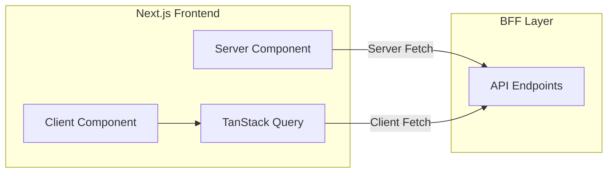
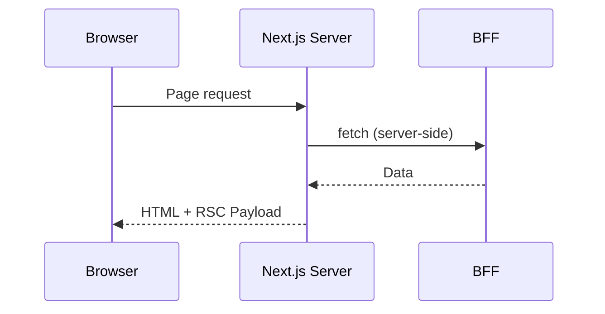
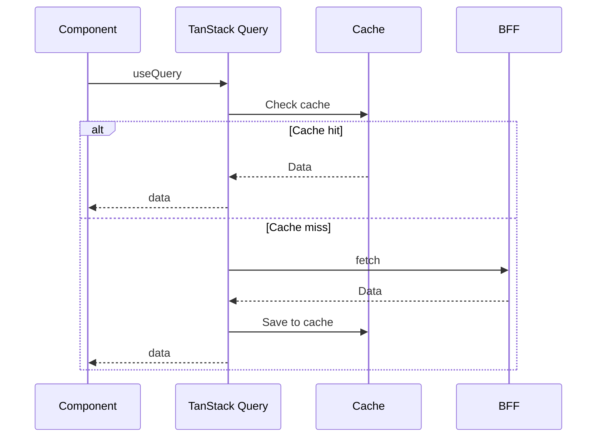
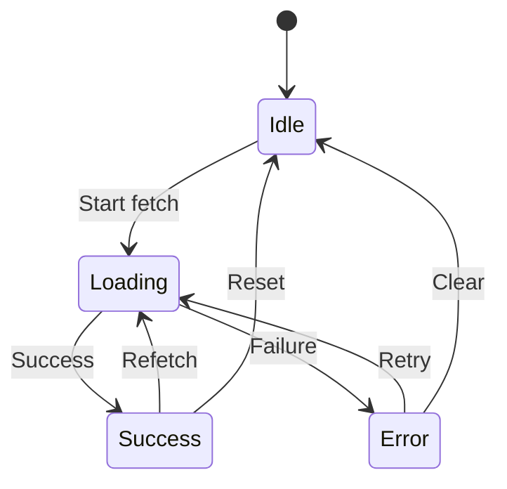

# API Integration Design Document

## Basic Information

| Item | Content |
|------|---------|
| **Feature Name** | `[FeatureName]` |
| **Created** | YYYY-MM-DD |
| **Updated** | YYYY-MM-DD |
| **Author** | [Author Name] |

## Overview

Describes the communication design with BFF APIs.

## Architecture

### Communication Flow



## API Client Design

### Basic Structure

```typescript
// lib/api/client.ts
const BASE_URL = process.env.NEXT_PUBLIC_API_URL || '/api';

interface FetchOptions extends RequestInit {
  params?: Record<string, string>;
}

class ApiClient {
  private baseUrl: string;

  constructor(baseUrl: string) {
    this.baseUrl = baseUrl;
  }

  async request<T>(
    endpoint: string,
    options: FetchOptions = {}
  ): Promise<T> {
    const { params, ...fetchOptions } = options;

    let url = `${this.baseUrl}${endpoint}`;
    if (params) {
      url += `?${new URLSearchParams(params)}`;
    }

    const response = await fetch(url, {
      ...fetchOptions,
      headers: {
        'Content-Type': 'application/json',
        ...fetchOptions.headers,
      },
    });

    if (!response.ok) {
      throw await this.handleError(response);
    }

    return response.json();
  }

  private async handleError(response: Response): Promise<ApiError> {
    const data = await response.json().catch(() => ({}));
    return new ApiError(
      data.error?.message || 'Unknown error',
      response.status,
      data.error?.code
    );
  }

  // Convenience methods
  get<T>(endpoint: string, params?: Record<string, string>) {
    return this.request<T>(endpoint, { method: 'GET', params });
  }

  post<T>(endpoint: string, body: unknown) {
    return this.request<T>(endpoint, {
      method: 'POST',
      body: JSON.stringify(body),
    });
  }

  put<T>(endpoint: string, body: unknown) {
    return this.request<T>(endpoint, {
      method: 'PUT',
      body: JSON.stringify(body),
    });
  }

  delete<T>(endpoint: string) {
    return this.request<T>(endpoint, { method: 'DELETE' });
  }
}

export const apiClient = new ApiClient(BASE_URL);
```

### Error Class

```typescript
// lib/api/errors.ts
export class ApiError extends Error {
  constructor(
    message: string,
    public status: number,
    public code?: string
  ) {
    super(message);
    this.name = 'ApiError';
  }

  get isUnauthorized() {
    return this.status === 401;
  }

  get isForbidden() {
    return this.status === 403;
  }

  get isNotFound() {
    return this.status === 404;
  }

  get isValidationError() {
    return this.status === 400 || this.status === 422;
  }

  get isServerError() {
    return this.status >= 500;
  }
}
```

## Data Fetching Patterns

### Server Component



```typescript
// app/products/page.tsx (Server Component)
async function ProductsPage() {
  const products = await apiClient.get<Product[]>('/products');

  return (
    <ProductList products={products} />
  );
}
```

### Client Component with TanStack Query



```typescript
// hooks/useProducts.ts
export function useProducts(filters?: ProductFilters) {
  return useQuery({
    queryKey: queryKeys.products.list(filters),
    queryFn: () => apiClient.get<Product[]>('/products', filters),
  });
}

// Component
function ProductList() {
  const { data, isLoading, error } = useProducts({ category: 'electronics' });

  if (isLoading) return <Skeleton />;
  if (error) return <ErrorMessage error={error} />;

  return <div>{data?.map(product => <ProductCard key={product.id} product={product} />)}</div>;
}
```

## Error Handling

### Error Classification

| Error Type | HTTP Status | User Response |
|------------|-------------|---------------|
| Validation Error | 400, 422 | Show field errors |
| Auth Error | 401 | Redirect to login |
| Permission Error | 403 | Show error message |
| Not Found | 404 | Show 404 page |
| Server Error | 5xx | Generic error + retry |

### Global Error Handling

```typescript
// providers/QueryProvider.tsx
const queryClient = new QueryClient({
  defaultOptions: {
    queries: {
      retry: (failureCount, error) => {
        if (error instanceof ApiError) {
          // Don't retry auth errors
          if (error.isUnauthorized) return false;
          // Retry server errors up to 3 times
          if (error.isServerError) return failureCount < 3;
        }
        return false;
      },
    },
    mutations: {
      onError: (error) => {
        if (error instanceof ApiError && error.isUnauthorized) {
          // Redirect on auth expiry
          window.location.href = '/login';
        }
      },
    },
  },
});
```

### Component-level Error Display

```tsx
function ErrorMessage({ error }: { error: ApiError }) {
  if (error.isValidationError) {
    return (
      <Alert variant="warning">
        Please check your input
      </Alert>
    );
  }

  if (error.isServerError) {
    return (
      <Alert variant="error">
        A server error occurred. Please try again later.
      </Alert>
    );
  }

  return (
    <Alert variant="error">
      {error.message}
    </Alert>
  );
}
```

## Loading States

### Loading Patterns



### Skeleton UI

```tsx
function ProductListSkeleton() {
  return (
    <div className="grid grid-cols-3 gap-4">
      {[...Array(6)].map((_, i) => (
        <div key={i} className="animate-pulse">
          <div className="bg-gray-200 h-48 rounded" />
          <div className="bg-gray-200 h-4 mt-2 rounded w-3/4" />
          <div className="bg-gray-200 h-4 mt-1 rounded w-1/2" />
        </div>
      ))}
    </div>
  );
}
```

## Type Safety

### API Type Definitions

```typescript
// types/api.ts

// Request types
interface CreateProductRequest {
  name: string;
  price: number;
  description?: string;
}

// Response types
interface Product {
  id: string;
  name: string;
  price: number;
  description: string | null;
  createdAt: string;
  updatedAt: string;
}

interface PaginatedResponse<T> {
  data: T[];
  meta: {
    total: number;
    page: number;
    limit: number;
    totalPages: number;
  };
}

// API function
async function createProduct(data: CreateProductRequest): Promise<Product> {
  return apiClient.post('/products', data);
}
```

### Runtime Validation with Zod

```typescript
// schemas/product.ts
import { z } from 'zod';

export const productSchema = z.object({
  id: z.string(),
  name: z.string(),
  price: z.number(),
  description: z.string().nullable(),
  createdAt: z.string().datetime(),
  updatedAt: z.string().datetime(),
});

export type Product = z.infer<typeof productSchema>;

// Validate API response
async function fetchProducts(): Promise<Product[]> {
  const data = await apiClient.get('/products');
  return z.array(productSchema).parse(data);
}
```

## Retry Strategy

### Exponential Backoff

```typescript
// lib/api/retry.ts
export async function withRetry<T>(
  fn: () => Promise<T>,
  options: {
    maxRetries?: number;
    baseDelay?: number;
    maxDelay?: number;
  } = {}
): Promise<T> {
  const { maxRetries = 3, baseDelay = 1000, maxDelay = 30000 } = options;

  let lastError: Error;

  for (let attempt = 0; attempt < maxRetries; attempt++) {
    try {
      return await fn();
    } catch (error) {
      lastError = error as Error;

      if (error instanceof ApiError && !error.isServerError) {
        throw error; // Don't retry non-server errors
      }

      const delay = Math.min(baseDelay * 2 ** attempt, maxDelay);
      await new Promise(resolve => setTimeout(resolve, delay));
    }
  }

  throw lastError!;
}
```

## Related Documents

- [State Management Design](./state-management)
- [BFF API Design](../bff/api-design)
- [Error Handling Design](../bff/error-handling)

## Change History

| Version | Date | Changes |
|---------|------|---------|
| 1.0.0 | YYYY-MM-DD | Initial release |
