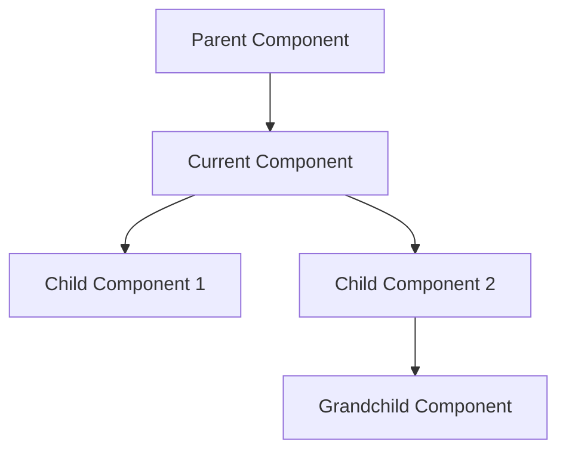
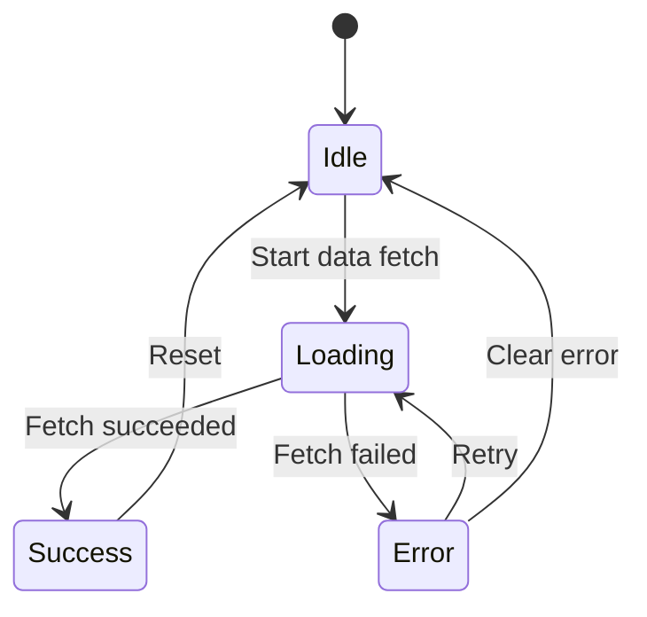
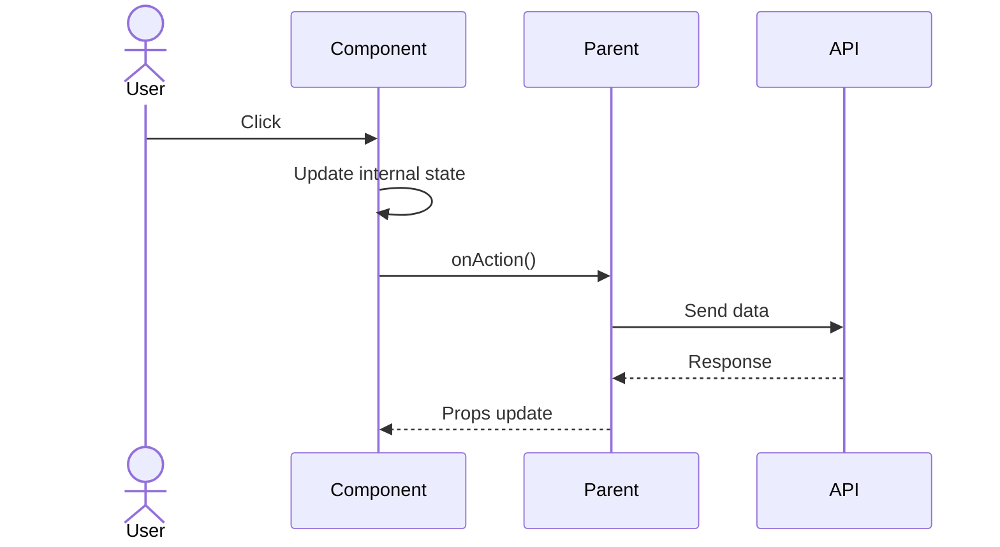

# Component Design Document

## Basic Information

| Item | Content |
|------|---------|
| **Component Name** | `[ComponentName]` |
| **Type** | Atom / Molecule / Organism / Template |
| **Created** | YYYY-MM-DD |
| **Updated** | YYYY-MM-DD |
| **Author** | [Author Name] |

## Overview

Briefly describe the purpose and responsibilities of the component.

## Component Hierarchy



## Props API

### Required Props

| Prop Name | Type | Description |
|-----------|------|-------------|
| `id` | `string` | Unique identifier |
| `data` | `DataType` | Display data |

### Optional Props

| Prop Name | Type | Default | Description |
|-----------|------|---------|-------------|
| `variant` | `'primary' \| 'secondary'` | `'primary'` | Visual variant |
| `size` | `'sm' \| 'md' \| 'lg'` | `'md'` | Size |
| `disabled` | `boolean` | `false` | Disabled state |
| `className` | `string` | - | Additional CSS classes |
| `onAction` | `() => void` | - | Action callback |

### Type Definitions

```typescript
interface ComponentProps {
  // Required
  id: string;
  data: DataType;

  // Optional
  variant?: 'primary' | 'secondary';
  size?: 'sm' | 'md' | 'lg';
  disabled?: boolean;
  className?: string;
  onAction?: () => void;
}

interface DataType {
  title: string;
  description?: string;
  items: Item[];
}
```

## State Management

### Internal State

| State Name | Type | Initial Value | Purpose |
|------------|------|---------------|---------|
| `isOpen` | `boolean` | `false` | Open/close state |
| `selectedIndex` | `number` | `0` | Selected index |

### State Transition Diagram



## Composition Patterns

### Compound Components

```tsx
<DataTable>
  <DataTable.Header>
    <DataTable.Column field="name">Name</DataTable.Column>
    <DataTable.Column field="status">Status</DataTable.Column>
  </DataTable.Header>
  <DataTable.Body>
    {data.map(item => (
      <DataTable.Row key={item.id} data={item} />
    ))}
  </DataTable.Body>
</DataTable>
```

### Render Props

```tsx
<DataFetcher
  url="/api/data"
  render={({ data, loading, error }) => (
    loading ? <Spinner /> : <DataDisplay data={data} />
  )}
/>
```

## Interactions

### Event Flow



### Keyboard Controls

| Key | Action |
|-----|--------|
| `Enter` | Confirm selection |
| `Escape` | Cancel/Close |
| `ArrowUp/Down` | Navigate items |
| `Tab` | Move focus |

## Accessibility

### ARIA Attributes

```tsx
<div
  role="button"
  aria-label="Action description"
  aria-expanded={isOpen}
  aria-controls="dropdown-id"
  tabIndex={0}
>
```

### Checklist

- [ ] Appropriate role attribute
- [ ] aria-label/aria-labelledby
- [ ] Focus management
- [ ] Live regions (if needed)

## Responsive Design

| Breakpoint | Changes |
|------------|---------|
| `< 640px` (sm) | Vertical stack layout |
| `640px - 1024px` (md) | 2 columns |
| `> 1024px` (lg) | 3+ columns |

## Performance Considerations

### Optimization Techniques

- [ ] Memoize with `React.memo`
- [ ] Cache computed values with `useMemo`
- [ ] Stabilize callbacks with `useCallback`
- [ ] Virtual scrolling (for large datasets)

### Lazy Loading

```tsx
const HeavyComponent = lazy(() => import('./HeavyComponent'));
```

## Testing Strategy

### Unit Tests

```typescript
describe('ComponentName', () => {
  it('renders correctly with default props', () => {});
  it('disables click when disabled', () => {});
  it('keyboard navigation works correctly', () => {});
});
```

### Test Cases

| Category | Test Case | Priority |
|----------|-----------|----------|
| Rendering | Default display | High |
| Interaction | Click behavior | High |
| Accessibility | Keyboard controls | Medium |
| Edge Case | Empty data | Medium |

## Usage Examples

### Basic Usage

```tsx
import { ComponentName } from '@/components/ComponentName';

export function Example() {
  return (
    <ComponentName
      id="example-1"
      data={{ title: 'Sample', items: [] }}
      onAction={() => console.log('action')}
    />
  );
}
```

## Related Components

- [RelatedComponent1](./component-design): Relationship description
- [RelatedComponent2](./component-design): Relationship description

## Change History

| Version | Date | Changes |
|---------|------|---------|
| 1.0.0 | YYYY-MM-DD | Initial release |
