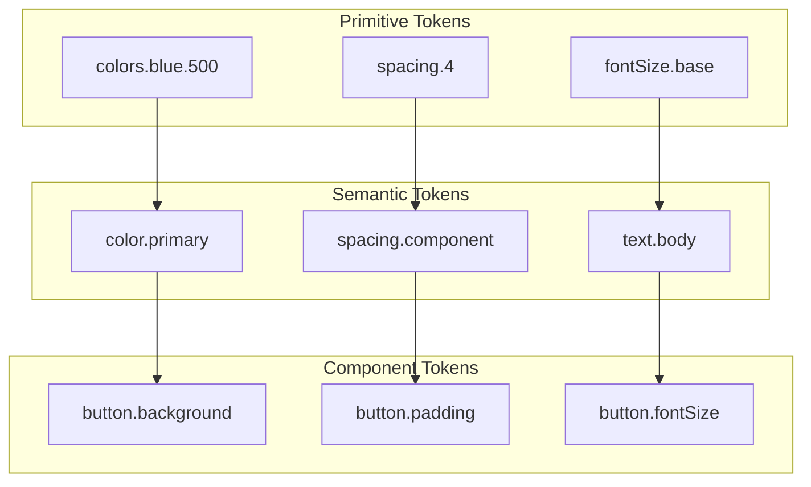
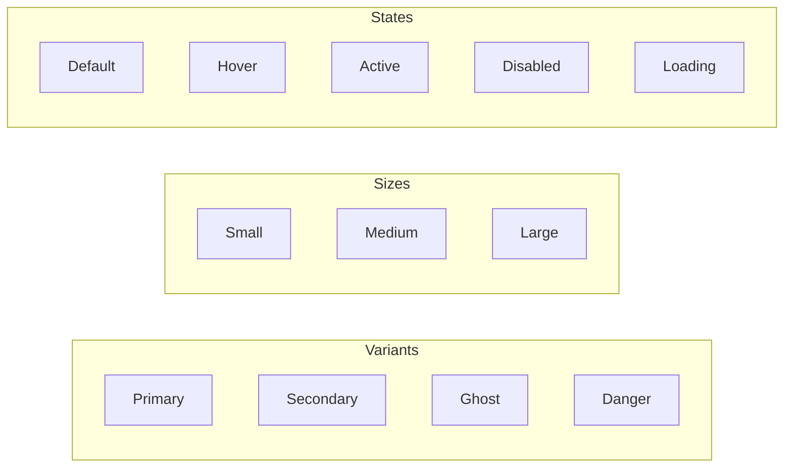

# Design System Document

## Basic Information

| Item | Content |
|------|---------|
| **System Name** | `[DesignSystemName]` |
| **Created** | YYYY-MM-DD |
| **Updated** | YYYY-MM-DD |
| **Author** | [Author Name] |

## Overview

Describes the components and design principles of the design system.

## Design Tokens

### Token Hierarchy



### Token Definitions (CSS Custom Properties)

```css
:root {
  /* Primitive tokens */
  --color-blue-50: #eff6ff;
  --color-blue-100: #dbeafe;
  --color-blue-500: #3b82f6;
  --color-blue-600: #2563eb;
  --color-blue-700: #1d4ed8;

  --color-gray-50: #f9fafb;
  --color-gray-100: #f3f4f6;
  --color-gray-500: #6b7280;
  --color-gray-900: #111827;

  /* Semantic tokens */
  --color-primary: var(--color-blue-600);
  --color-primary-hover: var(--color-blue-700);
  --color-text: var(--color-gray-900);
  --color-text-muted: var(--color-gray-500);
  --color-background: var(--color-gray-50);
  --color-surface: white;
}

/* Dark mode */
[data-theme="dark"] {
  --color-primary: var(--color-blue-500);
  --color-text: var(--color-gray-100);
  --color-text-muted: var(--color-gray-400);
  --color-background: var(--color-gray-900);
  --color-surface: var(--color-gray-800);
}
```

## Color Palette

### Brand Colors

| Name | Hex | Use |
|------|-----|-----|
| Primary | `#2563eb` | Main actions, links |
| Secondary | `#7c3aed` | Secondary actions |
| Accent | `#06b6d4` | Highlights |

### System Colors

| Name | Hex | Use |
|------|-----|-----|
| Success | `#22c55e` | Success state |
| Warning | `#f59e0b` | Warning state |
| Error | `#ef4444` | Error state |
| Info | `#3b82f6` | Info state |

### Grayscale

| Name | Hex | Use |
|------|-----|-----|
| Gray 50 | `#f9fafb` | Background |
| Gray 100 | `#f3f4f6` | Surface |
| Gray 300 | `#d1d5db` | Border |
| Gray 500 | `#6b7280` | Placeholder |
| Gray 700 | `#374151` | Secondary text |
| Gray 900 | `#111827` | Body text |

## Typography

### Font Families

```css
:root {
  --font-sans: 'Inter', 'Noto Sans JP', sans-serif;
  --font-mono: 'JetBrains Mono', monospace;
}
```

### Font Size Scale

| Token | Size | Line Height | Use |
|-------|------|-------------|-----|
| `text-xs` | 12px | 16px | Captions |
| `text-sm` | 14px | 20px | Helper text |
| `text-base` | 16px | 24px | Body |
| `text-lg` | 18px | 28px | Lead text |
| `text-xl` | 20px | 28px | h4 |
| `text-2xl` | 24px | 32px | h3 |
| `text-3xl` | 30px | 36px | h2 |
| `text-4xl` | 36px | 40px | h1 |

### Text Styles

```css
.text-heading {
  font-family: var(--font-sans);
  font-weight: 700;
  letter-spacing: -0.02em;
}

.text-body {
  font-family: var(--font-sans);
  font-weight: 400;
  letter-spacing: 0;
}

.text-code {
  font-family: var(--font-mono);
  font-size: 0.875em;
}
```

## Spacing

### Spacing Scale

| Token | Value | Use |
|-------|-------|-----|
| `space-0` | 0 | - |
| `space-1` | 4px | Minimum gap |
| `space-2` | 8px | Element padding |
| `space-3` | 12px | Small gap |
| `space-4` | 16px | Standard gap |
| `space-6` | 24px | Within sections |
| `space-8` | 32px | Between sections |
| `space-12` | 48px | Large divider |
| `space-16` | 64px | Page sections |

### Layout Grid

```css
.container {
  max-width: 1280px;
  margin: 0 auto;
  padding: 0 var(--space-4);
}

@media (min-width: 640px) {
  .container {
    padding: 0 var(--space-6);
  }
}

@media (min-width: 1024px) {
  .container {
    padding: 0 var(--space-8);
  }
}
```

## Components

### Button



| Property | Primary | Secondary | Ghost |
|----------|---------|-----------|-------|
| Background | `--color-primary` | `transparent` | `transparent` |
| Border | `none` | `1px solid --color-primary` | `none` |
| Text | `white` | `--color-primary` | `--color-primary` |
| Hover BG | `--color-primary-hover` | `--color-primary/10` | `--color-gray-100` |

### Input

| State | Border | Background | Notes |
|-------|--------|------------|-------|
| Default | `--color-gray-300` | `white` | |
| Focus | `--color-primary` | `white` | + ring |
| Error | `--color-error` | `--color-error/5` | |
| Disabled | `--color-gray-200` | `--color-gray-50` | |

### Card

```css
.card {
  background: var(--color-surface);
  border-radius: var(--radius-lg);
  box-shadow: var(--shadow-sm);
  padding: var(--space-6);
}

.card-hover {
  transition: box-shadow 0.2s, transform 0.2s;
}

.card-hover:hover {
  box-shadow: var(--shadow-md);
  transform: translateY(-2px);
}
```

## Shadows

| Token | Value | Use |
|-------|-------|-----|
| `shadow-sm` | `0 1px 2px rgba(0,0,0,0.05)` | Cards, buttons |
| `shadow-md` | `0 4px 6px rgba(0,0,0,0.1)` | Hover state |
| `shadow-lg` | `0 10px 15px rgba(0,0,0,0.1)` | Dropdowns |
| `shadow-xl` | `0 20px 25px rgba(0,0,0,0.1)` | Modals |

## Border Radius

| Token | Value | Use |
|-------|-------|-----|
| `radius-sm` | 4px | Small elements |
| `radius-md` | 8px | Buttons, inputs |
| `radius-lg` | 12px | Cards |
| `radius-xl` | 16px | Modals |
| `radius-full` | 9999px | Pills, avatars |

## Animation

### Transitions

```css
:root {
  --duration-fast: 150ms;
  --duration-normal: 200ms;
  --duration-slow: 300ms;

  --ease-in: cubic-bezier(0.4, 0, 1, 1);
  --ease-out: cubic-bezier(0, 0, 0.2, 1);
  --ease-in-out: cubic-bezier(0.4, 0, 0.2, 1);
}

.transition-colors {
  transition: color var(--duration-fast) var(--ease-out),
              background-color var(--duration-fast) var(--ease-out);
}

.transition-transform {
  transition: transform var(--duration-normal) var(--ease-out);
}
```

### Animation Patterns

| Name | Use | Duration |
|------|-----|----------|
| Fade In | Element appearance | 200ms |
| Slide Up | Modal, toast | 300ms |
| Scale | Button hover | 150ms |
| Spin | Loading | 1s (infinite) |

## Icons

### Icon Sizes

| Token | Size | Use |
|-------|------|-----|
| `icon-xs` | 12px | Inline icons |
| `icon-sm` | 16px | In buttons |
| `icon-md` | 20px | Standard |
| `icon-lg` | 24px | Navigation |
| `icon-xl` | 32px | Empty states |

### Usage Guidelines

```tsx
// Icon button
<button aria-label="Settings">
  <SettingsIcon className="icon-md" aria-hidden="true" />
</button>

// Button with text
<button>
  <PlusIcon className="icon-sm mr-2" aria-hidden="true" />
  Add
</button>
```

## Related Documents

- [Component Design](./component-design)
- [Accessibility Design](./accessibility-design)

## Change History

| Version | Date | Changes |
|---------|------|---------|
| 1.0.0 | YYYY-MM-DD | Initial release |
