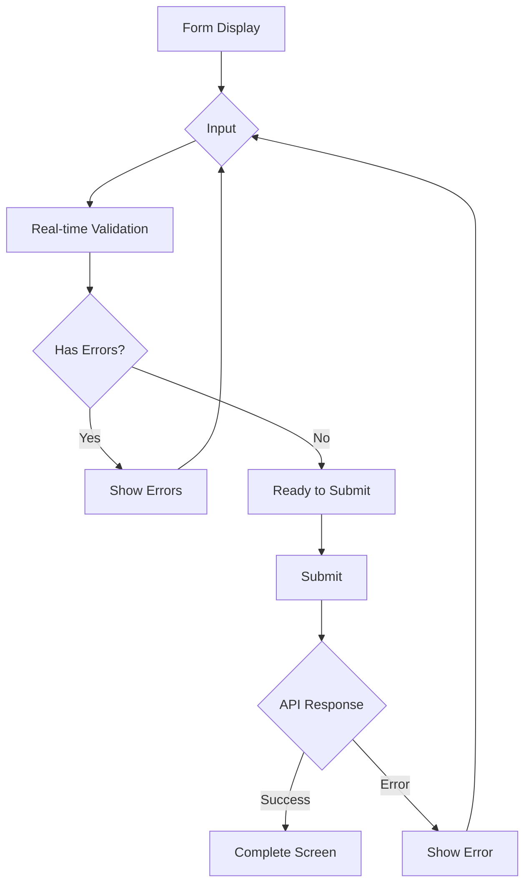
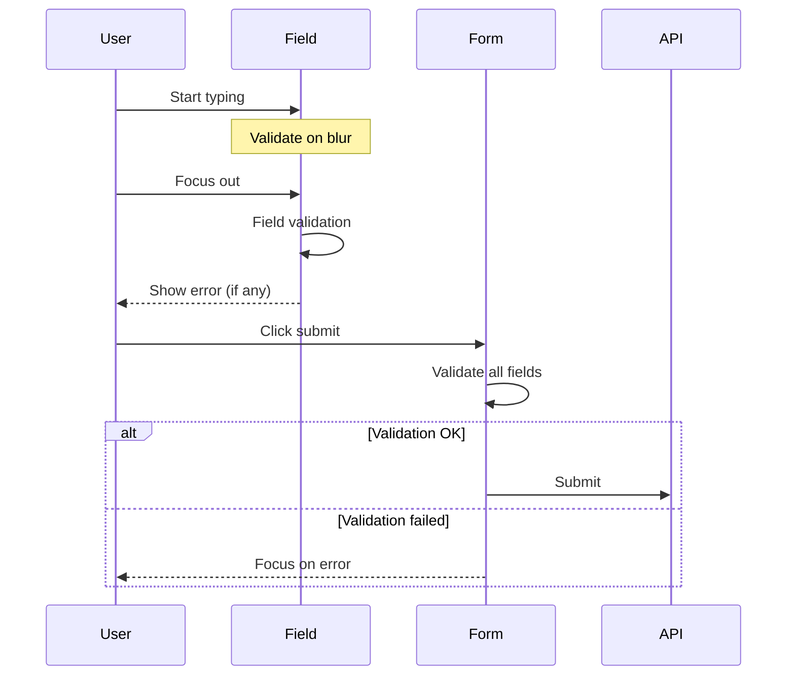
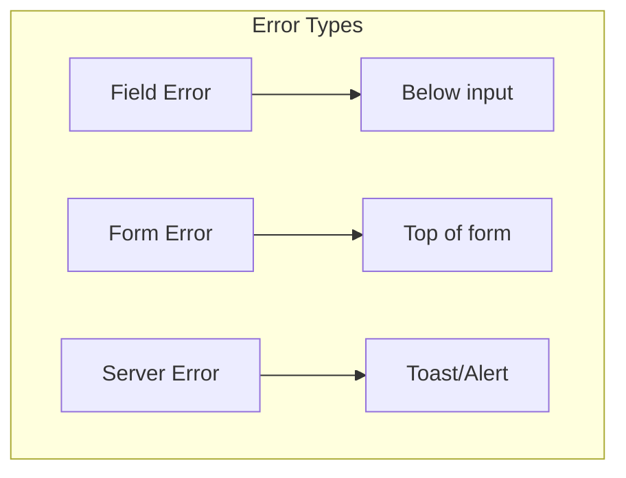
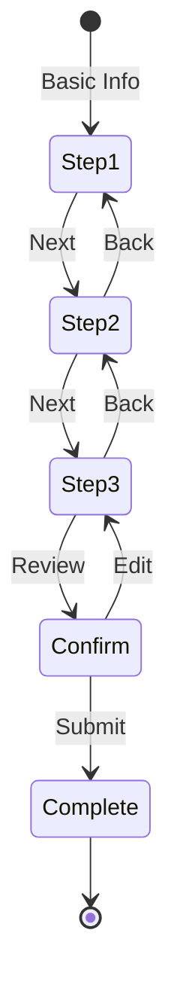

# Form Design Document

## Basic Information

| Item | Content |
|------|---------|
| **Form Name** | `[FormName]` |
| **Created** | YYYY-MM-DD |
| **Updated** | YYYY-MM-DD |
| **Author** | [Author Name] |

## Overview

Describes the purpose and design principles of the form.

## Form Structure

### Field List

| Field Name | Type | Required | Validation | Notes |
|------------|------|----------|------------|-------|
| `email` | `string` | Yes | Email format | |
| `password` | `string` | Yes | 8+ chars, alphanumeric | |
| `name` | `string` | Yes | 1-100 chars | |
| `phone` | `string` | No | Phone format | No hyphens |
| `birthDate` | `date` | No | Past date | |
| `agreeTerms` | `boolean` | Yes | Must be true | |

### Form Flow



## Validation Design

### Zod Schema

```typescript
import { z } from 'zod';

export const userFormSchema = z.object({
  email: z
    .string()
    .min(1, 'Email is required')
    .email('Please enter a valid email address'),

  password: z
    .string()
    .min(8, 'Password must be at least 8 characters')
    .regex(
      /^(?=.*[a-zA-Z])(?=.*[0-9])/,
      'Password must contain letters and numbers'
    ),

  name: z
    .string()
    .min(1, 'Name is required')
    .max(100, 'Name must be 100 characters or less'),

  phone: z
    .string()
    .regex(/^[0-9]{10,11}$/, 'Phone must be 10-11 digits')
    .optional()
    .or(z.literal('')),

  birthDate: z
    .date()
    .max(new Date(), 'Birth date must be in the past')
    .optional(),

  agreeTerms: z
    .boolean()
    .refine((val) => val === true, 'You must agree to the terms'),
});

export type UserFormData = z.infer<typeof userFormSchema>;
```

### Validation Timing



| Timing | Trigger | Target |
|--------|---------|--------|
| onChange | While typing | Specific fields only (optional) |
| onBlur | Focus out | Current field |
| onSubmit | Submit | All fields |

## React Hook Form Implementation

### Basic Structure

```typescript
import { useForm } from 'react-hook-form';
import { zodResolver } from '@hookform/resolvers/zod';

export function UserForm({ onSubmit }: UserFormProps) {
  const {
    register,
    handleSubmit,
    formState: { errors, isSubmitting, isDirty, isValid },
    setError,
    reset,
  } = useForm<UserFormData>({
    resolver: zodResolver(userFormSchema),
    mode: 'onBlur', // Validation timing
    defaultValues: {
      email: '',
      password: '',
      name: '',
      phone: '',
      agreeTerms: false,
    },
  });

  const onSubmitHandler = async (data: UserFormData) => {
    try {
      await onSubmit(data);
      reset();
    } catch (error) {
      if (error instanceof ApiError && error.code === 'EMAIL_EXISTS') {
        setError('email', {
          type: 'server',
          message: 'This email address is already in use',
        });
      }
    }
  };

  return (
    <form onSubmit={handleSubmit(onSubmitHandler)}>
      {/* Fields */}
    </form>
  );
}
```

### Field Component

```tsx
interface FormFieldProps {
  label: string;
  name: string;
  type?: string;
  required?: boolean;
  error?: string;
  hint?: string;
}

function FormField({
  label,
  name,
  type = 'text',
  required,
  error,
  hint,
  ...inputProps
}: FormFieldProps) {
  const id = `field-${name}`;
  const errorId = `${id}-error`;
  const hintId = `${id}-hint`;

  return (
    <div className="form-field">
      <label htmlFor={id}>
        {label}
        {required && <span className="required" aria-hidden="true">*</span>}
      </label>

      <input
        id={id}
        type={type}
        aria-required={required}
        aria-invalid={!!error}
        aria-describedby={`${hint ? hintId : ''} ${error ? errorId : ''}`.trim()}
        {...inputProps}
      />

      {hint && (
        <span id={hintId} className="hint">
          {hint}
        </span>
      )}

      {error && (
        <span id={errorId} className="error" role="alert">
          {error}
        </span>
      )}
    </div>
  );
}
```

## Error Display

### Error Display Patterns



### Error Message Design

| Error Type | Position | Style |
|------------|----------|-------|
| Validation error | Below field | Red text + icon |
| Server error (field) | Below field | Red text |
| Server error (general) | Top of form | Alert box |
| Network error | Toast | Error toast |

### Error Focus

```typescript
// Focus first error field on error
useEffect(() => {
  const firstError = Object.keys(errors)[0];
  if (firstError) {
    const element = document.querySelector(`[name="${firstError}"]`);
    element?.focus();
  }
}, [errors]);
```

## Multi-step Forms

### Step Structure



### Step Implementation

```typescript
type Step = 'basic' | 'detail' | 'confirm';

function MultiStepForm() {
  const [step, setStep] = useState<Step>('basic');
  const [formData, setFormData] = useState<Partial<FormData>>({});

  const updateFormData = (data: Partial<FormData>) => {
    setFormData((prev) => ({ ...prev, ...data }));
  };

  const nextStep = () => {
    const steps: Step[] = ['basic', 'detail', 'confirm'];
    const currentIndex = steps.indexOf(step);
    if (currentIndex < steps.length - 1) {
      setStep(steps[currentIndex + 1]);
    }
  };

  const prevStep = () => {
    const steps: Step[] = ['basic', 'detail', 'confirm'];
    const currentIndex = steps.indexOf(step);
    if (currentIndex > 0) {
      setStep(steps[currentIndex - 1]);
    }
  };

  return (
    <div>
      <StepIndicator currentStep={step} />

      {step === 'basic' && (
        <BasicInfoStep
          data={formData}
          onNext={(data) => {
            updateFormData(data);
            nextStep();
          }}
        />
      )}

      {step === 'detail' && (
        <DetailStep
          data={formData}
          onNext={(data) => {
            updateFormData(data);
            nextStep();
          }}
          onBack={prevStep}
        />
      )}

      {step === 'confirm' && (
        <ConfirmStep
          data={formData}
          onSubmit={handleSubmit}
          onBack={prevStep}
        />
      )}
    </div>
  );
}
```

## Auto-save

### Implementation Pattern

```typescript
function AutoSaveForm() {
  const form = useForm<FormData>();
  const { watch } = form;

  // Debounced auto-save
  const formValues = watch();

  useEffect(() => {
    const timeoutId = setTimeout(() => {
      localStorage.setItem('form-draft', JSON.stringify(formValues));
    }, 1000);

    return () => clearTimeout(timeoutId);
  }, [formValues]);

  // Restore initial values
  useEffect(() => {
    const draft = localStorage.getItem('form-draft');
    if (draft) {
      form.reset(JSON.parse(draft));
    }
  }, []);

  return <form>{/* Fields */}</form>;
}
```

## File Upload

### Drag & Drop

```tsx
function FileUpload({ onUpload }: { onUpload: (files: File[]) => void }) {
  const [isDragging, setIsDragging] = useState(false);

  const handleDrop = (e: React.DragEvent) => {
    e.preventDefault();
    setIsDragging(false);
    const files = Array.from(e.dataTransfer.files);
    onUpload(files);
  };

  return (
    <div
      className={`dropzone ${isDragging ? 'dragging' : ''}`}
      onDragOver={(e) => {
        e.preventDefault();
        setIsDragging(true);
      }}
      onDragLeave={() => setIsDragging(false)}
      onDrop={handleDrop}
      role="button"
      tabIndex={0}
      aria-label="Drop files or click to upload"
    >
      <p>Drag and drop files</p>
      <p>or</p>
      <input
        type="file"
        multiple
        onChange={(e) => onUpload(Array.from(e.target.files || []))}
      />
    </div>
  );
}
```

## Testing

### Form Tests

```typescript
describe('UserForm', () => {
  it('displays validation errors', async () => {
    const user = userEvent.setup();
    render(<UserForm onSubmit={vi.fn()} />);

    // Submit empty form
    await user.click(screen.getByRole('button', { name: 'Submit' }));

    expect(await screen.findByText('Email is required')).toBeInTheDocument();
    expect(await screen.findByText('Password must be at least 8 characters')).toBeInTheDocument();
  });

  it('submits with correct input', async () => {
    const onSubmit = vi.fn();
    const user = userEvent.setup();
    render(<UserForm onSubmit={onSubmit} />);

    await user.type(screen.getByLabelText('Email'), 'test@example.com');
    await user.type(screen.getByLabelText('Password'), 'password123');
    await user.type(screen.getByLabelText('Name'), 'Test User');
    await user.click(screen.getByLabelText('I agree to the terms'));
    await user.click(screen.getByRole('button', { name: 'Submit' }));

    await waitFor(() => {
      expect(onSubmit).toHaveBeenCalledWith({
        email: 'test@example.com',
        password: 'password123',
        name: 'Test User',
        phone: '',
        agreeTerms: true,
      });
    });
  });
});
```

## Related Documents

- [State Management Design](./state-management)
- [Validation Design](../bff/validation-design)
- [Accessibility Design](./accessibility-design)

## Change History

| Version | Date | Changes |
|---------|------|---------|
| 1.0.0 | YYYY-MM-DD | Initial release |
