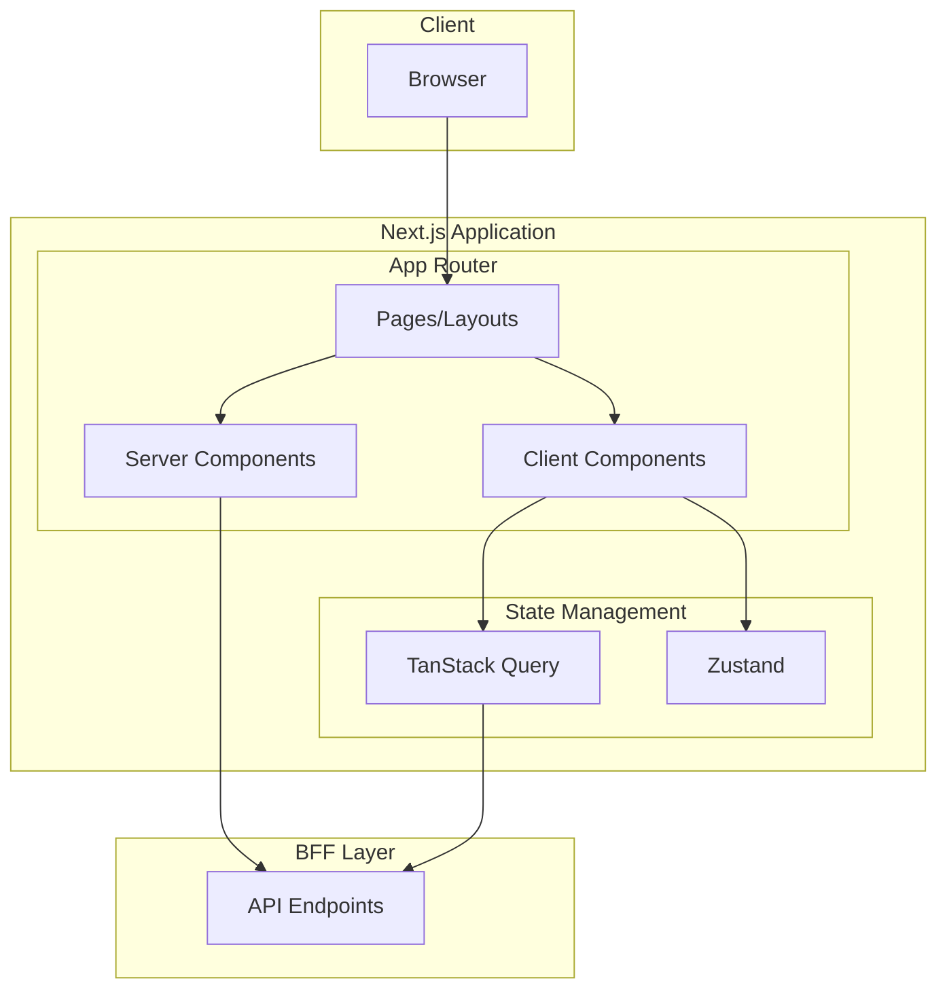

# Frontend Design Overview

Documentation for frontend (React/Next.js) design.

## Technology Stack

| Category | Technology |
|----------|------------|
| **Framework** | Next.js (App Router) |
| **UI Library** | React |
| **State Management** | Zustand / Jotai |
| **Server State** | TanStack Query |
| **Styling** | CSS Modules / Tailwind CSS |
| **Testing** | Jest, Testing Library, Playwright |
| **Validation** | Zod |

## Architecture Overview



## Document List

| Document | Overview |
|----------|----------|
| [Component Design](./component-design) | Atomic Design, Props API, Composition Patterns |
| [Page Design](./page-design) | Layout, Routing, Data Fetching |
| [State Management](./state-management) | Global/Server State Design Patterns |
| [Routing Design](./routing-design) | App Router, Authentication Flow, Middleware |
| [API Integration](./api-integration) | BFF Communication, Error Handling, Type Safety |
| [Performance Design](./performance-design) | Core Web Vitals, Optimization Strategies |
| [Testing Design](./testing-design) | Unit/Integration/E2E Testing Strategies |
| [Accessibility Design](./accessibility-design) | WCAG Compliance, ARIA, Keyboard Navigation |
| [Design System](./design-system) | Tokens, Typography, Spacing |
| [Form Design](./form-design) | Validation, Error Display, Multi-step Forms |

## Directory Structure Example

```
src/
├── app/                    # Next.js App Router
│   ├── layout.tsx
│   ├── page.tsx
│   ├── (auth)/            # Auth group
│   └── (main)/            # Main content group
├── components/
│   ├── ui/                # Generic UI components
│   ├── features/          # Feature-specific components
│   └── layouts/           # Layout components
├── hooks/                 # Custom hooks
├── stores/                # Zustand stores
├── lib/                   # Utilities
├── types/                 # Type definitions
└── styles/                # Global styles
```
