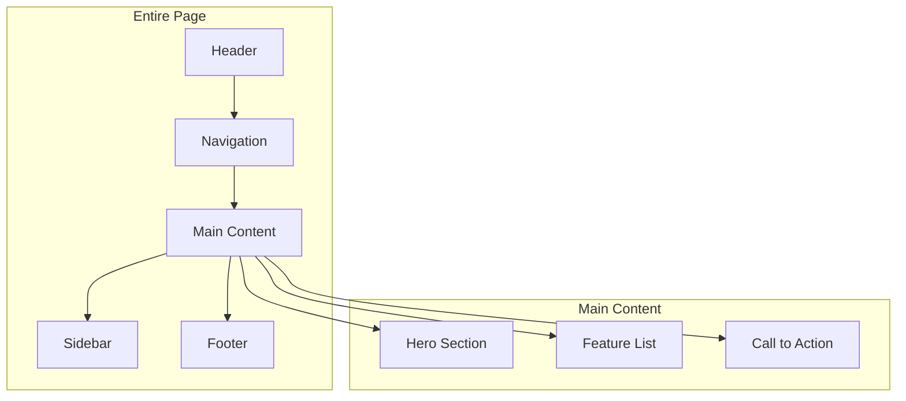
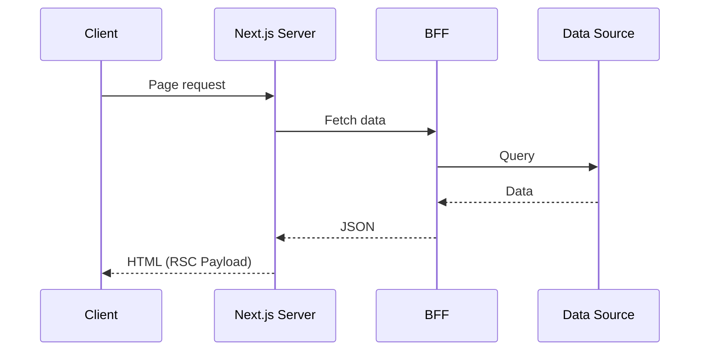
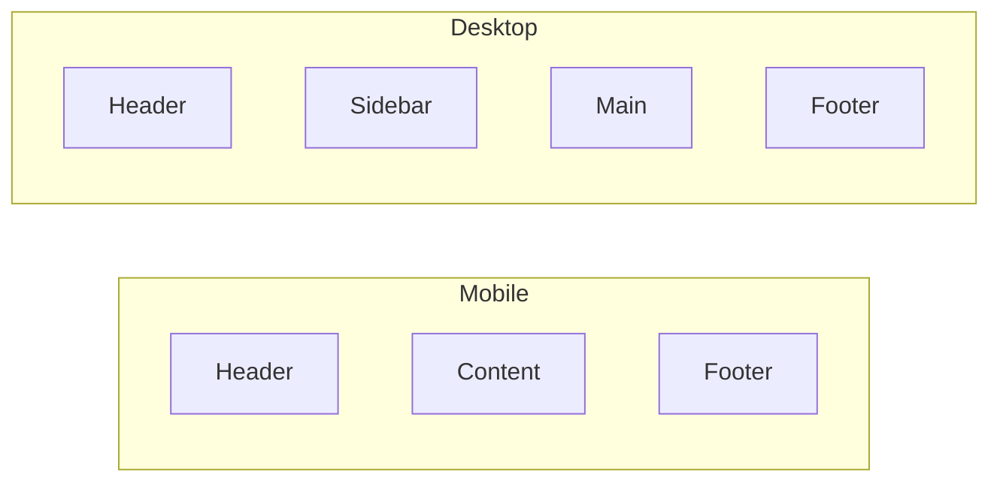
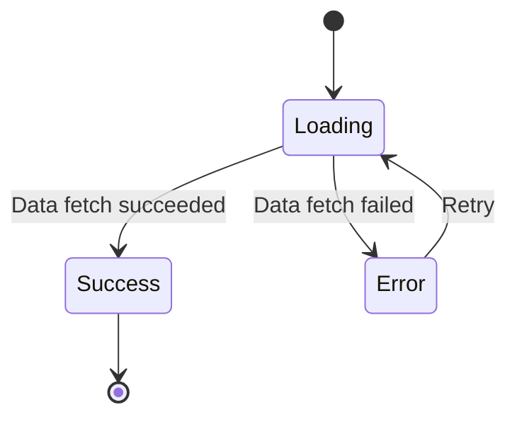
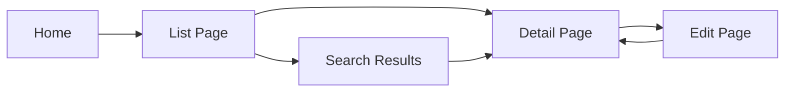

# Page/Screen Design Document

## Basic Information

| Item | Content |
|------|---------|
| **Page Name** | `[PageName]` |
| **URL Path** | `/path/to/page` |
| **Created** | YYYY-MM-DD |
| **Updated** | YYYY-MM-DD |
| **Author** | [Author Name] |

## Overview

Describe the purpose and main functionality of the page.

## Page Structure

### Information Architecture



### Wireframe

```
+------------------------------------------+
|              Header / Nav                |
+------------------------------------------+
|                                          |
|            Hero Section                  |
|                                          |
+------------------------------------------+
|  Content Area          |    Sidebar     |
|                        |                |
|  - Section 1           |  - Widget 1   |
|  - Section 2           |  - Widget 2   |
|  - Section 3           |               |
|                        |               |
+------------------------------------------+
|              Footer                      |
+------------------------------------------+
```

## Routing

### Next.js App Router Structure

```
app/
├── layout.tsx           # Root layout
├── page.tsx             # Home page
├── [locale]/            # i18n support
│   ├── layout.tsx
│   └── page/
│       ├── page.tsx     # Target page
│       └── loading.tsx  # Loading UI
```

### Dynamic Routes

| Parameter | Type | Example | Description |
|-----------|------|---------|-------------|
| `[id]` | `string` | `abc123` | Resource ID |
| `[...slug]` | `string[]` | `['a', 'b']` | Catch-all path |

## Data Fetching

### Server Components



### Data Fetching Patterns

| Data Type | Fetch Method | Cache Strategy |
|-----------|--------------|----------------|
| User info | Server Component | no-store |
| Product list | Server Component | revalidate: 60 |
| Static content | generateStaticParams | static |

## Layout Design

### Responsive Breakpoints

| Breakpoint | Width | Layout |
|------------|-------|--------|
| Mobile | < 640px | Single column |
| Tablet | 640px - 1024px | 2 columns |
| Desktop | > 1024px | 3 columns + sidebar |

### Layout Diagram



## State Management

### Page State

| State | Type | Management | Description |
|-------|------|------------|-------------|
| `filters` | `FilterState` | URL Query | Filter conditions |
| `selectedItem` | `Item \| null` | Zustand | Selected item |
| `serverData` | `Data[]` | TanStack Query | Server data |

### URL State Management

```typescript
// URL state management with nuqs
const [page, setPage] = useQueryState('page', parseAsInteger.withDefault(1));
const [sort, setSort] = useQueryState('sort', parseAsString.withDefault('date'));
```

## SEO / Metadata

### Static Metadata

```typescript
export const metadata: Metadata = {
  title: 'Page Title | Site Name',
  description: 'Page description (120-160 characters)',
  openGraph: {
    title: 'OGP Title',
    description: 'OGP Description',
    images: ['/og-image.png'],
  },
};
```

### Dynamic Metadata

```typescript
export async function generateMetadata({ params }): Promise<Metadata> {
  const data = await fetchData(params.id);
  return {
    title: data.title,
    description: data.description,
  };
}
```

## Loading / Error States

### Loading UI



### Suspense Boundaries

```tsx
<Suspense fallback={<PageSkeleton />}>
  <DataSection />
</Suspense>
```

### Error Boundary

```tsx
<ErrorBoundary fallback={<ErrorMessage />}>
  <RiskyComponent />
</ErrorBoundary>
```

## Accessibility

### Landmarks

```html
<header role="banner">...</header>
<nav role="navigation">...</nav>
<main role="main">...</main>
<aside role="complementary">...</aside>
<footer role="contentinfo">...</footer>
```

### Skip Links

```tsx
<a href="#main-content" className="skip-link">
  Skip to main content
</a>
```

## Performance Requirements

### Core Web Vitals Targets

| Metric | Target | Measurement |
|--------|--------|-------------|
| LCP | < 2.5s | Lighthouse |
| FID | < 100ms | Web Vitals |
| CLS | < 0.1 | Lighthouse |
| TTFB | < 600ms | DevTools |

### Optimization Strategies

- [ ] Image optimization (next/image)
- [ ] Font optimization (next/font)
- [ ] Code splitting (dynamic import)
- [ ] Prefetch (Link prefetch)

## Security Considerations

- [ ] XSS protection (sanitization)
- [ ] CSRF protection (tokens)
- [ ] Authentication state check
- [ ] Authorization check

## Page Navigation



## Related Documents

- [API Endpoint Specification](../bff/api-design)
- [Authentication Flow](./routing-design)
- [Shared Components](./component-design)

## Change History

| Version | Date | Changes |
|---------|------|---------|
| 1.0.0 | YYYY-MM-DD | Initial release |
