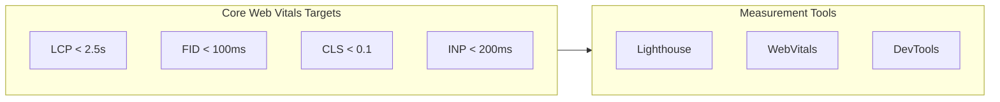
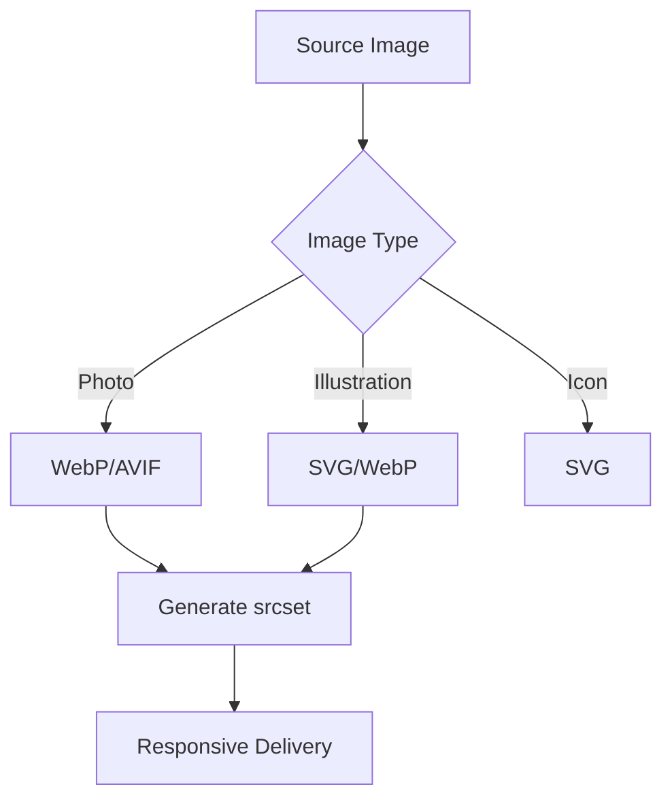
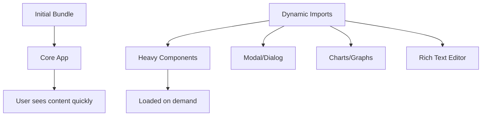

# Performance Design Document

## Basic Information

| Item | Content |
|------|---------|
| **Feature Name** | `[FeatureName]` |
| **Created** | YYYY-MM-DD |
| **Updated** | YYYY-MM-DD |
| **Author** | [Author Name] |

## Overview

Describes performance design goals and optimization strategies.

## Performance Goals

### Core Web Vitals



| Metric | Description | Target | Good | Needs Improvement | Poor |
|--------|-------------|--------|------|-------------------|------|
| LCP | Largest Contentful Paint | < 2.5s | ≤ 2.5s | 2.5s - 4s | > 4s |
| FID | First Input Delay | < 100ms | ≤ 100ms | 100ms - 300ms | > 300ms |
| CLS | Cumulative Layout Shift | < 0.1 | ≤ 0.1 | 0.1 - 0.25 | > 0.25 |
| INP | Interaction to Next Paint | < 200ms | ≤ 200ms | 200ms - 500ms | > 500ms |
| TTFB | Time to First Byte | < 600ms | ≤ 600ms | 600ms - 1.8s | > 1.8s |

## Performance Budget

### JavaScript Bundle Size

| Bundle | Target Size | Current | Status |
|--------|-------------|---------|--------|
| Initial (gzip) | < 100KB | - | - |
| Vendor (gzip) | < 150KB | - | - |
| Total (gzip) | < 300KB | - | - |

### Page Weight

| Resource | Target | Notes |
|----------|--------|-------|
| HTML | < 50KB | Compressed |
| CSS | < 50KB | Compressed |
| JavaScript | < 300KB | Compressed |
| Images | < 500KB | First view |
| Fonts | < 100KB | Subset |

## Image Optimization

### Next.js Image

```tsx
import Image from 'next/image';

<Image
  src="/hero.jpg"
  alt="Hero image"
  width={1200}
  height={600}
  priority // LCP image
  placeholder="blur"
  blurDataURL={blurDataUrl}
/>
```

### Image Format Strategy



| Use Case | Format | Quality | Notes |
|----------|--------|---------|-------|
| Hero image | WebP/AVIF | 80% | priority attribute |
| Thumbnail | WebP | 75% | lazy loading |
| Icon | SVG | - | Inline |
| OGP image | PNG | 90% | 1200x630px |

## Font Optimization

### Using next/font

```typescript
// app/layout.tsx
import { Inter, Noto_Sans_JP } from 'next/font/google';

const inter = Inter({
  subsets: ['latin'],
  display: 'swap',
  variable: '--font-inter',
});

const notoSansJP = Noto_Sans_JP({
  subsets: ['latin'],
  weight: ['400', '700'],
  display: 'swap',
  variable: '--font-noto-sans-jp',
});
```

### Font Subset

| Font | Subset | Target Size |
|------|--------|-------------|
| Inter | latin | < 20KB |
| Noto Sans JP | latin + common kanji | < 80KB |

## Code Splitting

### Dynamic Import



```typescript
// Lazy load heavy components
import dynamic from 'next/dynamic';

const ChartComponent = dynamic(
  () => import('@/components/Chart'),
  {
    loading: () => <ChartSkeleton />,
    ssr: false,
  }
);

const RichTextEditor = dynamic(
  () => import('@/components/RichTextEditor'),
  { ssr: false }
);
```

### Route-based Code Splitting

```
app/
├── page.tsx          # / (Initial)
├── dashboard/
│   └── page.tsx      # /dashboard (Lazy)
└── admin/
    └── page.tsx      # /admin (Lazy)
```

## Caching Strategy

### Next.js Cache

| Cache Layer | Setting | Use Case |
|-------------|---------|----------|
| Full Route Cache | static | Static pages |
| Data Cache | revalidate | API responses |
| Router Cache | client | Navigation |

```typescript
// Data cache configuration
fetch('https://api.example.com/data', {
  next: {
    revalidate: 60, // Revalidate after 60 seconds
    tags: ['products'], // Cache tag
  },
});

// Cache invalidation
import { revalidateTag } from 'next/cache';
revalidateTag('products');
```

### Browser Cache Headers

| Resource | Cache-Control | Notes |
|----------|---------------|-------|
| HTML | no-cache | Always validate |
| JS/CSS (hashed) | max-age=31536000 | 1 year |
| Images | max-age=86400 | 1 day |
| Fonts | max-age=31536000 | 1 year |

## Rendering Optimization

### React Optimization

```typescript
// Memoization
const MemoizedComponent = memo(ExpensiveComponent);

// Computed value memoization
const sortedData = useMemo(
  () => data.sort((a, b) => a.name.localeCompare(b.name)),
  [data]
);

// Callback stabilization
const handleClick = useCallback(() => {
  doSomething(id);
}, [id]);
```

### Virtual Scrolling

```tsx
import { useVirtualizer } from '@tanstack/react-virtual';

function VirtualList({ items }: { items: Item[] }) {
  const parentRef = useRef<HTMLDivElement>(null);

  const virtualizer = useVirtualizer({
    count: items.length,
    getScrollElement: () => parentRef.current,
    estimateSize: () => 50,
  });

  return (
    <div ref={parentRef} style={{ height: '400px', overflow: 'auto' }}>
      <div style={{ height: `${virtualizer.getTotalSize()}px` }}>
        {virtualizer.getVirtualItems().map((virtualItem) => (
          <div
            key={virtualItem.key}
            style={{
              position: 'absolute',
              top: virtualItem.start,
              height: virtualItem.size,
            }}
          >
            {items[virtualItem.index].name}
          </div>
        ))}
      </div>
    </div>
  );
}
```

## Measurement and Monitoring

### Performance Measurement

```typescript
// Web Vitals reporting
import { onCLS, onFID, onLCP, onINP, onTTFB } from 'web-vitals';

function reportWebVitals(metric: Metric) {
  console.log(metric);
  // Send to analytics
  sendToAnalytics(metric);
}

onCLS(reportWebVitals);
onFID(reportWebVitals);
onLCP(reportWebVitals);
onINP(reportWebVitals);
onTTFB(reportWebVitals);
```

### Monitoring Dashboard

- [ ] Lighthouse CI setup
- [ ] Web Vitals dashboard
- [ ] Bundle size monitoring
- [ ] Error rate monitoring

## Checklist

### Build Time

- [ ] Bundle size within budget
- [ ] Unused code removal (Tree Shaking)
- [ ] Compression enabled (gzip/brotli)
- [ ] Source map configuration

### Runtime

- [ ] priority attribute on LCP images
- [ ] Appropriate size attributes on images
- [ ] display: swap on fonts
- [ ] Lazy loading heavy components

### Monitoring

- [ ] Core Web Vitals tracking
- [ ] Error monitoring setup
- [ ] Performance regression testing

## Related Documents

- [Image Optimization Guide](../guides/getting-started)
- [Cache Design](../bff/cache-design)

## Change History

| Version | Date | Changes |
|---------|------|---------|
| 1.0.0 | YYYY-MM-DD | Initial release |
