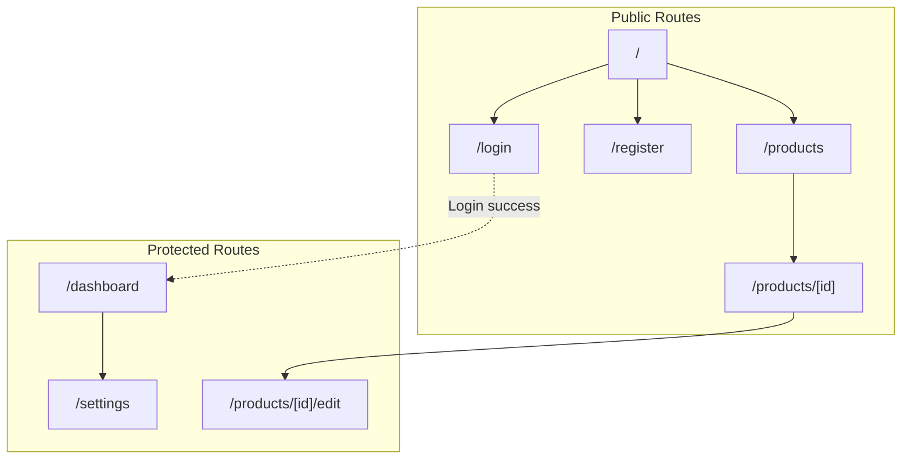
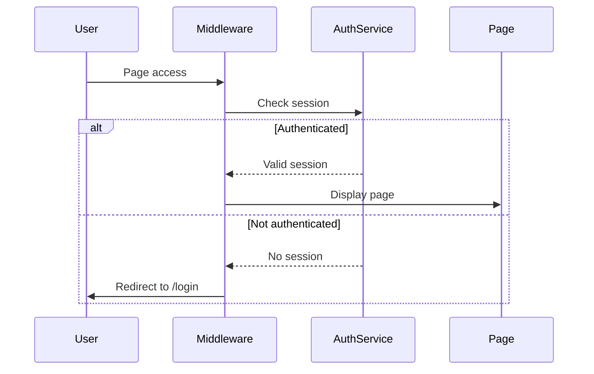
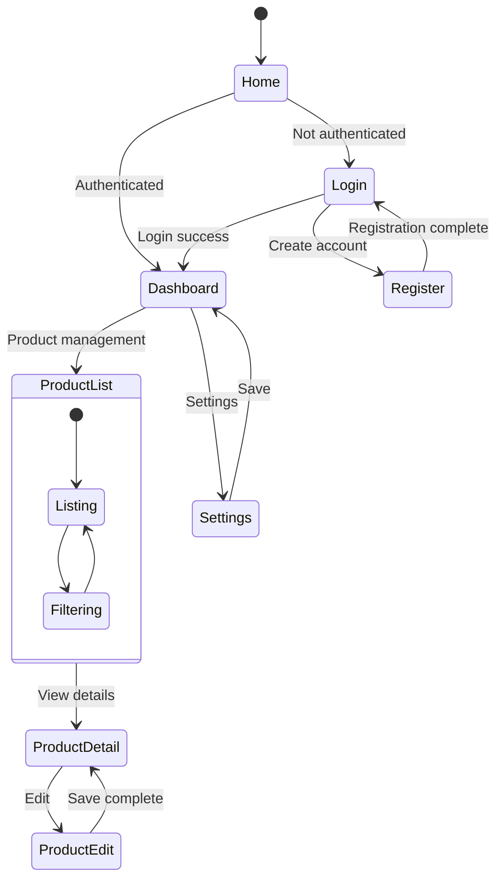

# Routing Design Document

## Basic Information

| Item | Content |
|------|---------|
| **Feature Name** | `[FeatureName]` |
| **Created** | YYYY-MM-DD |
| **Updated** | YYYY-MM-DD |
| **Author** | [Author Name] |

## Overview

Describe the purpose and overall strategy of routing design.

## App Router Structure

### Directory Structure

```
app/
├── layout.tsx              # Root layout
├── page.tsx                # Home page (/)
├── loading.tsx             # Global loading
├── error.tsx               # Global error
├── not-found.tsx           # 404 page
│
├── (auth)/                 # Auth group (shared layout)
│   ├── layout.tsx
│   ├── login/
│   │   └── page.tsx        # /login
│   └── register/
│       └── page.tsx        # /register
│
├── (main)/                 # Main content group
│   ├── layout.tsx
│   ├── dashboard/
│   │   └── page.tsx        # /dashboard
│   └── settings/
│       └── page.tsx        # /settings
│
├── products/
│   ├── page.tsx            # /products
│   └── [id]/
│       ├── page.tsx        # /products/[id]
│       └── edit/
│           └── page.tsx    # /products/[id]/edit
│
└── api/                    # Route Handlers
    └── [...]/
```

### Route Map



## Authentication Flow

### Authentication State Check



### Middleware Implementation

```typescript
// middleware.ts
import { NextResponse } from 'next/server';
import type { NextRequest } from 'next/server';

const protectedRoutes = ['/dashboard', '/settings', '/products/*/edit'];
const publicRoutes = ['/login', '/register'];

export function middleware(request: NextRequest) {
  const { pathname } = request.nextUrl;
  const token = request.cookies.get('auth-token');

  // Check protected routes
  const isProtected = protectedRoutes.some(route =>
    new RegExp(`^${route.replace('*', '.*')}$`).test(pathname)
  );

  if (isProtected && !token) {
    const loginUrl = new URL('/login', request.url);
    loginUrl.searchParams.set('redirect', pathname);
    return NextResponse.redirect(loginUrl);
  }

  // Authenticated user accessing public routes
  if (publicRoutes.includes(pathname) && token) {
    return NextResponse.redirect(new URL('/dashboard', request.url));
  }

  return NextResponse.next();
}

export const config = {
  matcher: ['/((?!api|_next/static|_next/image|favicon.ico).*)'],
};
```

## Dynamic Routing

### Parameter Definitions

| Pattern | Example | Parameters |
|---------|---------|------------|
| `[id]` | `/products/123` | `{ id: '123' }` |
| `[...slug]` | `/docs/a/b/c` | `{ slug: ['a', 'b', 'c'] }` |
| `[[...slug]]` | `/docs` or `/docs/a` | `{ slug: [] }` or `{ slug: ['a'] }` |

### Static Parameter Generation

```typescript
// app/products/[id]/page.tsx
export async function generateStaticParams() {
  const products = await fetchProducts();
  return products.map((product) => ({
    id: product.id,
  }));
}
```

## Page Navigation

### Navigation Diagram



### Navigation Implementation

```tsx
// Client component
'use client';
import { useRouter, usePathname } from 'next/navigation';

export function Navigation() {
  const router = useRouter();
  const pathname = usePathname();

  return (
    <nav>
      <Link href="/dashboard" className={pathname === '/dashboard' ? 'active' : ''}>
        Dashboard
      </Link>
      <button onClick={() => router.push('/products')}>
        Products
      </button>
      <button onClick={() => router.back()}>
        Back
      </button>
    </nav>
  );
}
```

## Parallel Routes / Intercepting Routes

### Parallel Routes

```
app/
├── @modal/
│   ├── default.tsx
│   └── (.)products/[id]/
│       └── page.tsx    # Modal display
├── products/
│   └── [id]/
│       └── page.tsx    # Full page display
└── layout.tsx          # Receives modal and children
```

### Layout

```tsx
// app/layout.tsx
export default function Layout({
  children,
  modal,
}: {
  children: React.ReactNode;
  modal: React.ReactNode;
}) {
  return (
    <html>
      <body>
        {children}
        {modal}
      </body>
    </html>
  );
}
```

## Route Handlers

### API Route Design

| Method | Path | Description |
|--------|------|-------------|
| GET | `/api/products` | Get product list |
| POST | `/api/products` | Create product |
| GET | `/api/products/[id]` | Get product details |
| PUT | `/api/products/[id]` | Update product |
| DELETE | `/api/products/[id]` | Delete product |

### Implementation Example

```typescript
// app/api/products/route.ts
import { NextRequest, NextResponse } from 'next/server';

export async function GET(request: NextRequest) {
  const searchParams = request.nextUrl.searchParams;
  const page = searchParams.get('page') || '1';

  const products = await fetchProducts({ page: parseInt(page) });
  return NextResponse.json(products);
}

export async function POST(request: NextRequest) {
  const body = await request.json();
  const product = await createProduct(body);
  return NextResponse.json(product, { status: 201 });
}
```

## Error Handling

### Error Boundary

```tsx
// app/products/error.tsx
'use client';

export default function Error({
  error,
  reset,
}: {
  error: Error & { digest?: string };
  reset: () => void;
}) {
  return (
    <div>
      <h2>An error occurred</h2>
      <p>{error.message}</p>
      <button onClick={reset}>Retry</button>
    </div>
  );
}
```

### Not Found

```tsx
// app/products/[id]/not-found.tsx
export default function NotFound() {
  return (
    <div>
      <h2>Product not found</h2>
      <Link href="/products">Back to product list</Link>
    </div>
  );
}
```

## SEO and Metadata

### Dynamic Metadata

```typescript
// app/products/[id]/page.tsx
export async function generateMetadata({ params }): Promise<Metadata> {
  const product = await fetchProduct(params.id);

  return {
    title: `${product.name} | Product Details`,
    description: product.description,
    openGraph: {
      title: product.name,
      images: [product.image],
    },
  };
}
```

## Related Documents

- [Page Design](./page-design)
- [Authentication Design](../bff/authentication-design)
- [API Design](../bff/api-design)

## Change History

| Version | Date | Changes |
|---------|------|---------|
| 1.0.0 | YYYY-MM-DD | Initial release |
