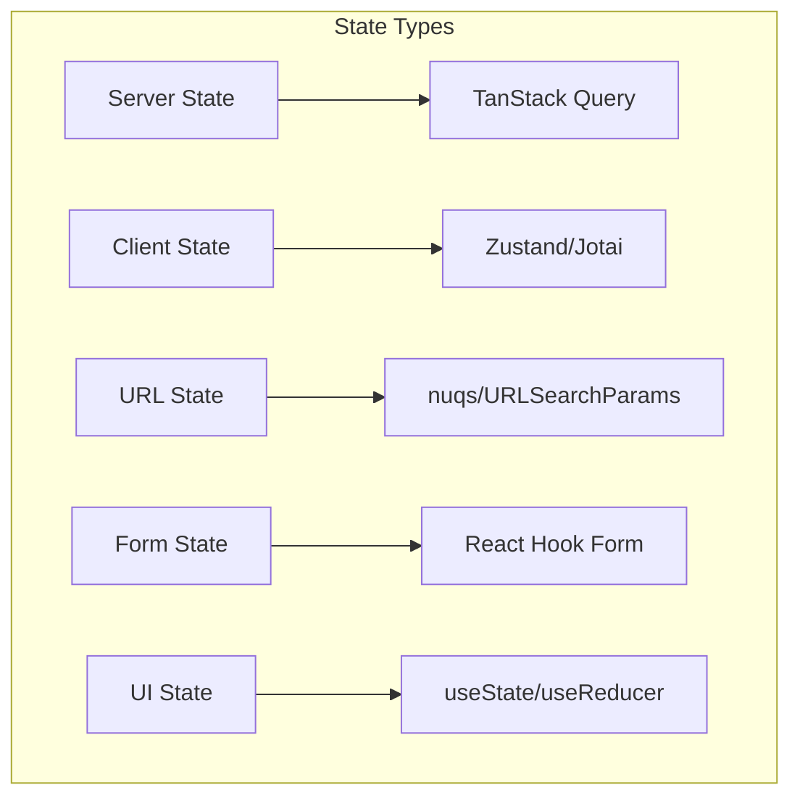
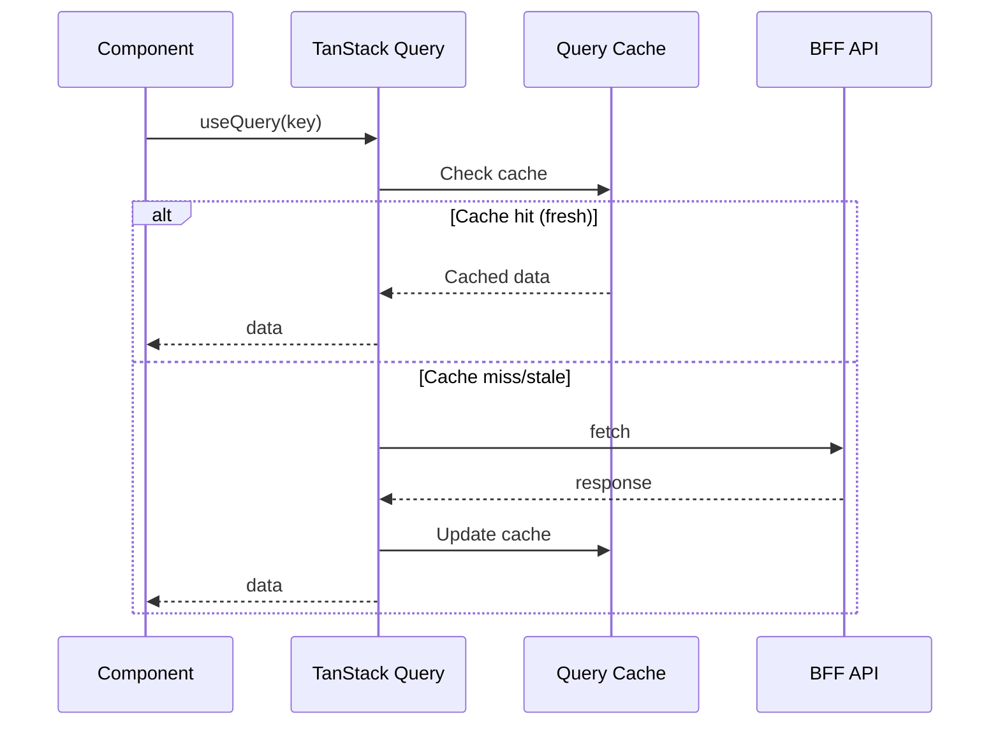
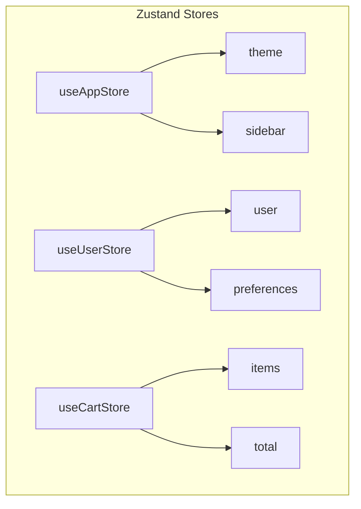
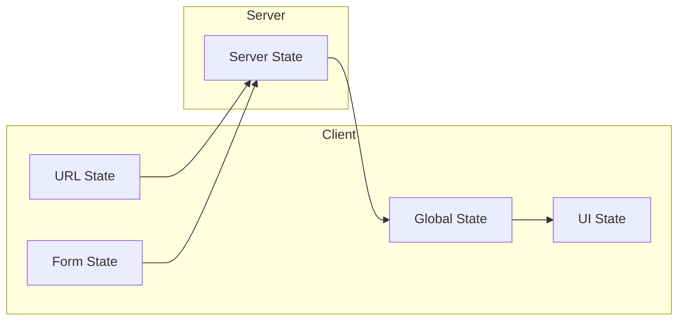

# State Management Design Document

## Basic Information

| Item | Content |
|------|---------|
| **Feature Name** | `[FeatureName]` |
| **Created** | YYYY-MM-DD |
| **Updated** | YYYY-MM-DD |
| **Author** | [Author Name] |

## Overview

Describe the purpose and overall strategy of state management.

## State Classification



## Server State

### TanStack Query Configuration

```typescript
// queryClient.ts
export const queryClient = new QueryClient({
  defaultOptions: {
    queries: {
      staleTime: 1000 * 60 * 5, // 5 minutes
      gcTime: 1000 * 60 * 30,   // 30 minutes
      retry: 3,
      refetchOnWindowFocus: false,
    },
  },
});
```

### Query Key Design

```typescript
// queryKeys.ts
export const queryKeys = {
  users: {
    all: ['users'] as const,
    list: (filters: UserFilters) => [...queryKeys.users.all, 'list', filters] as const,
    detail: (id: string) => [...queryKeys.users.all, 'detail', id] as const,
  },
  products: {
    all: ['products'] as const,
    list: (params: ProductParams) => [...queryKeys.products.all, 'list', params] as const,
  },
} as const;
```

### Data Flow Diagram



### Mutation Patterns

```typescript
// Optimistic Update
const mutation = useMutation({
  mutationFn: updateUser,
  onMutate: async (newData) => {
    await queryClient.cancelQueries({ queryKey: queryKeys.users.detail(id) });
    const previous = queryClient.getQueryData(queryKeys.users.detail(id));
    queryClient.setQueryData(queryKeys.users.detail(id), newData);
    return { previous };
  },
  onError: (err, newData, context) => {
    queryClient.setQueryData(queryKeys.users.detail(id), context?.previous);
  },
  onSettled: () => {
    queryClient.invalidateQueries({ queryKey: queryKeys.users.all });
  },
});
```

## Client State

### Zustand Store Design

```typescript
// stores/useAppStore.ts
interface AppState {
  // State
  theme: 'light' | 'dark';
  sidebarOpen: boolean;

  // Actions
  setTheme: (theme: 'light' | 'dark') => void;
  toggleSidebar: () => void;
}

export const useAppStore = create<AppState>()(
  devtools(
    persist(
      (set) => ({
        theme: 'light',
        sidebarOpen: true,
        setTheme: (theme) => set({ theme }),
        toggleSidebar: () => set((state) => ({ sidebarOpen: !state.sidebarOpen })),
      }),
      { name: 'app-store' }
    )
  )
);
```

### State Slices



## URL State

### Managed Parameters

| Parameter | Type | Default | Purpose |
|-----------|------|---------|---------|
| `page` | `number` | `1` | Pagination |
| `sort` | `string` | `'created'` | Sort order |
| `filter` | `string[]` | `[]` | Filters |
| `search` | `string` | `''` | Search query |

### Implementation Pattern

```typescript
// Using nuqs
import { parseAsInteger, parseAsString, useQueryStates } from 'nuqs';

const [params, setParams] = useQueryStates({
  page: parseAsInteger.withDefault(1),
  sort: parseAsString.withDefault('created'),
  search: parseAsString.withDefault(''),
});
```

## Form State

### React Hook Form Design

```typescript
// Validation schema
const schema = z.object({
  email: z.string().email('Please enter a valid email address'),
  password: z.string().min(8, 'Password must be at least 8 characters'),
});

type FormData = z.infer<typeof schema>;

// Form configuration
const form = useForm<FormData>({
  resolver: zodResolver(schema),
  defaultValues: {
    email: '',
    password: '',
  },
});
```

## State Coordination



## State Persistence

### Persistence Targets

| State | Storage | TTL |
|-------|---------|-----|
| Theme settings | localStorage | Permanent |
| Auth token | Cookie (httpOnly) | 7 days |
| Cart info | localStorage | 24 hours |
| Search history | sessionStorage | Session |

## Debug & Development Tools

- [ ] React DevTools
- [ ] TanStack Query DevTools
- [ ] Zustand DevTools

```typescript
// DevTools configuration
import { ReactQueryDevtools } from '@tanstack/react-query-devtools';

<QueryClientProvider client={queryClient}>
  <App />
  <ReactQueryDevtools initialIsOpen={false} />
</QueryClientProvider>
```

## Testing Strategy

### Store Tests

```typescript
describe('useAppStore', () => {
  beforeEach(() => {
    useAppStore.setState({ theme: 'light', sidebarOpen: true });
  });

  it('can toggle theme', () => {
    useAppStore.getState().setTheme('dark');
    expect(useAppStore.getState().theme).toBe('dark');
  });
});
```

## Related Documents

- [API Integration Design](./api-integration)
- [Form Design](./form-design)

## Change History

| Version | Date | Changes |
|---------|------|---------|
| 1.0.0 | YYYY-MM-DD | Initial release |
