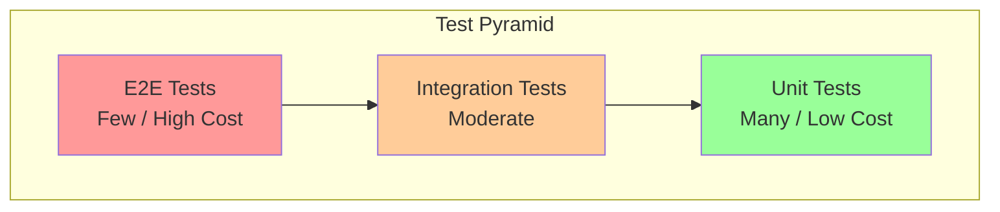
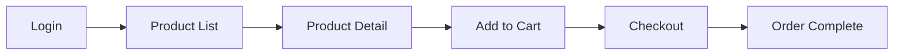

# Testing Design Document

## Basic Information

| Item | Content |
|------|---------|
| **Feature Name** | `[FeatureName]` |
| **Created** | YYYY-MM-DD |
| **Updated** | YYYY-MM-DD |
| **Author** | [Author Name] |

## Overview

Describes the testing strategy and design principles.

## Test Pyramid



### Target Test Ratios

| Test Type | Ratio | Execution | Tool |
|-----------|-------|-----------|------|
| Unit | 70% | On commit | Jest/Vitest |
| Integration | 20% | On PR | Testing Library |
| E2E | 10% | Before deploy | Playwright |

## Unit Tests

### Test Targets

| Target | Priority | Test Content |
|--------|----------|--------------|
| Utility functions | High | Input/output verification |
| Custom hooks | High | State/side effects |
| State management (Store) | High | Actions/selectors |
| Validation | High | Success/failure cases |
| Components (UI) | Medium | Render output |

### Jest/Vitest Configuration

```typescript
// vitest.config.ts
import { defineConfig } from 'vitest/config';
import react from '@vitejs/plugin-react';

export default defineConfig({
  plugins: [react()],
  test: {
    environment: 'jsdom',
    globals: true,
    setupFiles: ['./src/test/setup.ts'],
    coverage: {
      provider: 'v8',
      reporter: ['text', 'html'],
      exclude: ['node_modules/', 'src/test/'],
    },
  },
});
```

### Utility Function Tests

```typescript
// utils/format.test.ts
import { describe, it, expect } from 'vitest';
import { formatCurrency, formatDate } from './format';

describe('formatCurrency', () => {
  it('formats numbers as currency', () => {
    expect(formatCurrency(1000)).toBe('$1,000');
    expect(formatCurrency(1234567)).toBe('$1,234,567');
  });

  it('truncates decimal places', () => {
    expect(formatCurrency(1000.5)).toBe('$1,000');
  });

  it('handles negative numbers correctly', () => {
    expect(formatCurrency(-1000)).toBe('-$1,000');
  });
});

describe('formatDate', () => {
  it('converts date to specified format', () => {
    const date = new Date('2024-01-15');
    expect(formatDate(date, 'YYYY-MM-DD')).toBe('2024-01-15');
    expect(formatDate(date, 'MM/DD/YYYY')).toBe('01/15/2024');
  });
});
```

### Custom Hook Tests

```typescript
// hooks/useCounter.test.ts
import { renderHook, act } from '@testing-library/react';
import { useCounter } from './useCounter';

describe('useCounter', () => {
  it('sets initial value correctly', () => {
    const { result } = renderHook(() => useCounter(10));
    expect(result.current.count).toBe(10);
  });

  it('increments by 1', () => {
    const { result } = renderHook(() => useCounter(0));
    act(() => {
      result.current.increment();
    });
    expect(result.current.count).toBe(1);
  });

  it('decrements by 1', () => {
    const { result } = renderHook(() => useCounter(5));
    act(() => {
      result.current.decrement();
    });
    expect(result.current.count).toBe(4);
  });
});
```

## Integration Tests

### Testing Library

```typescript
// components/LoginForm.test.tsx
import { render, screen, waitFor } from '@testing-library/react';
import userEvent from '@testing-library/user-event';
import { LoginForm } from './LoginForm';

describe('LoginForm', () => {
  it('logs in successfully with correct input', async () => {
    const onSubmit = vi.fn();
    const user = userEvent.setup();

    render(<LoginForm onSubmit={onSubmit} />);

    await user.type(screen.getByLabelText('Email'), 'test@example.com');
    await user.type(screen.getByLabelText('Password'), 'password123');
    await user.click(screen.getByRole('button', { name: 'Login' }));

    await waitFor(() => {
      expect(onSubmit).toHaveBeenCalledWith({
        email: 'test@example.com',
        password: 'password123',
      });
    });
  });

  it('displays validation errors', async () => {
    const user = userEvent.setup();
    render(<LoginForm onSubmit={vi.fn()} />);

    await user.click(screen.getByRole('button', { name: 'Login' }));

    expect(await screen.findByText('Email is required')).toBeInTheDocument();
    expect(await screen.findByText('Password is required')).toBeInTheDocument();
  });
});
```

### API Mocking

```typescript
// test/mocks/handlers.ts
import { http, HttpResponse } from 'msw';

export const handlers = [
  http.get('/api/users', () => {
    return HttpResponse.json([
      { id: '1', name: 'User 1' },
      { id: '2', name: 'User 2' },
    ]);
  }),

  http.post('/api/login', async ({ request }) => {
    const body = await request.json();
    if (body.email === 'test@example.com') {
      return HttpResponse.json({ token: 'mock-token' });
    }
    return HttpResponse.json(
      { error: 'Invalid credentials' },
      { status: 401 }
    );
  }),
];
```

## E2E Tests

### Playwright Configuration

```typescript
// playwright.config.ts
import { defineConfig, devices } from '@playwright/test';

export default defineConfig({
  testDir: './e2e',
  timeout: 30000,
  retries: process.env.CI ? 2 : 0,
  workers: process.env.CI ? 1 : undefined,
  reporter: 'html',
  use: {
    baseURL: 'http://localhost:3000',
    trace: 'on-first-retry',
    screenshot: 'only-on-failure',
  },
  projects: [
    { name: 'chromium', use: { ...devices['Desktop Chrome'] } },
    { name: 'firefox', use: { ...devices['Desktop Firefox'] } },
    { name: 'webkit', use: { ...devices['Desktop Safari'] } },
    { name: 'mobile', use: { ...devices['iPhone 13'] } },
  ],
  webServer: {
    command: 'pnpm dev',
    url: 'http://localhost:3000',
    reuseExistingServer: !process.env.CI,
  },
});
```

### E2E Test Scenarios



```typescript
// e2e/checkout.spec.ts
import { test, expect } from '@playwright/test';

test.describe('Checkout Flow', () => {
  test.beforeEach(async ({ page }) => {
    // Login
    await page.goto('/login');
    await page.fill('[name="email"]', 'test@example.com');
    await page.fill('[name="password"]', 'password123');
    await page.click('button[type="submit"]');
    await expect(page).toHaveURL('/dashboard');
  });

  test('can add product to cart and purchase', async ({ page }) => {
    // Go to products
    await page.goto('/products');
    await expect(page.getByRole('heading', { name: 'Products' })).toBeVisible();

    // Add to cart
    await page.click('[data-testid="product-card-1"]');
    await page.click('button:has-text("Add to Cart")');
    await expect(page.getByText('Added to cart')).toBeVisible();

    // Checkout
    await page.click('[data-testid="cart-icon"]');
    await page.click('button:has-text("Proceed to Checkout")');

    // Confirm order
    await page.fill('[name="address"]', '123 Main St...');
    await page.click('button:has-text("Confirm Order")');

    // Verify completion
    await expect(page.getByText('Thank you for your order')).toBeVisible();
  });
});
```

## Test Coverage

### Coverage Targets

| Metric | Target | Minimum |
|--------|--------|---------|
| Line Coverage | 80% | 70% |
| Branch Coverage | 75% | 65% |
| Function Coverage | 85% | 75% |

### Coverage Reports

```bash
# Run tests with coverage
pnpm test --coverage

# Generate coverage report
pnpm test --coverage --reporter=html
```

## CI/CD Integration

### GitHub Actions

```yaml
# .github/workflows/test.yml
name: Test
on:
  pull_request:
    branches: [main]

jobs:
  unit-test:
    runs-on: ubuntu-latest
    steps:
      - uses: actions/checkout@v4
      - uses: pnpm/action-setup@v2
      - uses: actions/setup-node@v4
        with:
          node-version: 24
          cache: 'pnpm'
      - run: pnpm install
      - run: pnpm test --coverage
      - uses: codecov/codecov-action@v4

  e2e-test:
    runs-on: ubuntu-latest
    steps:
      - uses: actions/checkout@v4
      - uses: pnpm/action-setup@v2
      - uses: actions/setup-node@v4
      - run: pnpm install
      - run: pnpm exec playwright install --with-deps
      - run: pnpm build
      - run: pnpm exec playwright test
      - uses: actions/upload-artifact@v4
        if: failure()
        with:
          name: playwright-report
          path: playwright-report/
```

## Test Data Management

### Factory Pattern

```typescript
// test/factories/user.ts
import { faker } from '@faker-js/faker';

export const createUser = (overrides = {}) => ({
  id: faker.string.uuid(),
  name: faker.person.fullName(),
  email: faker.internet.email(),
  createdAt: faker.date.past().toISOString(),
  ...overrides,
});

export const createUsers = (count: number) =>
  Array.from({ length: count }, () => createUser());
```

## Related Documents

- [Component Design](./component-design)
- [CI/CD Design](../guides/getting-started)

## Change History

| Version | Date | Changes |
|---------|------|---------|
| 1.0.0 | YYYY-MM-DD | Initial release |
